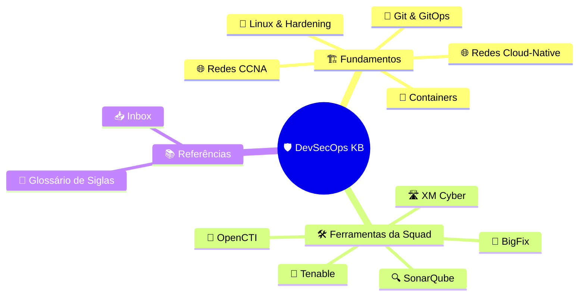
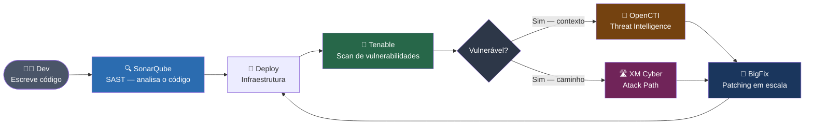
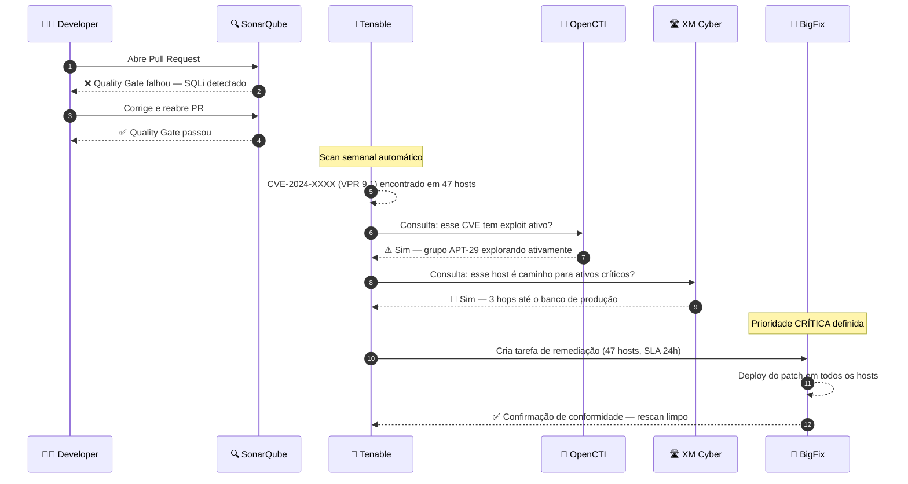
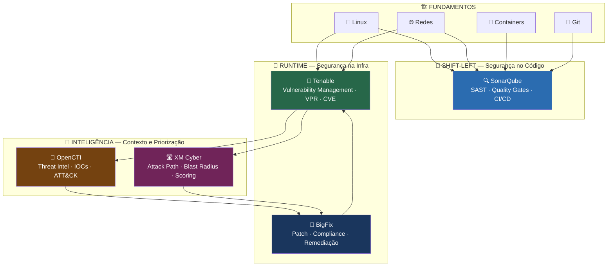
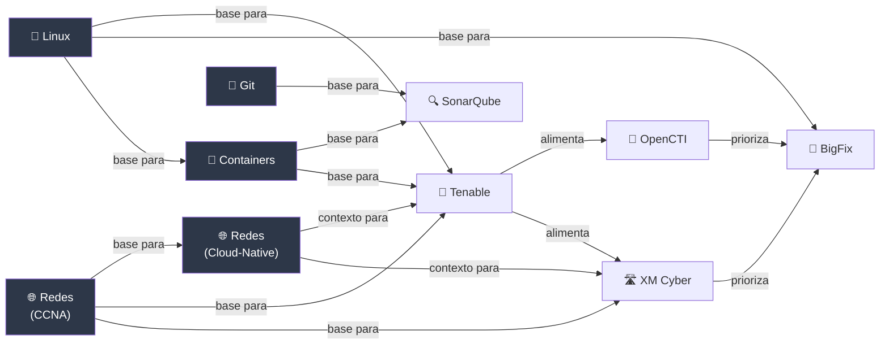
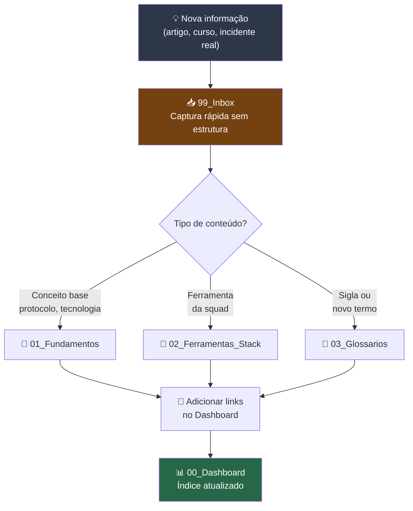

# 🛡️ DevSecOps Knowledge Base

> Base de conhecimento pessoal sobre **DevSecOps** e **Cybersecurity** — estruturada para consulta rápida, aprendizado progressivo e referência técnica no dia a dia da squad.

---

## 🗺️ Onde Estou?



---

## ⚡ Navegação Rápida

|🏗️ Fundamentos|🛠️ Stack da Squad|📚 Referências|
|---|---|---|
|[[01_Fundamentos/Linux\|🐧 Linux & Hardening]]|[[02_Ferramentas_Stack/SonarCube\|🔍 SonarQube]]|[[03_Glossarios/Siglas\|📖 Glossário de Siglas]]|
|[[01_Fundamentos/CCNA\|🎓 CCNA 200-301]]|[[02_Ferramentas_Stack/Tenable\|🎯 Tenable]]|[[99_Inbox/\|📥 Capturas Rápidas]]|
|[[01_Fundamentos/Redes\|🌐 Redes Cloud-Native]]|[[02_Ferramentas_Stack/OpenCTI\|🧠 OpenCTI]]||
|[[01_Fundamentos/Conteiners\|🐳 Docker & Containers]]|[[02_Ferramentas_Stack/XM Cyber\|🛣️ XM Cyber]]||
|[[01_Fundamentos/Git\|🌿 Git & GitOps]]|[[02_Ferramentas_Stack/BigFix Compliance\|🔧 BigFix]]||

---

## 🏢 Contexto da Squad

> As cinco ferramentas abaixo compõem o arsenal operacional da squad. Cada uma atua em uma camada distinta do ciclo de segurança.



---

## 🛠️ Ferramentas — Resumo Operacional

```yaml
squad_tools:

  sonarqube:
    categoria: "SAST / Code Quality"
    camada: "Código (Build)"
    pergunta: "Meu código tem brechas de segurança ou dívida técnica?"
    analogia: "Corretor ortográfico — não deixa publicar o livro com erros"
    quando_usar:
      - Pull Request aberto
      - Antes de merge na branch principal
      - Review de qualidade de novo serviço
    link: "[[02_Ferramentas_Stack/SonarCube]]"

  tenable:
    categoria: "Vulnerability Management"
    camada: "Infraestrutura (Runtime)"
    pergunta: "Quais hosts têm CVEs críticos abertos na minha rede?"
    analogia: "Inspetor predial — checa janelas, trancas e muros"
    quando_usar:
      - Scan periódico de infra
      - Após deploy em produção
      - Triagem de CVEs com VPR score
    link: "[[02_Ferramentas_Stack/Tenable]]"

  opencti:
    categoria: "Cyber Threat Intelligence (CTI)"
    camada: "Inteligência"
    pergunta: "Esse CVE está sendo explorado ativamente? Por quem?"
    analogia: "Quadro do detetive — conecta pistas, mapeia adversários"
    quando_usar:
      - Contextualizar um CVE encontrado pelo Tenable
      - Investigar IOCs de um incidente
      - Alimentar playbooks de resposta
    link: "[[02_Ferramentas_Stack/OpenCTI]]"

  xm_cyber:
    categoria: "Attack Path Management"
    camada: "Estratégia / Priorização"
    pergunta: "Como um atacante chegaria nos meus ativos críticos?"
    analogia: "GPS do ladrão — mostra a rota exata da entrada até o cofre"
    quando_usar:
      - Priorizar qual vuln corrigir primeiro
      - Avaliar blast radius de um ativo comprometido
      - Relatório executivo de exposição
    link: "[[02_Ferramentas_Stack/XM Cyber]]"

  bigfix:
    categoria: "Patching & Compliance"
    camada: "Operação / Remediação"
    pergunta: "Como aplico esse patch em 1.000 máquinas ao mesmo tempo?"
    analogia: "Equipe de manutenção mágica — troca 1000 lâmpadas com um clique"
    quando_usar:
      - Remediação de CVEs identificados pelo Tenable
      - Ciclo mensal de patch management
      - Verificação de conformidade (compliance scan)
    link: "[[02_Ferramentas_Stack/BigFix Compliance]]"
```

---

## 🔄 Fluxo de Operação da Squad

> Como as ferramentas se conectam em um ciclo real de trabalho:



---

## 🎯 Ciclo de Operação — Visão de Camadas



---

## 📐 Fundamentos — Mapa de Dependências

> O que estudar antes do quê:



---

## 📊 Comparativo das Ferramentas da Squad

|Ferramenta|Camada|Tipo de Scan|O que protege|Quando aciona|Output principal|
|---|---|---|---|---|---|
|**SonarQube**|Código|Estático (SAST)|Aplicação|No commit/PR|Quality Gate pass/fail|
|**Tenable**|Infra|Ativo/Autenticado|Rede + Hosts|Periódico + on-demand|CVE com VPR score|
|**OpenCTI**|Inteligência|Passivo/Correlação|Contexto de ameaça|Investigação|IOCs + TTPs + Grupos|
|**XM Cyber**|Estratégia|Simulação|Caminhos críticos|Contínuo|Choke points + Score|
|**BigFix**|Operação|Compliance check|Endpoints|Pós-priorização|Patch deployed / compliant|

---

## 🗂️ Índice Completo do Vault

```yaml
vault_index:

  fundamentos:
    descricao: "Base técnica transversal — leia antes das ferramentas"
    arquivos:
      - titulo: "CCNA 200-301"
        link: "[[01_Fundamentos/CCNA]]"
        topicos: ["OSI", "TCP/IP", "VLANs", "OSPF", "STP", "ACLs", "Subnetting", "Wireless"]
        nivel: intermediario

      - titulo: "Redes Cloud-Native & DevSecOps"
        link: "[[01_Fundamentos/Redes]]"
        topicos: ["VPC", "Kubernetes CNI", "Service Mesh", "Zero Trust", "ZTNA", "Firewall APIs"]
        nivel: avancado

      - titulo: "Linux & Hardening"
        link: "[[01_Fundamentos/Linux]]"
        topicos: ["Administração", "Permissões", "Hardening", "Bash scripting", "Systemd"]
        nivel: intermediario

      - titulo: "Docker & Containers"
        link: "[[01_Fundamentos/Conteiners]]"
        topicos: ["Docker", "Kubernetes", "Segurança de containers", "Registries", "CIS Benchmark"]
        nivel: intermediario

      - titulo: "Git & GitOps"
        link: "[[01_Fundamentos/Git]]"
        topicos: ["Branching", "CI/CD", "Hooks de segurança", "GitOps", "Integração com SAST"]
        nivel: basico-intermediario

  ferramentas_stack:
    descricao: "Documentação técnica das ferramentas da squad"
    arquivos:
      - titulo: "CTI, ASM & Vulnerability Management"
        link: "[[02_Ferramentas_Stack/CTI, ASM & Vulnerability Management]]"
        topicos: ["Shodan", "Censys", "VirusTotal", "Tenable VPR", "SOAR", "Automação de IOCs"]
        nivel: avancado

      - titulo: "Tenable"
        link: "[[02_Ferramentas_Stack/Tenable]]"
        topicos: ["Nessus Plugins", "VPR vs CVSS", "Scan policies", "Remediação", "API"]
        nivel: intermediario

      - titulo: "BigFix Compliance"
        link: "[[02_Ferramentas_Stack/BigFix Compliance]]"
        topicos: ["Patch management", "Compliance scan", "Fixlets", "Relevance language"]
        nivel: intermediario

      - titulo: "OpenCTI"
        link: "[[02_Ferramentas_Stack/OpenCTI]]"
        topicos: ["STIX/TAXII", "Conectores", "MITRE ATT&CK", "Threat actors", "IOCs"]
        nivel: intermediario

      - titulo: "XM Cyber"
        link: "[[02_Ferramentas_Stack/XM Cyber]]"
        topicos: ["Attack path", "Choke points", "Blast radius", "Entity scoring", "Relatórios"]
        nivel: intermediario

      - titulo: "SonarQube"
        link: "[[02_Ferramentas_Stack/SonarCube]]"
        topicos: ["SAST", "Quality Gates", "Rules", "CI/CD integration", "Security Hotspots"]
        nivel: basico-intermediario

  referencias:
    arquivos:
      - titulo: "Glossário de Siglas"
        link: "[[03_Glossarios/Siglas]]"
        descricao: "Dicionário de termos e siglas do ecossistema de segurança"

      - titulo: "Inbox"
        link: "[[99_Inbox/kwords]]"
        descricao: "Notas rápidas pendentes de refinamento"
```

---

## 📈 Frameworks de Referência

|Framework|Aplicação no dia a dia|Link|
|---|---|---|
|**MITRE ATT&CK**|Contextualizar TTPs no OpenCTI, mapear caminhos no XM Cyber|[attack.mitre.org](https://attack.mitre.org/)|
|**CVSS v3**|Score base de vulnerabilidades no Tenable|[first.org/cvss](https://www.first.org/cvss/)|
|**VPR (Tenable)**|Score de priorização com contexto de exploração ativa|[[02_Ferramentas_Stack/Tenable]]|
|**OWASP Top 10**|Categorias de falhas que o SonarQube detecta|[owasp.org](https://owasp.org/www-project-top-ten/)|
|**CIS Benchmarks**|Base para compliance checks no BigFix|[cisecurity.org](https://www.cisecurity.org/cis-benchmarks)|
|**NIST CSF**|Framework macro de gestão de segurança|[nist.gov/cyberframework](https://www.nist.gov/cyberframework)|
|**NIST SP 800-207**|Zero Trust — base conceitual para Redes Cloud-Native|[csrc.nist.gov](https://csrc.nist.gov/publications/detail/sp/800-207/final)|

---

## 🔁 Fluxo de Captura de Conhecimento



---

_Atualizado em: 2026-03-02 · [[README|→ Ver README do repositório]]_