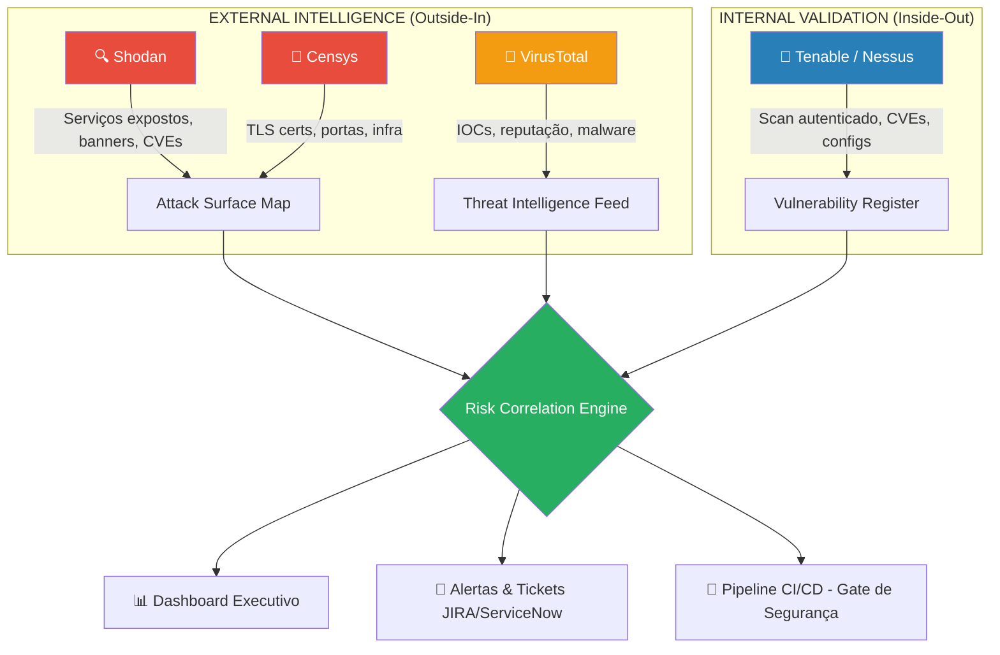
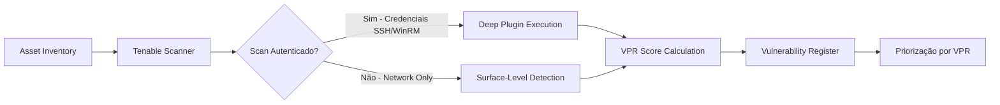
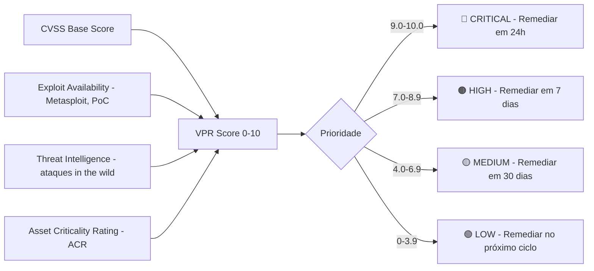
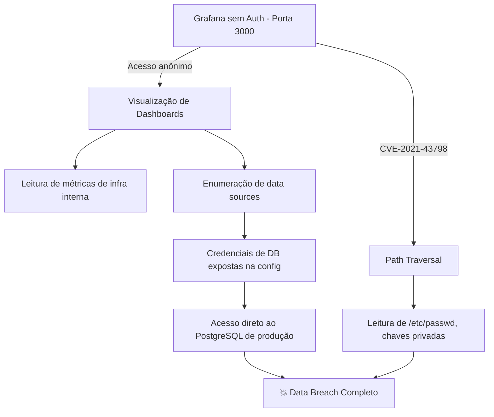
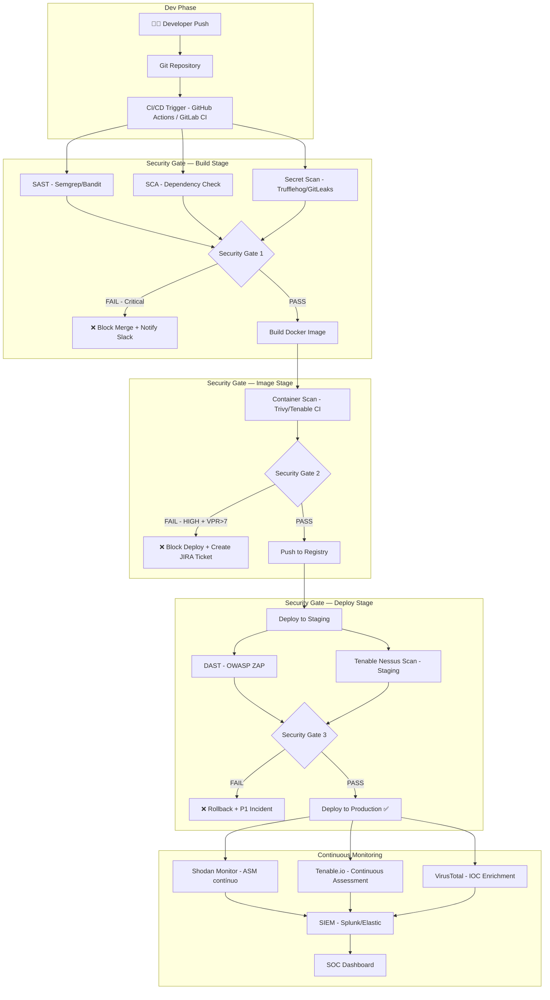
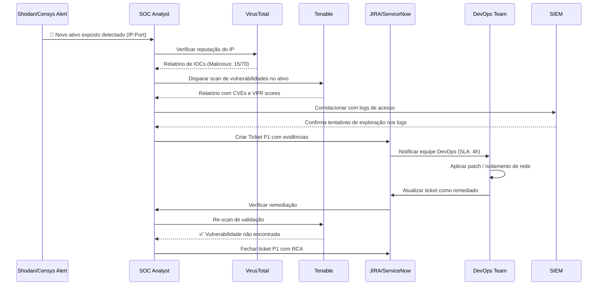

---


title: "CTI, ASM & Vulnerability Management: Guia Avançado"
tags:
  - cybersecurity
  - devsecops
  - threat-intelligence
  - ASM
  - CTI
  - shodan
  - censys
  - virustotal
  - tenable
  - vulnerability-management
  - automation
aliases:
  - "Guia CTI DevSecOps"
  - "ASM Tooling"
created: 2026-03-02
updated: 2026-03-02
status: ativo
nivel: avancado
author: "DevSecOps Vault"
---

---

# 🛡️ CTI, ASM & Vulnerability Management: Guia Técnico Avançado

> [!INFO] Sobre este documento Este guia é uma referência técnica e prática para profissionais de segurança e engenheiros DevSecOps. Cobre inteligência de ameaças, gestão da superfície de ataque e análise de vulnerabilidades com foco no ecossistema **Shodan**, **Censys**, **VirusTotal** e **Tenable**.

---

## Índice

- [[#1. Conceitos Fundamentais e Arquitetura de Soluções]]
- [[#2. Cheatsheet de Buscas Avançadas (Dorks)]]
- [[#3. Análise Prática de Vulnerabilidades]]
- [[#4. DevSecOps – Automação e Consumo de APIs]]
- [[#5. Fluxo de Remediação e Pipeline]]

---

## 1. Conceitos Fundamentais e Arquitetura de Soluções

### 1.1 O Ecossistema: Visão Macro



---

### 1.2 Papel de Cada Ferramenta no ASM e CTI

#### 🔍 Shodan — O "Google dos Dispositivos Conectados"

O Shodan é um mecanismo de busca de **infraestruturas expostas na internet**. Ele realiza varreduras contínuas (via seus próprios crawlers) em toda a internet indexando banners de serviços, cabeçalhos HTTP, certificados TLS e respostas de protocolos como SSH, FTP, SMTP, RDP etc.

|Dimensão|Detalhe|
|---|---|
|**Tipo**|Passive Reconnaissance / ASM|
|**Dados coletados**|Banners, portas abertas, OS fingerprint, CVEs detectadas, geolocalização|
|**Frequência de scan**|Contínua (dados podem ter horas a dias de defasagem)|
|**Casos de uso CTI**|Identificar infra de threat actors, rastrear botnets por banner patterns|
|**Casos de uso ASM**|Descoberta de shadow IT, ativos expostos sem autorização|

#### 🔎 Censys — Inteligência Focada em Certificados e Infra

O Censys diferencia-se do Shodan por ter um foco mais estruturado em **análise de certificados X.509**, dados IPv4 e domínios. É amplamente usado por pesquisadores e times de Blue Team para mapeamento de infra corporativa a partir do ponto de vista externo.

|Dimensão|Detalhe|
|---|---|
|**Tipo**|Passive Reconnaissance / ASM|
|**Dados coletados**|Certificados TLS/SSL, hostnames, portas, protocolos, ASN|
|**Frequência de scan**|Contínua (ZMap/ZGrab based)|
|**Diferencial vs Shodan**|Melhor correlação via certificados e histórico de domínios|
|**Casos de uso**|Encontrar subdomínios corporativos, certificados expirados, infra cloud exposta|

#### 🦠 VirusTotal — Hub de Threat Intelligence

O VirusTotal é uma plataforma de análise de **indicadores de comprometimento (IOCs)**. Agrega resultados de mais de 70 antivírus e dezenas de feeds de inteligência de ameaças para classificar a reputação de arquivos, URLs, domínios e IPs.

|Dimensão|Detalhe|
|---|---|
|**Tipo**|Cyber Threat Intelligence (CTI)|
|**Dados coletados**|Hash de arquivos, URLs, domínios, IPs, relações entre IOCs|
|**Integrações**|MITRE ATT&CK, YARA rules, comportamento em sandbox|
|**Casos de uso**|Verificar se um IP de servidor está em blacklists, analisar malware droppers|
|**API**|REST API v3 com endpoints para files, urls, domains, ip_addresses|

---

### 1.3 Tenable — Vulnerability Management (VM)

> [!NOTE] Distinção Fundamental Shodan/Censys veem sua infra **de fora**, como um atacante veria. O Tenable escaneia sua infra **de dentro**, com credenciais, mapeando vulnerabilidades reais com profundidade técnica que scanners passivos não conseguem.

O Tenable (Tenable.io / Tenable.sc / Nessus) é uma plataforma de **Vulnerability Management (VM)** que realiza **scans ativos e autenticados** contra ativos de TI para identificar:

- CVEs com plugins proprietários (Nessus Plugins)
- Configurações inseguras (misconfigurations)
- Software desatualizado e fim de suporte (EoL)
- Compliance gaps (PCI-DSS, CIS Benchmarks, NIST)



#### Diferença entre VM (Tenable) e ASM (Shodan/Censys)

|Critério|Shodan / Censys|Tenable|
|---|---|---|
|**Perspectiva**|Externa (attacker view)|Interna (defender view)|
|**Autenticação**|Não (passive/unauthenticated)|Sim (credentialed scans)|
|**Profundidade**|Banners e respostas de rede|Versões exatas, patches, configs|
|**Cobertura**|Toda a internet|Ativos definidos no escopo|
|**Latência dos dados**|Horas/Dias|On-demand ou agendado|
|**Falsos positivos**|Alto (sem validação)|Baixo (plugin validado)|
|**Principal output**|Exposição de superfície|CVE com CVSS + VPR|

---

### 1.4 Métricas de Risco e Priorização

#### VPR — Vulnerability Priority Rating (Tenable)

O VPR é o score proprietário do Tenable, calculado com Machine Learning, que vai além do CVSS tradicional incorporando contexto de ameaças em tempo real.



> [!WARNING] CVSS vs VPR Uma vulnerabilidade com **CVSS 9.8** pode ter **VPR 4.2** se não houver exploit público ativo. Priorizar apenas por CVSS gera "alert fatigue" e ineficiência operacional. **Sempre use VPR como critério primário de priorização.**

#### Scores de Reputação no VirusTotal

|Score/Atributo|O que mede|Faixa|
|---|---|---|
|**Malicious detections**|Nº de engines que classificaram como malicioso|0 a ~70+|
|**Reputation Score**|Score da comunidade VT (-100 a +100)|-100 a +100|
|**Popularity rank**|Frequência de submissões|Percentil|
|**YARA matches**|Regras de detecção comportamental que bateram|Binário|
|**Crowdsourced IDS rules**|Regras de Suricata/Snort que batiram|Lista|

---

## 2. Cheatsheet de Buscas Avançadas (Dorks)

> [!WARNING] Aviso Legal As queries abaixo são para uso exclusivo em **ambientes autorizados**, programas de Bug Bounty ou pesquisa defensiva. O uso não autorizado de informações obtidas pode constituir crime de acordo com a Lei 12.737/2012 (Lei Carolina Dieckmann) e o Marco Civil da Internet no Brasil, além de leis internacionais como o CFAA nos EUA.

### 2.1 Shodan Dorks

|#|Query|O que encontra|Sintaxe explicada|
|---|---|---|---|
|1|`product:"MongoDB" port:27017 country:"BR" -authentication`|MongoDB sem autenticação no Brasil|`product:` filtra pelo software; `-authentication` exclui banners que mencionam auth|
|2|`http.title:"phpMyAdmin" http.status:200 org:"Empresa XYZ"`|Painéis phpMyAdmin acessíveis de uma organização específica|`http.title:` busca no título HTML; `org:` filtra pela organização do ASN|
|3|`port:3389 os:"Windows Server 2008" country:"BR"`|Servidores RDP em Windows Server 2008 (EoL) no Brasil|`port:3389` é RDP; `os:` filtra pelo sistema operacional detectado|
|4|`ssl.cert.subject.cn:"*.empresa.com.br" port:443`|Todos os hosts com certificado wildcard de um domínio|`ssl.cert.subject.cn:` busca pelo CN do certificado TLS|
|5|`http.html:"Index of /" http.title:"Index of" org:"AS ALVO"`|Directory listing habilitado (exposição de arquivos)|`http.html:` busca no corpo HTML; detecta Apache/Nginx com autoindex|
|6|`"default password" port:22 country:"BR"`|Dispositivos SSH com mensagem de senha padrão no banner|Busca textual no banner SSH retornado|
|7|`vuln:CVE-2021-44228`|Ativos potencialmente vulneráveis ao Log4Shell (Log4j)|`vuln:` é um filtro premium que correlaciona CVEs com banners|
|8|`http.favicon.hash:-297069493`|Servidores com o favicon do Kibana (Elasticsearch/ELK Stack)|Hash MD5 do favicon; técnica de fingerprinting por ícone|

> [!INFO] Shodan CLI Instale o cliente oficial: `pip install shodan` e configure com `shodan init SUA_API_KEY`

```bash
# Buscar via Shodan CLI
shodan search 'product:"MongoDB" port:27017 country:"BR"' --fields ip_str,port,org

# Contar resultados de uma query
shodan count 'vuln:CVE-2021-44228 country:"BR"'

# Ver detalhes de um IP específico
shodan host 8.8.8.8
```

---

### 2.2 Censys Dorks (Search 2.0 Syntax)

|#|Query|O que encontra|Sintaxe explicada|
|---|---|---|---|
|1|`services.software.product="Elasticsearch" and services.port=9200 and location.country_code="BR"`|Elasticsearch exposto sem autenticação|Combina produto, porta e país|
|2|`services.tls.certificates.leaf_data.subject.common_name="*.empresa.com.br"`|Subdomínios corporativos via certificado wildcard|Busca no campo CN do certificado TLS leaf|
|3|`services.http.response.html_title="Kibana" and services.port=5601`|Painéis Kibana expostos|Filtra pelo título HTML em porta padrão do Kibana|
|4|`services.ssh.server_host_key.fingerprint_sha256="<HASH>"`|Rastrear um servidor específico por fingerprint SSH|Útil para threat hunting e rastreamento de infra de atacantes|
|5|`services.http.response.headers.server="Apache/2.2*" and services.port=80`|Servidores Apache 2.2 (EoL desde 2017) ainda em produção|Glob matching no header `Server` da resposta HTTP|
|6|`autonomous_system.name="CLARO S.A." and services.port=21 and services.ftp.banner=/.*vsftpd 2\.3\.4.*/`|FTP com vsftpd 2.3.4 (backdoor clássica) em ASN específica|Regex no banner FTP|
|7|`services.http.response.body:/aws_access_key_id/`|Páginas web que expõem credenciais AWS no body|Regex no corpo da resposta HTTP|

```bash
# Censys CLI (após pip install censys)
export CENSYS_API_ID="sua_id"
export CENSYS_API_SECRET="seu_secret"

censys search 'services.software.product="Elasticsearch" and location.country_code="BR"' \
  --index-type hosts \
  --fields ip,services.port,services.software.version
```

---

## 3. Análise Prática de Vulnerabilidades

### Cenário 1: Servidor Web com Software Desatualizado (Apache Struts)

> [!NOTE] CVE de Referência: CVE-2017-5638 (Apache Struts RCE — usado no breach da Equifax)

#### 3.1.1 A Descoberta (Shodan/Censys)

Um analista de segurança ou threat actor usaria a seguinte query para identificar alvos:

```bash
# Shodan
shodan search 'http.component:"Apache Struts" http.status:200 country:"BR"'

# Censys
censys search 'services.http.response.headers.x_powered_by="Struts*"'
```

**Output simulado do Shodan:**

```json
{
  "ip_str": "200.100.50.25",
  "port": 8080,
  "transport": "tcp",
  "org": "Empresa Financeira Ltda",
  "country_code": "BR",
  "http": {
    "title": "Portal do Cliente - Empresa Financeira",
    "status": 200,
    "server": "Apache-Coyote/1.1",
    "components": {
      "Apache Struts": {
        "categories": ["Web frameworks"],
        "version": "2.3.5"
      }
    }
  },
  "vulns": {
    "CVE-2017-5638": {
      "cvss": 10.0,
      "summary": "RCE via Content-Type header in Jakarta Multipart parser"
    }
  }
}
```

#### 3.1.2 A Validação (Tenable)

**Plugin Tenable simulado — Plugin ID 97756:**

```
Plugin ID   : 97756
Plugin Name : Apache Struts 2 Jakarta Multipart Parser RCE (S2-045)
Severity    : CRITICAL
VPR Score   : 9.8
CVSS v3     : 10.0 (AV:N/AC:L/PR:N/UI:N/S:C/C:H/I:H/A:H)

Synopsis:
  The remote web server is running a version of Apache Struts 2 that
  is affected by a remote code execution vulnerability.

Description:
  Apache Struts 2.3.5 through 2.3.31 and 2.5 through 2.5.10 are
  vulnerable to remote code execution due to improper input validation
  in the Jakarta Multipart parser. An unauthenticated, remote attacker
  can exploit this by sending a crafted Content-Type header value to
  execute arbitrary OS commands.

  Detected Version : 2.3.5
  Fixed Version    : 2.3.32 / 2.5.10.1

Solution:
  Upgrade to Apache Struts 2.3.32 or 2.5.10.1 or later.
  As a temporary mitigation, use the Servlet filter SanitizeHTTPParameters.

Risk Factor    : Critical
CVSS Score     : 10.0
VPR            : 9.8
Exploit Available: true (Metasploit module: exploit/multi/http/struts2_content_type_ognl)
Patch Published: 2017-03-06
Plugin Published: 2017-03-07

Output:
  Path    : /fileUpload.action
  Version : Apache Struts 2.3.5
  Method  : Content-Type header injection confirmed via OGNL expression
```

#### 3.1.3 O Risco

|Dimensão|Impacto|
|---|---|
|**Confidencialidade**|CRÍTICO — Exfiltração de dados de clientes/PII|
|**Integridade**|CRÍTICO — Modificação de dados e código da aplicação|
|**Disponibilidade**|ALTO — Ransomware ou destruição de dados|
|**Negócio**|Multas LGPD, dano reputacional, paralisação de operações|
|**CVSS v3**|10.0 (máximo)|
|**Exploração**|Módulo Metasploit público, exploração trivial|

---

### Cenário 2: Bucket S3 Exposto Publicamente

#### 3.2.1 A Descoberta (Shodan/Censys)

```bash
# Shodan — busca por buckets S3 que retornam XML com listagem
shodan search 'http.html:"ListBucketResult" port:443'

# Google Dork correlacionado
# site:s3.amazonaws.com "Index of" "empresa"

# Via Censys buscando por response body
censys search 'services.http.response.body="ListBucketResult" and services.http.response.body="empresa"'
```

**Requisição HTTP de validação manual:**

```http
GET / HTTP/1.1
Host: empresa-backups.s3.amazonaws.com
User-Agent: Mozilla/5.0

---

HTTP/1.1 200 OK
x-amz-request-id: EXAMPLE123
x-amz-bucket-region: sa-east-1
Content-Type: application/xml

<?xml version="1.0" encoding="UTF-8"?>
<ListBucketResult>
  <Name>empresa-backups</Name>
  <Prefix></Prefix>
  <KeyCount>47</KeyCount>
  <Contents>
    <Key>backup_db_prod_2026-02-28.sql.gz</Key>
    <Size>2147483648</Size>
    <LastModified>2026-02-28T03:00:00.000Z</LastModified>
  </Contents>
  <Contents>
    <Key>employees_pii_export_2026.csv</Key>
    <Size>52428800</Size>
  </Contents>
</ListBucketResult>
```

#### 3.2.2 A Validação (Tenable)

```
Plugin ID   : 121010
Plugin Name : Amazon S3 Bucket Publicly Accessible (ACL Misconfiguration)
Severity    : HIGH
VPR Score   : 8.1

Synopsis:
  An Amazon S3 bucket associated with the target organization is
  publicly accessible without authentication.

Description:
  The remote Amazon S3 bucket 'empresa-backups' allows public LIST
  and GET operations. This exposes all stored objects to any
  unauthenticated internet user.

  Bucket Name     : empresa-backups
  Region          : sa-east-1 (São Paulo)
  Public Access   : ListBucket, GetObject — ALLOWED for AllUsers
  Objects Found   : 47
  Sensitive Files : backup_db_prod_2026-02-28.sql.gz
                    employees_pii_export_2026.csv

Solution:
  1. Enable 'Block All Public Access' at bucket level in AWS Console
  2. Review and restrict Bucket Policy and ACLs
  3. Enable S3 Server Access Logging
  4. Enable AWS Config rule: s3-bucket-public-read-prohibited
  5. Consider encrypting sensitive data with SSE-KMS

Risk Factor : High
CVSS v3     : 7.5 (AV:N/AC:L/PR:N/UI:N/S:U/C:H/I:N/A:N)
VPR         : 8.1
```

#### 3.2.3 O Risco

|Dimensão|Impacto|
|---|---|
|**LGPD/GDPR**|Violação de dados pessoais com notificação obrigatória à ANPD|
|**Confidencialidade**|Exposição de backup de banco de dados de produção com dados de clientes|
|**Custo**|Multa de até 2% do faturamento (LGPD), ou €20M (GDPR)|
|**Vetor de ataque subsequente**|Credenciais no dump de banco podem ser usadas para movimentação lateral|

---

### Cenário 3: Painel Administrativo sem Autenticação (Grafana)

#### 3.3.1 A Descoberta (Shodan)

```bash
# Shodan — Grafana com login anônimo habilitado
shodan search 'http.title:"Grafana" http.status:200 "Allow: anonymous" port:3000'

# Alternativa via hash do favicon do Grafana
shodan search 'http.favicon.hash:786176726'
```

**Output de verificação via curl:**

```bash
curl -s "http://200.150.75.100:3000/api/datasources" \
  -H "Accept: application/json" | python3 -m json.tool
```

```json
[
  {
    "id": 1,
    "name": "Prometheus-Prod",
    "type": "prometheus",
    "url": "http://prometheus-internal:9090",
    "access": "proxy"
  },
  {
    "id": 2,
    "name": "PostgreSQL-Prod",
    "type": "postgres",
    "url": "postgres-primary.internal:5432",
    "database": "app_production",
    "user": "grafana_ro",
    "access": "proxy"
  }
]
```

#### 3.3.2 A Validação (Tenable)

```
Plugin ID   : 165234
Plugin Name : Grafana Anonymous Access Enabled - Administrative Exposure
Severity    : HIGH
VPR Score   : 7.8

Description:
  The remote Grafana instance (v8.3.0) has anonymous access enabled
  with 'Viewer' or higher role. This allows unauthenticated users to:
  - View all dashboards and data source configurations
  - Execute queries against connected data sources (Prometheus, DB)
  - Enumerate internal network topology via data source URLs

  Grafana Version : 8.3.0 (also affected by CVE-2021-43798 - Path Traversal)
  Anonymous Role  : Editor
  Org Name        : Main Org.

Solution:
  1. Set 'enabled = false' under [auth.anonymous] in grafana.ini
  2. Upgrade to Grafana >= 8.3.3 (CVE-2021-43798 patch)
  3. Place Grafana behind VPN or IP allowlist
  4. Enable Grafana audit logging

CVSS v3 : 8.1
VPR     : 7.8
```

#### 3.3.3 O Risco



---

## 4. DevSecOps: Automação e Consumo de APIs

### 4.1 VirusTotal API v3

#### Verificar reputação de um IP via curl

```bash
export VT_API_KEY="sua_api_key_aqui"
export TARGET_IP="185.220.101.50"

curl -s --request GET \
  --url "https://www.virustotal.com/api/v3/ip_addresses/${TARGET_IP}" \
  --header "x-apikey: ${VT_API_KEY}" \
  --header "Accept: application/json" | python3 -m json.tool
```

#### Verificar um domínio suspeito

```bash
export DOMAIN="malicious-domain-example.com"

curl -s --request GET \
  --url "https://www.virustotal.com/api/v3/domains/${DOMAIN}" \
  --header "x-apikey: ${VT_API_KEY}" | python3 -m json.tool
```

#### Submeter um arquivo para análise

```bash
curl -s --request POST \
  --url "https://www.virustotal.com/api/v3/files" \
  --header "x-apikey: ${VT_API_KEY}" \
  --form "file=@/caminho/para/arquivo_suspeito.exe"
```

---

### 4.2 Shodan API via curl

```bash
export SHODAN_API_KEY="sua_shodan_api_key"

# Info de um IP
curl -s "https://api.shodan.io/shodan/host/8.8.8.8?key=${SHODAN_API_KEY}" \
  | python3 -m json.tool

# Contar resultados de uma query
curl -s "https://api.shodan.io/shodan/host/count?key=${SHODAN_API_KEY}&query=product:MongoDB+port:27017" \
  | python3 -m json.tool

# Busca com paginação
curl -s "https://api.shodan.io/shodan/host/search?key=${SHODAN_API_KEY}&query=product:Elasticsearch+country:BR&page=1" \
  | python3 -m json.tool

# Verificar créditos restantes
curl -s "https://api.shodan.io/api-info?key=${SHODAN_API_KEY}"
```

---

### 4.3 Script Python — Análise de IP Suspeito com VirusTotal

```python
#!/usr/bin/env python3
"""
ioc_analyzer.py — Análise de IOCs via VirusTotal API v3
DevSecOps Vault | Threat Intelligence Module

Usage:
    python3 ioc_analyzer.py --ip 185.220.101.50
    python3 ioc_analyzer.py --domain malicious.com --output report.json
"""

import argparse
import json
import sys
import os
from datetime import datetime, timezone
import requests

# ---------------------------------------------------------------------------
# Configuração
# ---------------------------------------------------------------------------

VT_API_KEY = os.environ.get("VT_API_KEY", "")
VT_BASE_URL = "https://www.virustotal.com/api/v3"
TIMEOUT = 30

HEADERS = {
    "x-apikey": VT_API_KEY,
    "Accept": "application/json",
}

# ---------------------------------------------------------------------------
# Funções de consulta
# ---------------------------------------------------------------------------

def get_ip_report(ip: str) -> dict:
    """Consulta relatório completo de um endereço IP no VirusTotal."""
    url = f"{VT_BASE_URL}/ip_addresses/{ip}"
    response = requests.get(url, headers=HEADERS, timeout=TIMEOUT)
    response.raise_for_status()
    return response.json()


def get_domain_report(domain: str) -> dict:
    """Consulta relatório completo de um domínio no VirusTotal."""
    url = f"{VT_BASE_URL}/domains/{domain}"
    response = requests.get(url, headers=HEADERS, timeout=TIMEOUT)
    response.raise_for_status()
    return response.json()


def get_ip_communicating_files(ip: str, limit: int = 10) -> dict:
    """Retorna arquivos maliciosos que comunicaram com o IP."""
    url = f"{VT_BASE_URL}/ip_addresses/{ip}/communicating_files"
    params = {"limit": limit}
    response = requests.get(url, headers=HEADERS, params=params, timeout=TIMEOUT)
    response.raise_for_status()
    return response.json()

# ---------------------------------------------------------------------------
# Funções de parsing
# ---------------------------------------------------------------------------

def parse_ip_report(data: dict) -> dict:
    """Extrai e estrutura os campos mais relevantes do relatório de IP."""
    attrs = data.get("data", {}).get("attributes", {})
    stats = attrs.get("last_analysis_stats", {})

    malicious  = stats.get("malicious", 0)
    suspicious = stats.get("suspicious", 0)
    harmless   = stats.get("harmless", 0)
    undetected = stats.get("undetected", 0)
    total_engines = malicious + suspicious + harmless + undetected

    # Determina severidade
    if malicious >= 10:
        severity = "CRITICAL"
    elif malicious >= 5:
        severity = "HIGH"
    elif malicious >= 1 or suspicious >= 3:
        severity = "MEDIUM"
    else:
        severity = "LOW"

    # Última data de análise
    last_analysis_ts = attrs.get("last_analysis_date", 0)
    last_analysis_dt = datetime.fromtimestamp(
        last_analysis_ts, tz=timezone.utc
    ).isoformat() if last_analysis_ts else "N/A"

    # Top engines que detectaram como malicioso
    analysis_results = attrs.get("last_analysis_results", {})
    malicious_detections = [
        {
            "engine": engine,
            "category": result.get("category"),
            "result": result.get("result"),
        }
        for engine, result in analysis_results.items()
        if result.get("category") in ("malicious", "suspicious")
    ]

    return {
        "ioc_type": "ip_address",
        "ioc_value": data.get("data", {}).get("id", ""),
        "analysis_timestamp": datetime.now(tz=timezone.utc).isoformat(),
        "last_vt_analysis": last_analysis_dt,
        "severity": severity,
        "reputation_score": attrs.get("reputation", 0),
        "country": attrs.get("country", "N/A"),
        "asn": attrs.get("asn", "N/A"),
        "as_owner": attrs.get("as_owner", "N/A"),
        "detection_stats": {
            "malicious": malicious,
            "suspicious": suspicious,
            "harmless": harmless,
            "undetected": undetected,
            "total_engines": total_engines,
            "detection_rate": f"{((malicious + suspicious) / total_engines * 100):.1f}%" if total_engines > 0 else "0%",
        },
        "malicious_detections": malicious_detections[:10],  # Top 10
        "tags": attrs.get("tags", []),
        "network": attrs.get("network", "N/A"),
        "whois": attrs.get("whois", "")[:500],  # Primeiros 500 chars
        "vtlink": f"https://www.virustotal.com/gui/ip-address/{data.get('data', {}).get('id', '')}",
    }

# ---------------------------------------------------------------------------
# Entry Point
# ---------------------------------------------------------------------------

def main():
    parser = argparse.ArgumentParser(
        description="Analisa IOCs (IP/Domínio) via VirusTotal API v3"
    )
    parser.add_argument("--ip", help="Endereço IP para análise")
    parser.add_argument("--domain", help="Domínio para análise")
    parser.add_argument(
        "--output", help="Arquivo de saída JSON (opcional)", default=None
    )
    parser.add_argument(
        "--communicating-files",
        action="store_true",
        help="Incluir arquivos que comunicaram com o IP",
    )
    args = parser.parse_args()

    if not VT_API_KEY:
        print("[ERRO] Variável de ambiente VT_API_KEY não definida.", file=sys.stderr)
        sys.exit(1)

    if not args.ip and not args.domain:
        parser.print_help()
        sys.exit(1)

    result = {}

    try:
        if args.ip:
            print(f"[*] Consultando IP: {args.ip}", file=sys.stderr)
            raw_data = get_ip_report(args.ip)
            result = parse_ip_report(raw_data)

            if args.communicating_files:
                print(f"[*] Buscando arquivos relacionados...", file=sys.stderr)
                comm_files = get_ip_communicating_files(args.ip)
                result["communicating_files"] = [
                    {
                        "sha256": f.get("id"),
                        "name": f.get("attributes", {}).get("meaningful_name", "N/A"),
                        "malicious": f.get("attributes", {}).get(
                            "last_analysis_stats", {}
                        ).get("malicious", 0),
                    }
                    for f in comm_files.get("data", [])
                ]

        elif args.domain:
            print(f"[*] Consultando Domínio: {args.domain}", file=sys.stderr)
            raw_data = get_domain_report(args.domain)
            # Para domínio, exibe os dados brutos estruturados
            attrs = raw_data.get("data", {}).get("attributes", {})
            result = {
                "ioc_type": "domain",
                "ioc_value": args.domain,
                "analysis_timestamp": datetime.now(tz=timezone.utc).isoformat(),
                "categories": attrs.get("categories", {}),
                "detection_stats": attrs.get("last_analysis_stats", {}),
                "reputation": attrs.get("reputation", 0),
                "registrar": attrs.get("registrar", "N/A"),
                "creation_date": attrs.get("creation_date", "N/A"),
                "tags": attrs.get("tags", []),
                "vtlink": f"https://www.virustotal.com/gui/domain/{args.domain}",
            }

    except requests.exceptions.HTTPError as e:
        error_result = {
            "error": str(e),
            "status_code": e.response.status_code if e.response else None,
            "ioc": args.ip or args.domain,
        }
        print(json.dumps(error_result, indent=2))
        sys.exit(1)
    except requests.exceptions.RequestException as e:
        print(f"[ERRO] Falha na requisição: {e}", file=sys.stderr)
        sys.exit(1)

    output_json = json.dumps(result, indent=2, ensure_ascii=False)

    if args.output:
        with open(args.output, "w", encoding="utf-8") as f:
            f.write(output_json)
        print(f"[✓] Relatório salvo em: {args.output}", file=sys.stderr)
    else:
        print(output_json)


if __name__ == "__main__":
    main()
```

**Exemplo de output do script:**

```json
{
  "ioc_type": "ip_address",
  "ioc_value": "185.220.101.50",
  "analysis_timestamp": "2026-03-02T10:30:00+00:00",
  "last_vt_analysis": "2026-03-01T22:14:33+00:00",
  "severity": "CRITICAL",
  "reputation_score": -97,
  "country": "DE",
  "asn": 60729,
  "as_owner": "Tor Exit Node Operator",
  "detection_stats": {
    "malicious": 32,
    "suspicious": 4,
    "harmless": 22,
    "undetected": 12,
    "total_engines": 70,
    "detection_rate": "51.4%"
  },
  "malicious_detections": [
    { "engine": "AlienVault", "category": "malicious", "result": "Tor Exit Node" },
    { "engine": "Forcepoint ThreatSeeker", "category": "malicious", "result": "Anonymizer" },
    { "engine": "Webroot", "category": "malicious", "result": "Malicious Sources" }
  ],
  "tags": ["tor", "exit-node", "anonymizer"],
  "vtlink": "https://www.virustotal.com/gui/ip-address/185.220.101.50"
}
```

---

### 4.4 Script de Correlação: Shodan + VirusTotal

```python
#!/usr/bin/env python3
"""
asset_intel.py — Correlaciona dados do Shodan com VirusTotal
Identifica ativos expostos E com reputação maliciosa
"""

import requests
import json
import os
import time

SHODAN_API_KEY = os.environ["SHODAN_API_KEY"]
VT_API_KEY     = os.environ["VT_API_KEY"]

def shodan_search(query: str, max_results: int = 10) -> list[dict]:
    url = "https://api.shodan.io/shodan/host/search"
    params = {"key": SHODAN_API_KEY, "query": query, "limit": max_results}
    r = requests.get(url, params=params, timeout=30)
    r.raise_for_status()
    return r.json().get("matches", [])

def vt_check_ip(ip: str) -> dict:
    url = f"https://www.virustotal.com/api/v3/ip_addresses/{ip}"
    headers = {"x-apikey": VT_API_KEY}
    r = requests.get(url, headers=headers, timeout=30)
    if r.status_code == 200:
        attrs = r.json()["data"]["attributes"]
        stats = attrs.get("last_analysis_stats", {})
        return {
            "malicious": stats.get("malicious", 0),
            "reputation": attrs.get("reputation", 0),
            "country": attrs.get("country", "N/A"),
            "as_owner": attrs.get("as_owner", "N/A"),
        }
    return {"malicious": -1, "reputation": 0, "country": "N/A", "as_owner": "N/A"}

def main():
    query = 'product:"MongoDB" port:27017 country:"BR"'
    print(f"[*] Buscando no Shodan: {query}\n")

    matches = shodan_search(query, max_results=5)
    enriched_results = []

    for host in matches:
        ip = host.get("ip_str")
        print(f"[*] Verificando {ip} no VirusTotal...")
        vt_data = vt_check_ip(ip)
        time.sleep(15)  # Respeitar rate limit da API gratuita (4 req/min)

        enriched_results.append({
            "ip": ip,
            "port": host.get("port"),
            "org": host.get("org"),
            "product": host.get("product", "MongoDB"),
            "version": host.get("version", "N/A"),
            "shodan_vulns": list(host.get("vulns", {}).keys()),
            "vt_malicious_count": vt_data["malicious"],
            "vt_reputation": vt_data["reputation"],
            "vt_as_owner": vt_data["as_owner"],
            "risk_level": "CRITICAL" if vt_data["malicious"] >= 5 else
                          "HIGH"     if vt_data["malicious"] >= 1 else
                          "MEDIUM"   if host.get("vulns") else "LOW",
        })

    print("\n=== RESULTADOS ===")
    print(json.dumps(enriched_results, indent=2, ensure_ascii=False))

if __name__ == "__main__":
    main()
```

---

## 5. Fluxo de Remediação e Pipeline

### 5.1 Pipeline de Segurança CI/CD Integrado



---

### 5.2 Integração com GitHub Actions

```yaml
# .github/workflows/devsecops-pipeline.yml
name: "DevSecOps Security Pipeline"

on:
  push:
    branches: [main, develop]
  pull_request:
    branches: [main]

env:
  TENABLE_ACCESS_KEY: ${{ secrets.TENABLE_ACCESS_KEY }}
  TENABLE_SECRET_KEY: ${{ secrets.TENABLE_SECRET_KEY }}
  VT_API_KEY:         ${{ secrets.VT_API_KEY }}
  SHODAN_API_KEY:     ${{ secrets.SHODAN_API_KEY }}

jobs:
  # -----------------------------------------------------------------------
  # Stage 1: Static Analysis & Secrets
  # -----------------------------------------------------------------------
  sast-and-secrets:
    name: "SAST + Secret Scanning"
    runs-on: ubuntu-latest
    steps:
      - uses: actions/checkout@v4
        with:
          fetch-depth: 0

      - name: "Semgrep SAST"
        uses: semgrep/semgrep-action@v1
        with:
          config: "p/owasp-top-ten p/python"

      - name: "GitLeaks Secret Scan"
        uses: gitleaks/gitleaks-action@v2
        env:
          GITHUB_TOKEN: ${{ secrets.GITHUB_TOKEN }}

  # -----------------------------------------------------------------------
  # Stage 2: Container Vulnerability Scan
  # -----------------------------------------------------------------------
  container-scan:
    name: "Container Scan (Trivy)"
    needs: sast-and-secrets
    runs-on: ubuntu-latest
    steps:
      - uses: actions/checkout@v4

      - name: "Build Docker Image"
        run: docker build -t app:${{ github.sha }} .

      - name: "Trivy Vulnerability Scan"
        uses: aquasecurity/trivy-action@master
        with:
          image-ref: "app:${{ github.sha }}"
          format: "sarif"
          output: "trivy-results.sarif"
          severity: "CRITICAL,HIGH"
          exit-code: "1"  # Falha o pipeline se encontrar CRITICAL/HIGH

      - name: "Upload Trivy results to GitHub Security"
        uses: github/codeql-action/upload-sarif@v3
        if: always()
        with:
          sarif_file: "trivy-results.sarif"

  # -----------------------------------------------------------------------
  # Stage 3: ASM Check — Verifica exposição do IP de produção
  # -----------------------------------------------------------------------
  asm-check:
    name: "ASM Check (Shodan + VirusTotal)"
    needs: container-scan
    runs-on: ubuntu-latest
    steps:
      - uses: actions/checkout@v4

      - name: "Verify Production IP Exposure"
        run: |
          PROD_IP="${{ vars.PRODUCTION_IP }}"
          
          echo "=== Shodan Check ==="
          SHODAN_RESULT=$(curl -s \
            "https://api.shodan.io/shodan/host/${PROD_IP}?key=${SHODAN_API_KEY}")
          
          VULN_COUNT=$(echo "$SHODAN_RESULT" | python3 -c \
            "import json,sys; d=json.load(sys.stdin); print(len(d.get('vulns',{})))")
          
          echo "Shodan Vulns encontradas: ${VULN_COUNT}"
          
          echo "=== VirusTotal Check ==="
          VT_RESULT=$(curl -s \
            "https://www.virustotal.com/api/v3/ip_addresses/${PROD_IP}" \
            -H "x-apikey: ${VT_API_KEY}")
          
          MALICIOUS=$(echo "$VT_RESULT" | python3 -c \
            "import json,sys; d=json.load(sys.stdin); \
             print(d['data']['attributes']['last_analysis_stats']['malicious'])")
          
          echo "VirusTotal Malicious: ${MALICIOUS}"
          
          if [ "$MALICIOUS" -gt "5" ]; then
            echo "::error::IP de produção flagado como malicioso no VirusTotal (${MALICIOUS} engines)"
            exit 1
          fi

  # -----------------------------------------------------------------------
  # Stage 4: Notify on Failure
  # -----------------------------------------------------------------------
  notify-failure:
    name: "Notify Security Team"
    needs: [sast-and-secrets, container-scan, asm-check]
    runs-on: ubuntu-latest
    if: failure()
    steps:
      - name: "Slack Notification"
        uses: 8398a7/action-slack@v3
        with:
          status: failure
          text: |
            🚨 *Security Gate FAILED* no pipeline de ${{ github.repository }}
            Branch: ${{ github.ref_name }}
            Commit: ${{ github.sha }}
            Actor: ${{ github.actor }}
          fields: repo,message,commit,author,action,eventName,ref,workflow
        env:
          SLACK_WEBHOOK_URL: ${{ secrets.SLACK_WEBHOOK_URL }}
```

---

### 5.3 Fluxo de Resposta a Incidentes (IR)



---

### 5.4 Tabela de SLAs de Remediação por Severidade

|Severidade|VPR Score|CVSS v3|SLA de Remediação|Ação Imediata|Owner|
|---|---|---|---|---|---|
|🔴 **Critical**|9.0 – 10.0|≥ 9.0|**24 horas**|Isolamento + War Room|CISO + Eng. Lead|
|🟠 **High**|7.0 – 8.9|7.0 – 8.9|**7 dias**|Ticket P1 + Notify|Sec. Team + DevOps|
|🟡 **Medium**|4.0 – 6.9|4.0 – 6.9|**30 dias**|Ticket P2|DevOps Team|
|🟢 **Low**|0 – 3.9|< 4.0|**90 dias**|Backlog|Dev Team|
|⚪ **Info**|N/A|N/A|Próximo ciclo|Documentar|Dev Team|

> [!WARNING] Critério de Exceção Qualquer vulnerabilidade com **exploit público confirmado no Metasploit ou PoC no GitHub**, independentemente do VPR, deve ser tratada como **Critical** com SLA de 24 horas.

---

### 5.5 Guia Rápido: Checklist de Investigação ASM

```markdown
## Checklist de Investigação de Novo Ativo Exposto

### Fase 1 — Descoberta (0-30min)
- [ ] Confirmar propriedade do ativo (WHOIS, ASN lookup, CMDB interno)
- [ ] Verificar portas e serviços via Shodan: `shodan host <IP>`
- [ ] Verificar histórico de certificados via Censys
- [ ] Checar reputação do IP/domínio no VirusTotal
- [ ] Verificar se IP aparece em blacklists (AbuseIPDB, Spamhaus)

### Fase 2 — Validação (30min-2h)
- [ ] Disparar scan autenticado no Tenable contra o ativo
- [ ] Identificar CVEs com VPR ≥ 7.0
- [ ] Verificar se há exploits públicos (searchsploit, Metasploit modules)
- [ ] Correlacionar com logs de acesso no SIEM (últimas 72h)
- [ ] Verificar se há IOCs de TI correlacionados no VirusTotal Graph

### Fase 3 — Contenção e Remediação
- [ ] Abrir ticket com classificação de severidade
- [ ] Notificar owner do ativo
- [ ] Definir estratégia: patch, WAF rule, isolamento de rede, ou mitigação
- [ ] Implementar fix em staging → validar → produção
- [ ] Re-scan de confirmação no Tenable
- [ ] Atualizar inventário de ativos (CMDB)

### Fase 4 — Documentação
- [ ] Redigir RCA (Root Cause Analysis)
- [ ] Atualizar runbook com lições aprendidas
- [ ] Revisar pipeline de CI/CD para prevenir regressão
```

---

> [!INFO] Recursos Adicionais
> 
> - [Shodan Filters Reference](https://www.shodan.io/search/filters)
> - [Censys Search Language](https://search.censys.io/search/language)
> - [VirusTotal API v3 Docs](https://developers.virustotal.com/reference/overview)
> - [Tenable Plugin Library](https://www.tenable.com/plugins)
> - [MITRE ATT&CK Framework](https://attack.mitre.org/)
> - [NVD CVE Database](https://nvd.nist.gov/vuln/search)

---

_Documento mantido pelo DevSecOps Vault. Última atualização: 2026-03-02_